# (PART) Data Essentials {-}

# Data Tables {#data}

Pretty much all statistical learning methods require data in a table format with multiple columns and rows. However, data comes in many different forms. In fact, data can come in many different presentations, and in a wide range of sizes, shapes, colors, textures, and flavors. It can come from one single source, or it may be the result of a variety of sources. It can have a very well defined structure, or it can simply be unstructured. In this chapter, we review some of the common types of data tables that you can typically encounter in practice while applying a statistical learning procedure.


## Data: Individuals and Variables

To illustrate some of the ideas presented in this chapter I'm going to use a toy example with data of three individuals from a galaxy far, far away: Leia Organa, Luke Skywalker, and Han Solo.

```{r fig.cap='Three individuals', echo = FALSE, out.width='60%'}
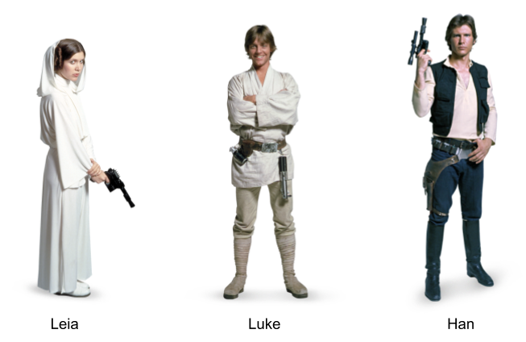
```

In particular, let's consider the following information about these subjects:

- Leia is a woman, 150 centimeters tall, and weighs 49 kilograms.
- Luke is a man, 172 centimeters tall, and weighs 77 kilograms.
- Han is a man, 180 centimeters tall, and weighs 80 kilograms.

We can say that the above information lists characteristics of three individuals. Or put in an equivalent way, that three subjects are described based on some of their characteristics: Name, Sex, Height, and Weight. Using statistical terminology, we formally say that we have data consisting of three _individuals_ described by some _variables_.

Statistical terminology is abundant and you'll find that individuals are also known as observations, cases, objects, samples or items. Example of individuals can be people, animals, plants, planets, spaceships, countries, or any other kind of object. 

A variable is any characteristic of an individual. Sometimes we refer to variables as features, aspects, indicators, descriptors, or properties that we measure or observe on individuals. 

This combo of __individuals and variables__ is perhaps the most common conceptualization of the term "data" within Statistical Learning methods. But it's not the only one. Bear in mind that there are other ways in which analysts and researchers think about data.


### Representing Data

Assuming that our data consists of Name, Sex, Height and Weight for three individuals, we can present this information in various forms. One option is to organize the information in some sort of rectangular or tabular layout, like the one below:

```{r fig.cap='Conceptual table', echo = FALSE, out.width='40%'}

```

We can say that this data set is in tabular form, with four columns and three rows (four if you include the row of column names). 

The same data could be represented in a non-tabular form. An example of a non-tabular format is XML (eXtensible Markup Language). In this case, we can organize the information in a hierarchical way with embeded elements also known as _nodes_, like in the following example:

```
<character>
  <name>Leia</name>
  <sex>female</sex>
  <weight>150 cm</weight>
  <height>49 kg</height>
</character>
<character>
  <name>Luke</name>
  <sex>male</sex>
  <weight>172 cm</weight>
  <height>77 kg</height>
</character>
<character>
  <name>Han</name>
  <sex>male</sex>
  <weight>180 cm</weight>
  <height>80 kg</height>
</character>
```

In the above example there are three `<character>` nodes, each one containing four nodes: `<name>`, `<sex>`, `<weight>`, and `<height>`. This is an example of what I call __raw data__. Don't worry if you are not familiar with XML. I just want to give you an example of the various ways in which data can be organized.

From a computational point of view, you could actually find a plethora of formats and conventions used to store information, and data sets in particular. Some formats have been designed to store data in a way that mimics the structure of a rectangular table. But you can find other formats that use a non-tabular structure, like XML.

When data is stored in a format that is supposed to represent a table, it is common to find visual displays with some grid of rows and columns.

```{r fig.cap='Data in tabular format', echo = FALSE, out.width='40%'}
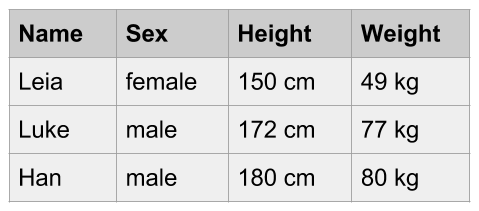
```

This is another example of raw data, in particular a _raw data table_. The data is visually organized and displayed in a rectangular grid of cells. However, this table is not ready yet to be manipulated statistically, much less algebraically. Obviously, this table needs some processing and reshaping in order to obtain a table with numerical information that becomes useful for matrix algebra operations. 

More often than not, raw data will be far from being in tabular format, or at least it will require extra reshaping steps so that it can be ready for the analysis. Although this is a very common issue in practice, in this book I will assume that you've already struggled to get the data in the _right_ rectangular shape. 


### Tabular Data

Eventually, to be analyzed with statistical learning tools and other multivariate techniques, your data will typically be required to have a certain specific structure, usually in the form of some sort of table or spreadsheet format (e.g. rows and columns). 

```{r fig.cap='Data Table Format', echo = FALSE, out.width='50%'}
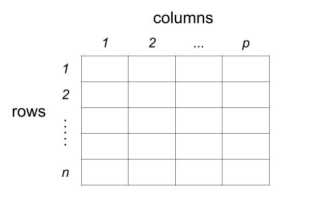
```

Depending on the nature of the data, and the way it is organized, rows and columns will have a particular meaning. The most common data table setting is the one of individuals-and-variables. Although somewhat arbitrary, the standard convention is that we use the columns to represent __variables__, and the rows to represent __individuals__. 

```{r fig.cap='Conceptual table of individuals and variables', echo = FALSE, out.width='50%'}
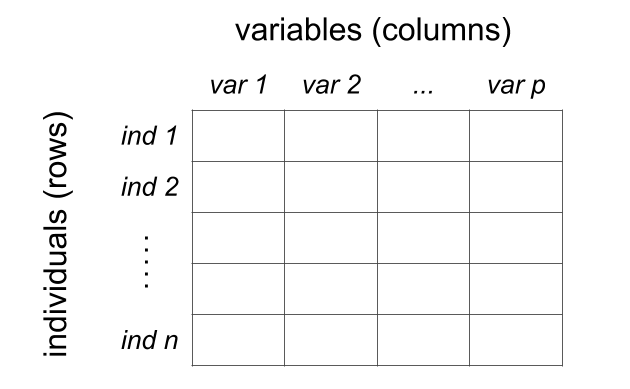
```


## Types of Tables

The most typical table format is that of individuals (rows) and variables (columns). However, the individuals-variables layout is not the only type of setting; there are other types of tables like contingency tables, crosstabulations, distance tables, as well as similarity and proximity tables. So let's review some examples of various kinds of rectangular formats.


### Heterogeneous Table

Perhaps the most ubiquitous type of table is that of inidividuals and variables in which the variables represent mixed or heterogeneous information. The toy data introduced so far is an example of a heterogeneous table involving distinct flavors of variables such as Name, Sex, Hieght and Weight. In other words, Name and Sex have strings values or categories, while Height and Weight have numeric values (representing quantities).

<!--
| Name   |  Sex    | Height   | Weight  |
|:-------|:--------|:---------|:--------|
| Leia   | female  | 150      | 49      |
| Luke   | male    | 172      | 77      |
| Han    | male    | 180      | 80      |
-->

```{r fig.cap='Mixed or heterogeneous variables', echo = FALSE, out.width='55%'}
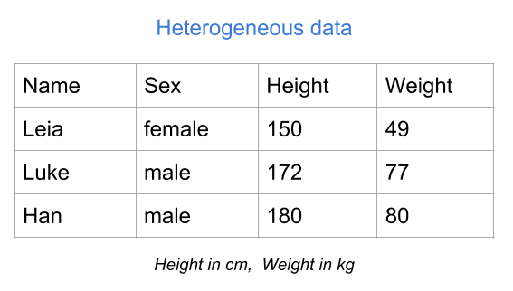
```

As you can tell, Height and Weight are already expressed in numeric values, and you can actually do some math on them (i.e. apply arithmetic and algebraic operations). In contrast, Name and Sex are not codified numerically, so the type of mathematical operations that you can perform on them is very limited. In or der to exploit their information in a deeper sense, you would have to transform the categories _male_ and _female_ with some numeric coding.


### Binary table

Another common type of table is a binary table. As its name indicates, this type of table contains variables that can only take two values. For example presence-absence, female-male, yes-no, success-failure, case-control, etc. In the table below, the variables represent drinks consumed: Beer, Wine, Juice, Coffee, and Tea. Each variable takes two possible values, _yes_ and _no_, indicating whether an individual consumes a specific type of drink.

```{r fig.cap='Binary table (raw values)', echo = FALSE, out.width='58%'}
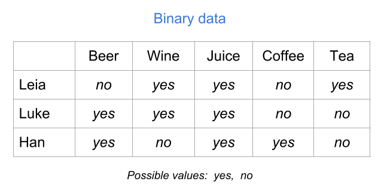
```

Although the values _yes_ and _no_ are very descriptive, you will need to codify them numerically to be able to perform statitical or algebraic operations with them. Perhaps the most natural way to codify binary values is with zeros and ones: "yes" = 1, and "no" = 0.

```{r fig.cap='Binary table (numeric values)', echo = FALSE, out.width='58%'}
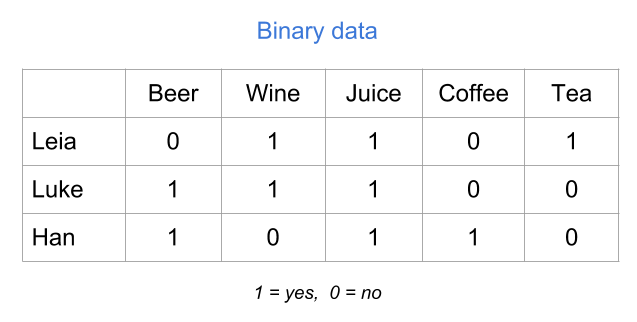
```

Another possible codification could be "yes" = 1, and "no" = -1. Or also with logical values: "yes" = TRUE, and "no" = FALSE.


### Modalities table

Another type of table consists of so-called _modalities_. These can come from variables or questions in a survey about how frequent you use/consume a specific product.

```{r fig.cap='Table of modalities (raw values)', echo = FALSE, out.width='58%'}
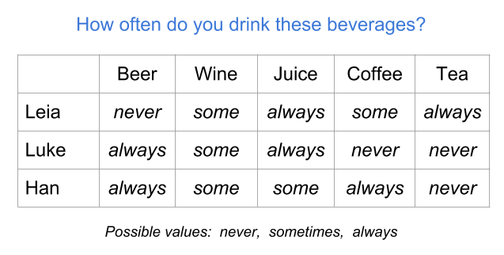
```

In order to statistically treat a modalities table, you will very likely have to transform the values of the categories (i.e. the modalities) to some numeric coding. For instance, you can assign values 1 = "never", 2 = "sometimes", and 3 = "always."

```{r fig.cap='Table of modalities (numeric values)', echo = FALSE, out.width='58%'}
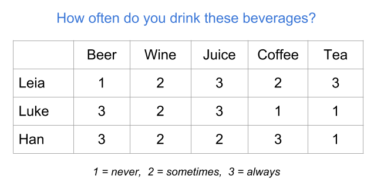
```


### Preference table

A preference table is a special case of individuals-variables table in which the  variables are measured in some kind of preference scale. For example, we can measure the preference level for various types of fruit juices on an ordinal scale ranging from 1 = "don't like at all" to 5 = "like it very much."

```{r fig.cap='Table of frequencies', echo = FALSE, out.width='55%'}
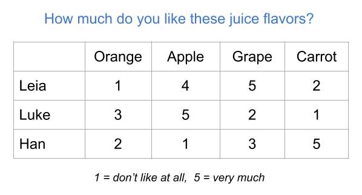
```


### Frequency table

As its name suggests, this type of table contains the frequencies (i.e. counts) resulting from _crossing_ two categorical variables. This is the reason why you also find the name cross-tables for this type of tabular data. Another common name for this type of tables is _contingency table_.

The example below shows a frequency table of the number of dialogues of each character, per episode (in the original trilogy of Star Wars). The rows correspond to the categories of the variable Name, while the columns corresponds to the categories of the variable Episode.

```{r fig.cap='Table of frequencies', echo = FALSE, out.width='50%'}
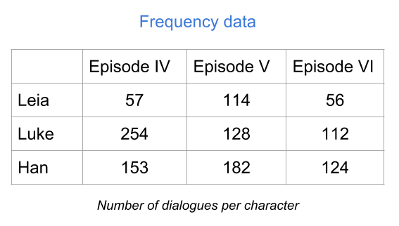
```

The value in the _ij_-th cell (_i_-th row, _j_-th column) tells you the number of occurrences that share Name's category _i_ and Episode's category _j_. If you add all the entries, you get the total number of individuals in each variable.

This tabular format is not really an individuals-variables table. Even though the example above has rows with names of the three individuals, the way you get a table like this is with two categorical variables.


### Distance table

Another interesting type of table is a distance table. Depending on who you talk to, the term "distance" may be used with slightly different meanings. Some authors refer to the word distance conveying a metric distance meaning. Other authors instead use the word distance to convey a general idea of dissimilarity. 

In general, you can find _distance_ tables under two opposite perspectives: similarities and disimilarities. The table below is an example of a similarity table.

```{r fig.cap='Table of proximities', echo = FALSE, out.width='45%'}
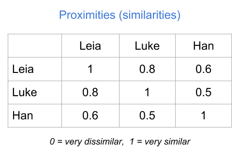
```


### Summary

- Most statistical learning methods require data in a table format with multiple columns and rows. 

- It's important to be aware of the difference between a _raw_ data table, and a _clean_ table numerically codified.

- Unless otherwise specified, in this book we'll assume that all the variables in a data matrix have numerical variables.

- For most of this book, we'll consider a data set to be integrated by a group of _individuals_ or objects on which we observe or measure one or more characteristics called _variables_.


-----

#### _Make a donation_ {-}

_If you find this resource useful, please consider making a one-time donation in any amount. Your support really matters._

<form action="https://www.paypal.com/cgi-bin/webscr" method="post" target="_top">
<input type="hidden" name="cmd" value="_donations" />
<input type="hidden" name="business" value="ZF6U7K5MW25W2" />
<input type="hidden" name="currency_code" value="USD" />
<input type="image" src="https://www.paypalobjects.com/en_US/i/btn/btn_donateCC_LG.gif" border="0" name="submit" title="PayPal - The safer, easier way to pay online!" alt="Donate with PayPal button" />

</form>
