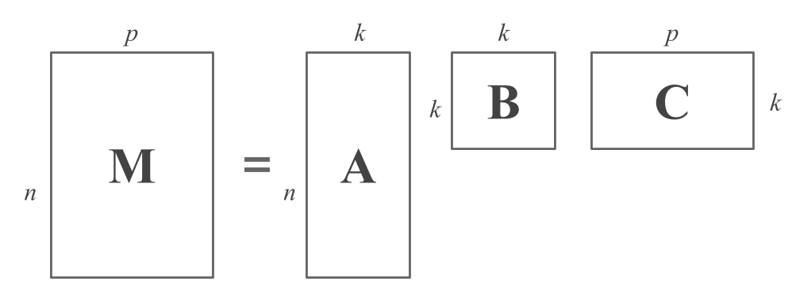

# (PART) Matrix Decompositions {-}

# Matrix Decompositions {#decomps}

This part of the book is dedicated to matrix decompositions. This is a central 
topic in matrix algebra, and it is also a fundamental tool for many statistical 
learning methods. Decompositions, even though they may seem obscure and scary 
the first time we encounter them, are our friends. Thanks to them we can 
analyze a great variety of data sets and do many great things that would 
otherwise be impossible.


## Decompositions

Simply put, decompositions are like factorizations of numbers. For example, 
consider the number 6; we can _decompose_ 6 as the product of 3 and 2:

$$
6 = 3 \times 2
$$

that is, we factorize 6 in terms of "simpler" numbers. 

More formally, a matrix decomposition is a way of expressing a matrix
$\mathbf{M}$ as the product of a set of new---typically two or three---matrices, 
usually simpler in some way, that shed light on the structures or relationships 
implicit in $\mathbf{M}$. By "simpler" we mean a series of ideas such as 
more compact matrices, or with less dimensions, or with less number of rows, 
or less number of columns; perhaps triangular matrices, or even matrices almost 
full of zeros, except in their diagonal.

Matrix factorizations are very useful because they allow us to break down a 
matrix and decompose it in its main parts. In other words, decompositions allow 
us to dismantle a matrix into a product of matrices that are "simpler". Think of 
a matrix decompositions like the factorizations of polynomials, they make it 
easier to study the properties of the mathematical objects, matrices in this 
case. Also, given a decomposition, computation generally becomes easier.

There are many different types of matrix decompositions, and each of them reveal 
different kinds of underlying structure. We are going to focus our discussion on 
two of them: 

1) the Singular Value Decomposition (SVD), and 

2) the Eigen Value Decomposition (EVD).

Why these two decompositions? Because we concentrate on the 
two types of matrices more important in statistics: 
_general rectangular matrices_ used to represent data tables, 
and _positive semi-definite matrices_ used to represent covariance matrices, 
correlation matrices, and any matrix that results from a crossproduct.


## General Idea

Roughly speaking, the decomposition of a matrix $\mathbf{M}$ can be described 
by an equation:

$$
\mathbf{M} = \mathbf{A B C}
$$

where the dimensions of the matrices are as follows: 

- $\mathbf{M}$ is $n \times p$ (we assume for simplicity that $n > p$)
- $\mathbf{A}$ is $n \times k$ (usually $k < p$)
- $\mathbf{B}$ is $k \times k$ (usually diagonal)
- $\mathbf{C}$ is $k \times p$ 

The following figure illustrates a matrix decomposition from the point of view 
of matrix shapes:

```{r fig.cap = 'Matrix Decomposition Diagram', echo = FALSE}

```


The matrix $\mathbf{A}$ has the same number of rows as $\mathbf{M}$. Each
row of $\mathbf{A}$ gives a different view of the object described by the
corresponding row of $\mathbf{M}$. In other words, the $i$-th row of 
$\mathbf{A}$ provides $k$ pieces of information that together are a new view
of the $i$-th object.

The matrix $\mathbf{C}$ has the same number of columns as $\mathbf{M}$. 
Each column of $\mathbf{C}$ gives a different view of the variable described
by the corresponding column of $\mathbf{M}$, in terms of $k$ pieces of
information, rather than the $n$ pieces of information in $\mathbf{M}$.

The role of $k$ is to force a representation for the data that is more
compact than its original form. Choosing $k = p$ still gives a sensible
decomposition, but it is usually the case that $k$ is chosen to be smaller
than $p$. We are implicitly assuming that a more compact representation
will capture underlying regularities in the data that might be obscured by 
the form in which the data is found in $\mathbf{A}$, usually because
$\mathbf{M}$ expresses the data in a way that contains redundancies.

The matrix $\mathbf{B}$ has entries that reflect connections among the
different latent or implicit regularities. For us, $\mathbf{B}$ will always
be a diagonal matrix. Some decompositions do not create this middle matrix, 
but we can always imagine that it is there as the $k \times k$ identity matrix
$\mathbf{I}$.

Usually $k$ is smaller, often mush smaller, than $p$, but a few matrix
decompositions allow $k > p$. In this case, the underlying factors must
somehow be of particular simple kind, so that the matrix decomposition is
still forced to discover a compact representation.


### About Decompositions

The equation that describes a decomposition:
$$
\mathbf{M} = \mathbf{A B C}
$$

does not explain how to compute one, or how such decomposition can reveal the
structures implicit in a data matrix. Nowadays, the computation of a matrix 
decomposition is straightforward; software to compute each one is readily 
available, and understanding how the algorithms work is not necessary to be 
able to interpret the results.

Seeing how a matrix decomposition reveals structure in a dataset is more 
complicated. Each decomposition reveals a different kind of implicit structure
and, for each decomposition, there are various ways to interpret the results.


## Rank

There is one general concept which plays a fundamental role in many 
decompositions: the __rank__. If $\mathbf{X}$ is a $n \times p$ matrix, then
$\mathbf{X}$ is of __full column rank__ if $\mathbf{Xb} = \mathbf{0}$ only if
$\mathbf{b} = \mathbf{0}$. We also say that the columns of $\mathbf{X}$ are
linearly independent. Full row rank is defined in a similar way.

If $\mathbf{X}$ can be written as the product $\mathbf{AB}$, with $\mathbf{A}$
an $n \times k$ matrix of full column rank and $\mathbf{B}$ an $k \times p$
matrix of full row rank, then $\mathbf{X}$ is said to have rank $k$. The
decomposition $\mathbf{X} = \mathbf{AB}$ is a _full rank decomposition_.

The _rank_ of a matrix is the minimum number of row or column vectors needed 
to generate the rows or columns of the matrix exactly through linear 
combinations. Geometrically, this algebraic concept is equivalent to the 
_dimensionality_ of the matrix. In practice, however, no large matrix is of 
low rank, but we can approximate it "optimally" by a matrix of low rank and 
then view this approximate matrix in a low-dimensional space.

Suppose that $\mathbf{X}$ is an $n \times p$ matrix with rank $r$. Then the 
idea of matrix approximation is to find another $n \times p$ matrix
$\mathbf{\hat{X}}$ of lower rank $k < r$ that resembles $\mathbf{X}$ "as
closely as" possible. Closeness can be measured in any reasonable way, but 
least-squares approximation makes the solution of the problem particularly 
simple. Hence we want to find a matrix $\mathbf{\hat{X}}$ that minimizes the 
following objective function over all possible rank $k$ matrices:

$$
trace [ (\mathbf{X} - \mathbf{\hat{X}} ) (\mathbf{X} - \mathbf{\hat{X}} )^\mathsf{T} ]
$$
