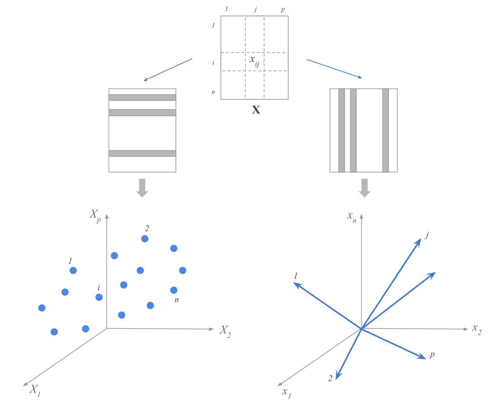

--- 
title: "A Matrix Algebra Companion for Statistical Learning (matrix4sl)"
author: "Gaston Sanchez"
date: "(work in progress)"
description: "This book provides a review of matrix algebra concepts central to the study of Statistical Learning Methods."
bibliography: [book.bib, packages.bib]
biblio-style: apalike
link-citations: yes
always_allow_html: yes
url: 'https\://www.gastonsanchez.com/matrix4sl/'
github-repo: gastonstat/matrix4sl
site: bookdown::bookdown_site
documentclass: book
---


# Welcome {-}

```{r echo = FALSE, out.width = "80%"}

```

The purpose of this book is to help you understand how statistical notions are connected to matrix algebra concepts that constantly appear around Statistical Learning methods.

This book will teach you how to make the transition from a data table to a data matrix, how to think of a data matrix from a geometric perspective, and how to express---and interpret---statistical operations with vector-matrix notation. More specifically, you will learn how to express common statistical summaries (e.g. mean, variance, covariance, correlation) with vector-matrix notation. You will also learn how to _see_ data---geometrically speaking---and how to provide a geometric interpretation to statistical summaries and related measures.


__How to cite this book__: 

Sanchez, G. (2018) __A Matrix Algebra Companion for Statistical Learning__ <br>
https://www.gastonsanchez.com/matrix4sl


-----

### Give Now {-}

If you find this resource useful (which I'm pretty sure you will) please consider making a one-time donation in any amount. Your support really matters.

<form action="https://www.paypal.com/cgi-bin/webscr" method="post" target="_top">
<input type="hidden" name="cmd" value="_donations" />
<input type="hidden" name="business" value="ZF6U7K5MW25W2" />
<input type="hidden" name="currency_code" value="USD" />
<input type="image" src="https://www.paypalobjects.com/en_US/i/btn/btn_donateCC_LG.gif" border="0" name="submit" title="PayPal - The safer, easier way to pay online!" alt="Donate with PayPal button" />

</form>

<br>

<a rel="license" href="http://creativecommons.org/licenses/by-nc-sa/4.0/"></a><br />This work is licensed under a <a rel="license" href="http://creativecommons.org/licenses/by-nc-sa/4.0/">Creative Commons Attribution-NonCommercial-ShareAlike 4.0 International License</a>.
