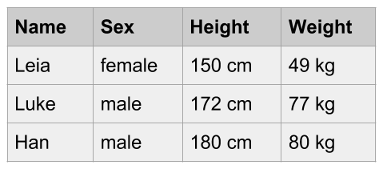
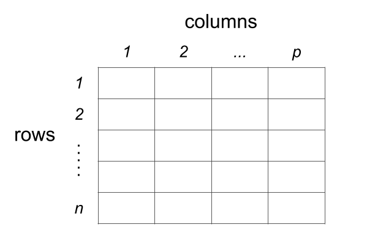
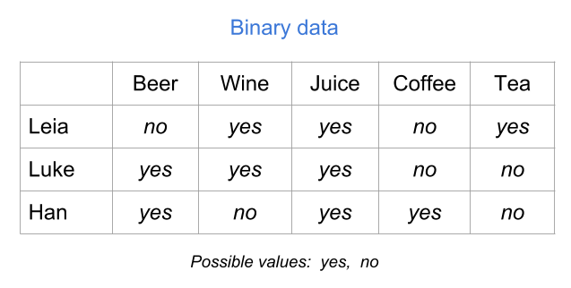
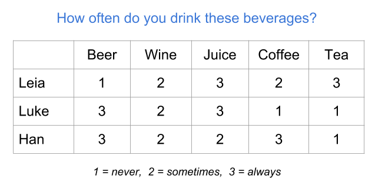
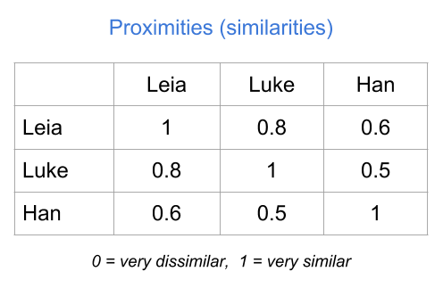
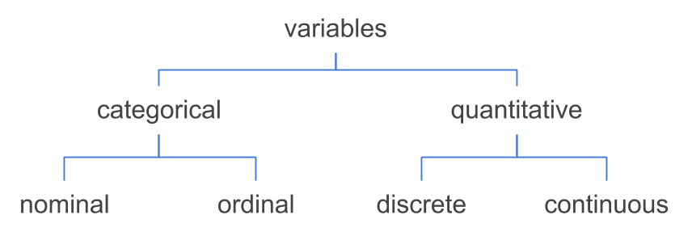
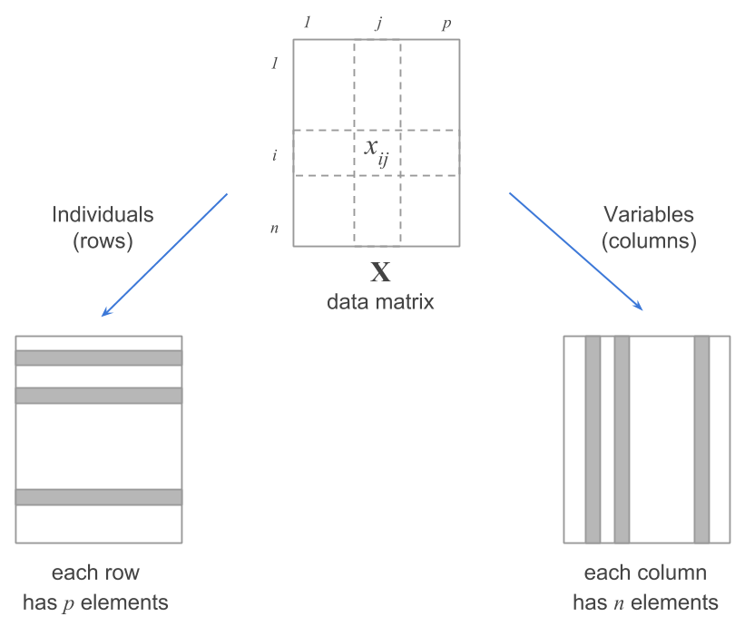
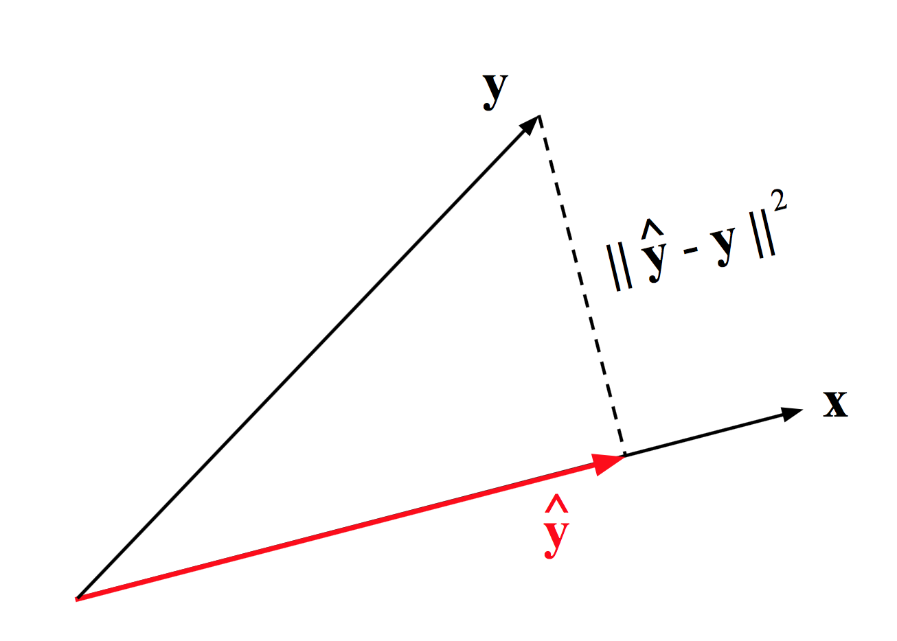
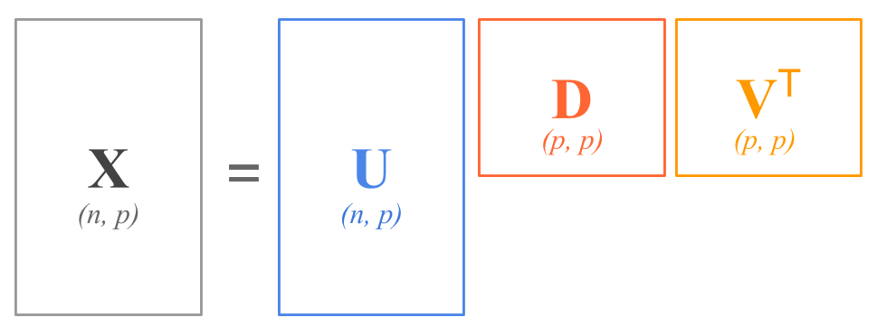

--- 
title: "A Matrix Algebra Companion for Statistical Learning"
author: "Gaston Sanchez"
description: "This book provides a review of matrix algebra concepts central to the study of Statistical Learning Methods."
date: ""
bibliography: [book.bib, packages.bib]
biblio-style: apalike
link-citations: yes
always_allow_html: yes
url: 'http\://gastonsanchez.com/matrix4sl/'
github-repo: gastonstat/matrix4sl
site: bookdown::bookdown_site
documentclass: book
---
```{r include=FALSE, cache=FALSE}
set.seed(1778)
options(digits = 3)

knitr::opts_chunk$set(
  comment = "",
  collapse = TRUE,
  cache = TRUE,
  error = TRUE,
  out.width = "70%",
  fig.align = 'center',
  fig.width = 6,
  fig.asp = 0.618,  # 1 / phi
  fig.show = "hold"
)
```


# Welcome {-}

The purpose of this book is to help you understand how statistical notions are connected to matrix algebra concepts that constantly appear around Statistical Learning methods.

This book will teach you how to make the transition from a data table to a data matrix, how to think of a data matrix from a geometric perspective, and how to express---and interpret---statistical operations with vector-matrix notation. More specifically, you will learn how to express common statistical summaries (e.g. mean, variance, covariance, correlation) with vector-matrix notation. You will also learn how to _see_ data---geometrically speaking---and how to provide a geometric interpretation to statistical summaries and related measures.


__How to cite this book__: 

Sanchez, G. (2018) __A Matrix Algebra Companion for Statistical Learning__ <br>
http://gastonsanchez.com/matrix4sl


-----


<a rel="license" href="http://creativecommons.org/licenses/by-nc-sa/4.0/"></a><br />This work is licensed under a <a rel="license" href="http://creativecommons.org/licenses/by-nc-sa/4.0/">Creative Commons Attribution-NonCommercial-ShareAlike 4.0 International License</a>.

<!--chapter:end:index.rmd-->

```{r include=FALSE, cache=FALSE}
set.seed(1778)
options(digits = 3)

knitr::opts_chunk$set(
  comment = "",
  collapse = TRUE,
  cache = TRUE,
  error = TRUE,
  out.width = "70%",
  fig.align = 'center',
  fig.width = 6,
  fig.asp = 0.618,  # 1 / phi
  fig.show = "hold"
)
```
# Introduction {#intro}

You've typically heard something like this before: "in order to have a solid understanding of statistical learning methods, you need a good knowledge of matrix algebra." Which I agree with. Matrix algebra is fundamental for a good understanding of Statistical Learning methods, Machine Learning methods, Data Mining techniques, as well as Multivariate Data Analysis methods (keep in mind that there is a considerable amount of overlap in all these fields).

What you probably haven't heard is that "knowing matrix algebra is not (really) enough." You also need to learn how various matrix algebra concepts are connected with the ideas and notions behind statistical learning methods.

In my opinion, the three main reasons for why you should bother learning about matrix algebra are:

1. Multivariate data is commonly represented in __tabular format__ (rows and columns).

2. Mathematically, a data table can be treated as a __matrix__.

3. Matrix algebra provides the __analytical machinery__ and tools to
manipulate and exploit values, information, and patterns of variability in data.


## How this book is organized?

By and large, I focus on concepts like mean, variance, covariance, notions of spread, distances, and their relationships with linear combinations, projections---that sort of thing. You will learn how to express statistical concepts with vector and matrix notation. The underlying goal is to show you how to get a geometrical interpretation of common statistical operations.

- Data tables
- Data matrix
- Variables
- Transformations
- Duality of the data matrix
- Statistical Summaries
- Spreads and Distances


## Prerequisites

This is NOT a book on matrix algebra, and it is also NOT a book on Statistical Learning. Instead, this book discusses general material from linear algebra that has to do with statistics. The level of exposure of the contents in this text is based on three ideal assumptions about you:

- You have some basic knowledge of matrix algebra.

- You have taken introductory statistics.

- You have some experience working with statistical learning techniques.


## Why this book?

As with most of the books that I have written, this book is the result of my professional experience and personal frustration of not having resources like these out there. More specifically, this book was motiviated by the lack of a text that I could refer my students to so they could learn about how various matrix algebra concepts are connected with statistical ideas.

Likewise, throughout my teaching activities to different user profiles, I've seen time and again that we are not trained to see the connections between many analytical notions, and their matrix-geometric interpretation. 

This book is my attempt to provide a resource for future (and current) data scientists that may have the software know-how, and a strong understanding of the working principles of the techniques they use, yet they have gaps at the matrix algebra level that prevents them to fully grasp the "under the hood" principles of their daily tools.

My hope is that the concepts and notions described in this text will allow you to get a good grasp of the methods discussed in any textbook about Statistical Learning, and how they work. I'm sure this book will be a great resource and consulting text for undergraduate and graduate students, as well as data scientists in the more general sense of this term.


## Acknowledgements

A very special and heartfelt mention to Mohamed Hanafi, who ignited a spark in me that eventually fired up the idea of this work. Very likely I wouldn't have started writing some draft notes had he hadn't invited me to be part of his one-man lab in the _Unit of Sensometrics and Chemometrics_ at Oniris-Nantes. I don't think I'll ever be able to forget our marathonian discussion sessions, the many dozens of whiteboards filled with illuminating scribbles, the corresponding quota of used markers, the constant skipped lunch breaks, the steady climbing of his voice volume as he got excited talking about some abstract concept, and of course his unique skill for breaking my patience beyond my tolerable limits. Now I know there's a toll to pay when working with a genious of such astounding talent. I also know I wouldn't have been able to connect all the dots without him sharing his wisdom, secrets, and utopic dreams. _Ustadh Hanafi... Shukran Jazilan_.

As always, you wouldn't be reading this book if it wasn't for the patience and support of my loving wife Jessica. Once again, she has let me occupy the dining table as my personal workspace for many months (consequently eating at the couches in uncountable occasions). If you find any value from the content in this book, which I am sure you will, you owe her almost as much as you owe me.


<!--chapter:end:introduction.Rmd-->

```{r include=FALSE, cache=FALSE}
set.seed(1778)
options(digits = 3)

knitr::opts_chunk$set(
  comment = "",
  collapse = TRUE,
  cache = TRUE,
  error = TRUE,
  out.width = "70%",
  fig.align = 'center',
  fig.width = 6,
  fig.asp = 0.618,  # 1 / phi
  fig.show = "hold"
)
```
# (PART) Data Essentials {-}

# Data Tables {#data}

Pretty much all statistical learning methods require data in a table format with multiple columns and rows. However, data comes in many different forms. In fact, data can come in many different presentations, and in a wide range of sizes, shapes, colors, textures, and flavors. It can come from one single source, or it may be the result of a variety of sources. It can have a very well defined structure, or it can simply be unstructured. In this chapter, we review some of the common types of data tables that you can typically encounter in practice while applying a statistical learning procedure.


## Data: Individuals and Variables

To illustrate some of the ideas presented in this chapter I'm going to use a toy example with data of three individuals from a galaxy far, far away: Leia Organa, Luke Skywalker, and Han Solo.

```{r fig.cap='Three individuals', echo = FALSE, out.width='60%'}
knitr::include_graphics("images/tables/sw-leia-luke-han.png")
```

In particular, let's consider the following information about these subjects:

- Leia is a woman, 150 centimeters tall, and weighs 49 kilograms.
- Luke is a man, 172 centimeters tall, and weighs 77 kilograms.
- Han is a man, 180 centimeters tall, and weighs 80 kilograms.

We can say that the above information lists characteristics of three individuals. Or put in an equivalent way, that three subjects are described based on some of their characteristics: Name, Sex, Height, and Weight. Using statistical terminology, we formally say that we have data consisting of three _individuals_ described by some _variables_.

Statistical terminology is abundant and you'll find that individuals are also known as observations, cases, objects, samples or items. Example of individuals can be people, animals, plants, planets, spaceships, countries, or any other kind of object. 

A variable is any characteristic of an individual. Sometimes we refer to variables as features, aspects, indicators, descriptors, or properties that we measure or observe on individuals. 

This combo of __individuals and variables__ is perhaps the most common conceptualization of the term "data" within Statistical Learning methods. But it's not the only one. Bear in mind that there are other ways in which analysts and researchers think about data.


### Representing Data

Assuming that our data consists of Name, Sex, Height and Weight for three individuals, we can present this information in various forms. One option is to organize the information in some sort of rectangular or tabular layout, like the one below:

```{r fig.cap='Conceptual table', echo = FALSE, out.width='40%'}

```

We can say that this data set is in tabular form, with four columns and three rows (four if you include the row of column names). 

The same data could be represented in a non-tabular form. An example of a non-tabular format is XML (eXtensible Markup Language). In this case, we can organize the information in a hierarchical way with embeded elements also known as _nodes_, like in the following example:

```
<character>
  <name>Leia</name>
  <sex>female</sex>
  <weight>150 cm</weight>
  <height>49 kg</height>
</character>
<character>
  <name>Luke</name>
  <sex>male</sex>
  <weight>172 cm</weight>
  <height>77 kg</height>
</character>
<character>
  <name>Han</name>
  <sex>male</sex>
  <weight>180 cm</weight>
  <height>80 kg</height>
</character>
```

In the above example there are three `<character>` nodes, each one containing four nodes: `<name>`, `<sex>`, `<weight>`, and `<height>`. This is an example of what I call __raw data__. Don't worry if you are not familiar with XML. I just want to give you an example of the various ways in which data can be organized.

From a computational point of view, you could actually find a plethora of formats and conventions used to store information, and data sets in particular. Some formats have been designed to store data in a way that mimics the structure of a rectangular table. But you can find other formats that use a non-tabular structure, like XML.

When data is stored in a format that is supposed to represent a table, it is common to find visual displays with some grid of rows and columns.

```{r fig.cap='Data in tabular format', echo = FALSE, out.width='40%'}

```

This is another example of raw data, in particular a _raw data table_. The data is visually organized and displayed in a rectangular grid of cells. However, this table is not ready yet to be manipulated statistically, much less algebraically. Obviously, this table needs some processing and reshaping in order to obtain a table with numerical information that becomes useful for matrix algebra operations. 

More often than not, raw data will be far from being in tabular format, or at least it will require extra reshaping steps so that it can be ready for the analysis. Although this is a very common issue in practice, in this book I will assume that you've already struggled to get the data in the _right_ rectangular shape. 


### Tabular Data

Eventually, to be analyzed with statistical learning tools and other multivariate techniques, your data will typically be required to have a certain specific structure, usually in the form of some sort of table or spreadsheet format (e.g. rows and columns). 

```{r fig.cap='Data Table Format', echo = FALSE, out.width='50%'}

```

Depending on the nature of the data, and the way it is organized, rows and columns will have a particular meaning. The most common data table setting is the one of individuals-and-variables. Although somewhat arbitrary, the standard convention is that we use the columns to represent __variables__, and the rows to represent __individuals__. 

```{r fig.cap='Conceptual table of individuals and variables', echo = FALSE, out.width='50%'}
knitr::include_graphics("images/tables/table-inds-vars.png")
```


## Types of Tables

The most typical table format is that of individuals (rows) and variables (columns). However, the individuals-variables layout is not the only type of setting; there are other types of tables like contingency tables, crosstabulations, distance tables, as well as similarity and proximity tables. So let's review some examples of various kinds of rectangular formats.


### Heterogeneous Table

Perhaps the most ubiquitous type of table is that of inidividuals and variables in which the variables represent mixed or heterogeneous information. The toy data introduced so far is an example of a heterogeneous table involving distinct flavors of variables such as Name, Sex, Hieght and Weight. In other words, Name and Sex have strings values or categories, while Height and Weight have numeric values (representing quantities).

<!--
| Name   |  Sex    | Height   | Weight  |
|:-------|:--------|:---------|:--------|
| Leia   | female  | 150      | 49      |
| Luke   | male    | 172      | 77      |
| Han    | male    | 180      | 80      |
-->

```{r fig.cap='Mixed or heterogeneous variables', echo = FALSE, out.width='55%'}
knitr::include_graphics("images/tables/table-mixed.png")
```

As you can tell, Height and Weight are already expressed in numeric values, and you can actually do some math on them (i.e. apply arithmetic and algebraic operations). In contrast, Name and Sex are not codified numerically, so the type of mathematical operations that you can perform on them is very limited. In or der to exploit their information in a deeper sense, you would have to transform the categories _male_ and _female_ with some numeric coding.


### Binary table

Another common type of table is a binary table. As its name indicates, this type of table contains variables that can only take two values. For example presence-absence, female-male, yes-no, success-failure, case-control, etc. In the table below, the variables represent drinks consumed: Beer, Wine, Juice, Coffee, and Tea. Each variable takes two possible values, _yes_ and _no_, indicating whether an individual consumes a specific type of drink.

```{r fig.cap='Binary table (raw values)', echo = FALSE, out.width='58%'}

```

Although the values _yes_ and _no_ are very descriptive, you will need to codify them numerically to be able to perform statitical or algebraic operations with them. Perhaps the most natural way to codify binary values is with zeros and ones: "yes" = 1, and "no" = 0.

```{r fig.cap='Binary table (numeric values)', echo = FALSE, out.width='58%'}
knitr::include_graphics("images/tables/table-binary.png")
```

Another possible codification could be "yes" = 1, and "no" = -1. Or also with logical values: "yes" = TRUE, and "no" = FALSE.


### Modalities table

Another type of table consists of so-called _modalities_. These can come from variables or questions in a survey about how frequent you use/consume a specific product.

```{r fig.cap='Table of modalities (raw values)', echo = FALSE, out.width='58%'}
knitr::include_graphics("images/tables/table-modalities-raw.png")
```

In order to statistically treat a modalities table, you will very likely have to transform the values of the categories (i.e. the modalities) to some numeric coding. For instance, you can assign values 1 = "never", 2 = "sometimes", and 3 = "always."

```{r fig.cap='Table of modalities (numeric values)', echo = FALSE, out.width='58%'}

```


### Preference table

A preference table is a special case of individuals-variables table in which the  variables are measured in some kind of preference scale. For example, we can measure the preference level for various types of fruit juices on an ordinal scale ranging from 1 = "don't like at all" to 5 = "like it very much."

```{r fig.cap='Table of frequencies', echo = FALSE, out.width='55%'}
knitr::include_graphics("images/tables/table-preference.png")
```


### Frequency table

As its name suggests, this type of table contains the frequencies (i.e. counts) resulting from _crossing_ two categorical variables. This is the reason why you also find the name cross-tables for this type of tabular data. Another common name for this type of tables is _contingency table_.

The example below shows a frequency table of the number of dialogues of each character, per episode (in the original trilogy of Star Wars). The rows correspond to the categories of the variable Name, while the columns corresponds to the categories of the variable Episode.

```{r fig.cap='Table of frequencies', echo = FALSE, out.width='50%'}
knitr::include_graphics("images/tables/table-frequency.png")
```

The value in the _ij_-th cell (_i_-th row, _j_-th column) tells you the number of occurrences that share Name's category _i_ and Episode's category _j_. If you add all the entries, you get the total number of individuals in each variable.

This tabular format is not really an individuals-variables table. Even though the example above has rows with names of the three individuals, the way you get a table like this is with two categorical variables.


### Distance table

Another interesting type of table is a distance table. Depending on who you talk to, the term "distance" may be used with slightly different meanings. Some authors refer to the word distance conveying a metric distance meaning. Other authors instead use the word distance to convey a general idea of dissimilarity. 

In general, you can find _distance_ tables under two opposite perspectives: similarities and disimilarities. The table below is an example of a similarity table.

```{r fig.cap='Table of proximities', echo = FALSE, out.width='45%'}

```


## Summary

- Most statistical learning methods require data in a table format with multiple columns and rows. 

- It's important to be aware of the difference between a _raw_ data table, and a _clean_ table numerically codified.

- Unless otherwise specified, in this book we'll assume that all the variables in a data matrix have numerical variables.

- For most of this book, we'll consider a data set to be integrated by a group of _individuals_ or objects on which we observe or measure one or more characteristics called _variables_.

<!--chapter:end:data-table.Rmd-->

```{r include=FALSE, cache=FALSE}
set.seed(1778)
options(digits = 3)

knitr::opts_chunk$set(
  comment = "",
  collapse = TRUE,
  cache = TRUE,
  error = TRUE,
  out.width = "70%",
  fig.align = 'center',
  fig.width = 6,
  fig.asp = 0.618,  # 1 / phi
  fig.show = "hold"
)
```
# Data Matrix {#datamatrix}


In the previous chapter we talked about the standard notion of _data_ from the statistical learning perspective, that is, as a "set of individuals described by one or more variables". In addition, we looked at various types of data tables, and we also discussed about the distinction between _raw_ tables and _clean_ tables. In this chapter, we make the transition from a data table to a data matrix. I will introduce some notation used in the rest of the book, and focus on how to think of a data table in terms of a matrix, and what aspects to keep in mind while converting any data table into a mathematical matrix.


## About Matrices

First let's talk about matrices in the mathematical sense of the word. A matrix is a rectangular array of elements. More formally, a matrix is a mathematical object whose structure is a rectangular array of entries.

Typically, we consider the elements of a matrix to be numbers. Although you can certainly generalize the contents of a matrix and think about them as any type of symbols, not necessarily numbers. This is perhaps a common way to conceive a generic matrix from a more computational-oriented perspective.

From example, an R matrix may be numeric, but you can also have matrices containing logical values (`TRUE` or `FALSE`), or even a matrix made up of characters.

```{r}
# numeric matrix
A <- matrix(1:12, nrow = 4, ncol = 3)
A
```

```{r}
# logical matrix
L <- matrix(c(TRUE, FALSE), nrow = 4, ncol = 3)
L
```

```{r}
# character matrix
S <- matrix(sample(letters, 12), nrow = 4, ncol = 3)
S
```


## Data Matrix

While the raw ingredient for any statistical learning endevour is a data set, typically reshaped and organized in a tabular form, the core input of any statistical learning method consists of the data matrix, or in some cases, matrices.

To make things less abstract I'm going to use the following toy data table with four variables measured on six individuals:

```{r setup, echo = FALSE}
sw <- read.csv('data/starwars.csv')
```

```{r echo = FALSE, comment = ''}
dat <- sw[1:6 ,c('gender', 'height', 'weight', 'jedi')]
rownames(dat) <- sw$name[1:6]
dat
```

You can actually find the corresponding CSV file in the `data/` folder of the book's github repository.


### Why a data matrix?

The reason to use matrices is simple: the typical structure in which the data can be mathematically manipulated from a multivariate standpoint is a __data matrix__.
No other mathematical object adapts so well to a rectangular structure of a data table.

Since we are getting more formal, we need to define some terminology and notation that we'll use in the rest of the book. We're going to represent matrices with bold upper-case letters like $\mathbf{A}$ or $\mathbf{B}$. 

In general, a matrix $\mathbf{X}$ has $n$ rows and $p$ columns, and we say that $\mathbf{X}$ is an $n \times p$ matrix. In addition, we are going to assume that all the matrices are real matrices, that is, matrices containing elements   in the set of Real numbers.

\[ 
\underset{n \times p}{\mathbf{X}} = 
\left[\begin{array}{ccccc}
x_{11} & \cdots & x_{1j} & \cdots & x_{1p} \\
\vdots &        & \vdots &        & \vdots \\
x_{i1} & \cdots & x_{ij} & \cdots & x_{ip} \\
\vdots &        & \vdots &        & \vdots \\
x_{n1} & \cdots & x_{nj} & \cdots & x_{np} \\
\end{array}\right]
\]

An element of a matrix $\mathbf{X}$ is denoted by $x_{ij}$ which represents the element in the $i$-th row and the $j$-th column. For instance, the data matrix $\mathbf{X}$ of size the element $x_{23}$ has the value `r dat[2,3]` and it represents the `r colnames(dat)[3]` of `r rownames(dat)[2]`.

Together with matrices we also have variables, and vectors. We are going to represent variables with italized capital letters such as $Y$ and $Z$. Also, variables in a matrix $\mathbf{X}$ can be represented with subscripts such as $X_j$ to indicate the index position. The first three variables in our matrix $\mathbf{X}$ would be represented as $X_1$ (`r colnames(dat)[1]`), $X_2$ (`r colnames(dat)[2]`), and $X_3$ (`r colnames(dat)[3]`). 

Vectors will be represented by bold lower case letters such as $\mathbf{w}$ or $\mathbf{u}$. A vector $\mathbf{w}$ with $m$ elements can be expressed as $\mathbf{w} = (w_1, w_2, \dots, w_m)$. Since variables can be expressed as vectors, we can use the vector notation $\mathbf{x}$ to represent a variable $X$. However, keep in mind that not all vectors are variables: a vector may well refer to an object or to any row of a matrix.


### Matrix Representations

You will that find people represent matrices in multiple ways, using various notations, symbols, and diagrams.

We can represent a data matrix $\mathbf{X}$ by simply regarding the table from its columns (i.e. variables) perspective:

$$
\mathbf{X} =
\left[\begin{array}{c|c|c|c|c|c}
  &   &   &   &  & \\
  \mathbf{x}_{1} & \mathbf{x}_{2} & \cdots & \mathbf{x}_{j} & \cdots & \mathbf{x}_{p} \\
  &   &   &   &  & \\
\end{array}\right]
$$

Note that each variable $X_j$ is represented with a column vector $\mathbf{x}_{j}$. In turn, the vertical lines are just a visual cue indicating separation between columns. Taking our toy data data matrix, we could represent it as:

$$
\mathbf{Data} =
\left[\begin{array}{c|c|c|c}
  &   &   &  \\
  \texttt{gender} & \texttt{height} & \texttt{weight} & \texttt{jedi} \\
  &   &   &  \\
\end{array}\right]
$$

Being more minimalists, we can even get a more compact representation by just expressing a matrix $\mathbf{X}$ as a list or sequence of its variables:

\[
\mathbf{X} = 
\left[\begin{array}{cccccc}
\mathbf{x}_{1} & \mathbf{x}_{2} & \cdots & \mathbf{x}_{j} & \cdots & \mathbf{x}_{p} \\
\end{array}\right]
\]


### A Block of Variables

While most of us are used to think of multivariate data in terms of a table or matrix, there can be other interesting representation options. If you are a visual person like me, we can also use an alternative way to display the variables using a standard convention of drawing them in rectangular shape. In this way, we can depict a set of variables in a data matrix as a series of rectangles, like those below inside the dashed box:

```{r out.width='50%', fig.cap='Variables in a matrix depicted as a set of rectangles', echo = FALSE}
knitr::include_graphics("images/matrix/matrix-with-rectangle-variables.png")
```

The rectangular-box shape perfectly illustrates the idea of a __block__ of variables. I will use the term __block__ to convey the idea of a group or set of variables measured on a set of objects. If you prefer, you can also think of a block as a data table.


## Types of Matrices

There are various kinds of matrices which are commonly used in statistical learning methods. Let's review several of them.


### General Rectangular Matrix

The most general type of matrix is a rectangular matrix. This means that there is an arbitrary number of rows and columns.

\[ 
\left[\begin{array}{ccc}
1 & 2 & 3  \\
4 & 5 & 6  \\
7 & 8 & 9  \\
10 & 11 & 12  \\
\end{array}\right]
\]

If a matrix has more rows than columns $n > p$, sometimes we call this a vertical or _tall_ matrix:

\[ 
\left[\begin{array}{ccc}
1 & 2 & 3  \\
4 & 5 & 6  \\
7 & 8 & 9  \\
10 & 11 & 12  \\
13 & 14 & 15  \\
\end{array}\right]
\]

In contrast, if a matrix has more columns than rows, $p > n$, sometimes we call this a horizontal, _flat_ or _wide_ matrix:

\[ 
\left[\begin{array}{cccc}
1 & 2 & 3 & 4 & 5 \\
6 & 7 & 8 & 9 & 10 \\
11 & 12 & 13 & 14 & 15 \\
\end{array}\right]
\]


### Square Matrix

A square matrix is one with same number of rows and columns, $n = p$. In statiscal learning, various matrices derived from the data matrix are typically square.

\[ 
\left[\begin{array}{ccc}
1 & 2 & 3  \\
4 & 5 & 6  \\
7 & 8 & 9  \\
\end{array}\right]
\]


### Symmetric Matrix

A symmetric matrix is a special case of a square matrix: the corresponding elements of corresponding rows and columns are equal. In other words, in a symmetric matrix we have that the element $x_{ij}$ is equal to $x_{ji}$.

\[ 
\left[\begin{array}{ccc}
1 & 2 & 3  \\
2 & 4 & 5  \\
3 & 5 & 6  \\
\end{array}\right]
\]


### Diagonal Matrix

A diagonal matrix is a special case of symmetric matrix in which all nondiagonal elements are 0. 

\[ 
\left[\begin{array}{ccc}
1 & 0 & 0  \\
0 & 2 & 0  \\
0 & 0 & 3  \\
\end{array}\right]
\]

In other words, in a symmetric matrix, $x_{ij} = 0$ for $i \neq j$. The only elements that may not necessarily be qual to zero are those in the diagonal.

\[ 
\left[\begin{array}{ccc}
x_{11} & 0 & 0  \\
0 & x_{22} & 0  \\
0 & 0 & x_{33}  \\
\end{array}\right]
\]


### Scalar Matrix

The scalar matrix is a special type of diagonal matrix in which all the diagonal elements are equal scalars.

\[ 
\left[\begin{array}{ccc}
5 & 0 & 0  \\
0 & 5 & 0  \\
0 & 0 & 5  \\
\end{array}\right]
\]


### Identity Matrix

The identity matrix is a special case of the scalar matrix in which the diagonal elements are all equal to one. This matrix is typically represented with the letter $\mathbf{I}$. To indicate the dimensions of this matrix, we typically write it with a subscript for the number of rows (or columns). For example, $\mathbf{I}_{n}$ represents the identity matrix of dimension $n \times n$.

\[ 
\mathbf{I}_{3} = 
\left[\begin{array}{ccc}
1 & 0 & 0  \\
0 & 1 & 0  \\
0 & 0 & 1  \\
\end{array}\right]
\]

In matrix algebra, the identity matrix plays the same role as the number 1 in ordinary or scalar algebra.


### Triangular Matrix

A square matrix with only 0's above or below the diagonal is called a _triangular_ matrix. There are two flavors of this type of matrix: upper triangular and lower triangular. 

An upper triangular matrix has zeros below the diagonal. 

\[ 
\left[\begin{array}{ccc}
1 & 2 & 3  \\
0 & 5 & 6  \\
0 & 0 & 9  \\
\end{array}\right]
\quad \textsf{or} \quad 
\left[\begin{array}{ccc}
1 & 2 & 3  \\
 & 5 & 6  \\
 &  & 9  \\
\end{array}\right]
\]

Conversely, a lower triangular matrix has zeros above the diagonal.

\[ 
\left[\begin{array}{ccc}
1 & 0 & 0  \\
4 & 5 & 0  \\
7 & 8 & 9  \\
\end{array}\right]
\quad \textsf{or} \quad 
\left[\begin{array}{ccc}
1 &  &   \\
4 & 5 &  \\
7 & 8 & 9  \\
\end{array}\right]
\]


### Shapes of Matrices

To summarize the various types of matrices described so far, here's a diagram depicting their shapes. The general type of matrix is a rectangular matrix which can be divided in three types: vertical or tall ($n > p$), square ($n = p$), and horizontal or wide ($n < p$). Among square matrices, the notion of symmetry plays a special role, and among symmetric matrices, we can say that diagonal ones have the most basic structure.

```{r out.width='60%', fig.cap = 'Various shapes of matrices', echo = FALSE}
knitr::include_graphics("images/matrix/matrix-shapes.png")
```


<!--chapter:end:data-matrix.Rmd-->

```{r include=FALSE, cache=FALSE}
set.seed(1778)
options(digits = 3)

knitr::opts_chunk$set(
  comment = "",
  collapse = TRUE,
  cache = TRUE,
  error = TRUE,
  out.width = "70%",
  fig.align = 'center',
  fig.width = 6,
  fig.asp = 0.618,  # 1 / phi
  fig.show = "hold"
)
```
# Variables {#variables}

To illustrate some of the ideas presented in this chapter I'm going to use a toy example with data from the characters of the Star Wars universe. You can actually find the corresponding CSV file in the `data/` folder of the book's github repository.

```{r sw, echo = FALSE}
sw <- read.csv('data/starwars.csv')
```

```{r echo = FALSE, comment = ''}
dat <- sw[ ,c('name', 'gender', 'height', 'weight', 'species', 'jedi', 'weapon')]
dat
```

The table consists of `r nrow(dat)` rows and `r ncol(dat)` columns. The rows correspond to _individuals_ and the columns correspond to _variables_. Although this data set is a toy example, it contains variables of different types commonly found in real data sets.


## Types of Variables

In statistical learning, the most typical data format involves a set of individuals or objects described by several characteristics commonly known as _variables_. Interestingly, we can classify variables in a couple of different ways.

The most basic and usual way to classify variables is in two distinct types: __quantitative__ variables and __categorical__ (or qualitative) variables.

```{r out.width='50%', echo = FALSE}
knitr::include_graphics("images/variables/variable-types.png")
```

The variables `height` and `weight` are examples of quantitative variables because their values represent quantities. That is, they can be measured numerically on some sort of interval scale. 

In turn, variables such as `name`, `gender`, `species`, `jedi`, and `weapon` are categorical or qualitative variables because their values represent categories (or qualities). More formally, they describe a quality of an individual, and allows you to place an individual into a category or group, such as male or female.


## Variable Flavors

The division between categorical and quantitative variables is not the only one. Often, data scientists further classifiy categorical variables as _nominal_ or _ordinal_. Likewise, quantitative variables can be classified as _discrete_ or _continuous_. This next level of classification is chiefly based on the notion of _scales of measurement_ of the variables.

```{r fig.cap='Further classification of variables', echo = FALSE}

```


### Nominal Variable

A categorical variable is __nominal__ when it results from naming or labeling values that don't have a natural order. An example of a nominal variable is `weapon` which has the following values:

```{r echo = FALSE}
levels(dat$weapon)
```

Can you order the categories in a "natural" way? Not really. The term _nominal_ according the dictionary means "existing in name only". Thus, nominal values are just that: names. There is no reason why blaster is better or greater than lightsaber. You could say that you prefer a blaster over a lightsaber but that's a different variable: personal preference.

Other typical examples of nominal variables are:

- the sex of a newborn child: e.g. female or male

- the ethnicity of an individual: e.g. Native-American, African-American, Asian, White

- ice cream flavors: e.g. chocolate, vanilla, strawberry

- the numbers on the players' jerseys of a soccer team: numbers used as identifiers


### Ordinal Variable

A categorical variable is __ordinal__ when it results from ordering values into a series of categories when no appropriate numerical scale is available. For example, consider a variable "usage frequency" measured with values _never_, _sometimes_, and _always_. In this case we can order the categories from less usage to more usage, or viceversa.

Some examples of ordinal variables are:

- size of clothes: extra-small, small, medium, large, extra-large

- college year: freshman, sophomore, junior, senior

- spiciness: none, mild, moderate, very

- jedis ranks: youngling, padawan, knight, master, and grand master


### Discrete Variable

A quantitative variable is __discrete__ when it results from counting. To be more precise, a discrete variable takes on zero or a positive integer value. Some examples of discrete variables are:

- the number of male ewooks in a family with four children (0, 1, 2, 3, or 4).

- the number of robots per Imperial Star Destroyer

- the number of moons orbiting around a planet


### Continuous Variable

A quantitative variable is __continuous__ when it results from measuring. More technically, a continuous variable theoretically takes on an infinite number of possible values, however, its reported values are subject to the precision or accuracy of the measurement device. Some examples of continuous variables are:

- the height of an individual
- the weight of a robot
- the speed of a starship


### Caveat

Keep in mind that not all variables fit neatly and unambiguously into one of the previous classes. For example, the age of an individual could be considered of a discrete variable when it gets reported in (whole) number of years. However, age could also be considered to be continuous when measured in a more granular scale: e.g. days, or hours, or seconds. Moreover, sometimes age is reported into ordered categories such as 0 to 5 years, 6 to 10, 11 to 15, and so on. These values would turn age into an ordinal variable.


## Coding Values

Another important aspect intimately connected with the various types of variables is that of how variable values are codified. To better understand what this is about, let me discuss a simple example.

Notice that the quantitative variables in the star wars data set have numeric values, while the categorical variables have non-numeric values. Does that mean that all numeric variables can be considered to be quantitative? And that all non-numeric variables can be considered to be categorical? The answer is: Not necessarily.

Often, analysts assign numeric values to the categories of a qualitative variable. Sooner or later you will find variables with numeric values that are not quantitative. An example could be a ice-cream flavors in which the categories are codified with numbers. For example, consider three ice-cream flavors: vanilla, chocolate, and lemon. And imagine that we assign a numeric code to each flavor: 1 = vanilla, 2 = chocolate, 3 = lemon. This numeric labeling is just for convenience purposes.

Assume that you get the preferred ice-cream flavor of 10 subjects with the following values: 

```{r echo = FALSE, comment = ''}
flavors <- c('vanilla', 'chocolate', 'lemon')
icecreams <- sample(1:3, size = 10, replace = TRUE)
cat(icecreams)
```

The above numbers, which are hypothetical values of a variable `icecream`, do not represent quantities; they represent flavors. Just because there are numbers, it does not mean that we can use those numbers to carry out arithmetic operations. What is the result of: 3 - 1, that is, lemon minus vanilla? It is meaningless to attempt this type of operation. 

Likewise, we could assign numbers to sizes: 1=small, 2=medium, 3=large. In this case, the numers are again used for convenient purposes. And we can even take one further step and say that we can use the numbers to rank the categories. But it will be impossible to add 1+2, since small + medium does not equal large.

The point is that just because a variable contains numbers, that doesn't automatically make it quantitative. You should always ask yourself if the numbers represent some sort of quantity. If the answer is a sounded yes, then you have a quantitative variable. Otherwise, you have a categorical one.


### More on coding

We can find categorical data under a wide range of formats. I've seen categorical data codified in different ways, and sometimes people are very creative in the way they do this.

The main types of formats can be classified in three main groups:

- text or characters
- numbers (ideally integers)
- logical (TRUE / FALSE), typically for binary variables

Here's an example with a `gender` variable:

- as text: `"F"` (female), `"M"` (male)
- as numbers: 1 (female), 0 (male)
- as logical: `TRUE` (female), `FALSE` (male)

When talking about the way data is stored and codified, I don't think there's an ideal/universal way to store categorical data effectively and efficiently. It all depends on the field of application, the size of the data, the legibility, the usage purposes, etc. What I do believe is that, when categorical data is being analyzed, we should consider a couple of issues:

- __understandability__: the analyst should be able to read, interpret and understand. Reduce friction, avoid having to decodified numbers.

- __compatibility__: this has to do with functions and commands in data analysis and statistical software. Some functions are programmed in a way that they accept a specific type of input (either a vector, a factor, a data frame, etc).

- __visibility__: this aspect is related to visual displays in graphics. Maybe long labels look fine in a table, but for plotting purposes they could cluttered the screen.


<!--chapter:end:variables.Rmd-->

```{r include=FALSE, cache=FALSE}
set.seed(1778)
options(digits = 3)

knitr::opts_chunk$set(
  comment = "",
  collapse = TRUE,
  cache = TRUE,
  error = TRUE,
  out.width = "70%",
  fig.align = 'center',
  fig.width = 6,
  fig.asp = 0.618,  # 1 / phi
  fig.show = "hold"
)
```
# Transformations {#transformations}

In many situations you will need to transform and modify the raw values of your data.

Transformations are useful for many reasons:

- change scales: from continuous to discrete
- recategorization
- discretization
- linear transformations
- non-linear transformations
- monotonic transformations (square-root, logarithmic)
- to make distributions more symmetric
- to re-center the data (mean-center, or center by other reference value)
- to stretch or compress the values (by standard deviation, by range, by eigenvalues)
- binarize or dummify

I will cover common transformations

- dummyfication
- mean-center
- standardization
- logarithmic transformation
- power transformation


## Dummy Variables

As we saw in the previous chapter, categorical variables are characteristics or qualities observed on individuals. An example of a categorical variable is Sex with possible values _male_ and _female_. Most of the time, categorical variables will be codified in a non-numeric way, usually as strings or character values. However, it is not unusual to find numeric codes such as "female" = 1, and "male" = 2.

More often than not, it is convenient to code categorical variables as __dummy variables__, that is, decompose a categorical variable into one or more indicator variables that take on the values 0 or 1. For example, suppose that Sex has two values _male_ and _female_. This variable can be coded as two dummy variables which have values [1 0 0] for _female_, [0 1 1] for _male_:

\[ 
\left[\begin{array}{c}
female \\
male \\
male \\
\end{array}\right]
= 
\left[\begin{array}{cc}
1 & 0 \\
0 & 1 \\
0 & 1 \\
\end{array}\right]
\]

For some statistical learning methods such as regression analysis---due to a technical reason---only one of these two dummies can be used. This means that you would drop one of the dummy columns:

\[ 
\left[\begin{array}{c}
female \\
male \\
male \\
\end{array}\right]
= 
\left[\begin{array}{c}
1 \\
0 \\
0 \\
\end{array}\right]
\]

The resulting one dummy variable is interpreted as the difference of _female_ and _male_, keeping _female_ as the reference value.


## Standardization

When variables are quantitative, they can be measured in the same scale. But they can also be measured in different scales. For example, consider four variables: 1) Weight measured in kilograms, 2) Height measured in centimeters, 3) Income measured in dollars, and 4) Temperature measured in Celsius degrees. When you use a method in which comparisons or calculations are made taking into account the variance of the variables, you will face an interesting phenomenon: the variable that has the largest magnitude will dominate the variability in the data. And this could be a (serious) problem.

To compensate for the differences in scales, something must be done. The question is then: how to balance the contributions of the variables in a way that you can have a fair comparison among them? The key is to put them all under a common scale. Let's review four options to standardize a variable:

- by standard deviations from the mean (i.e. standard units)
- by the overall range
- by chosen percentiles
- by the mean


### By Standard Units

One way to obtain a common scale is to standardize the variables by number of standard deviations from the mean. The goal is to convert a variable $X$ into a variable $Z$ in standard units. You do this by subtracting every value $x_i$ from the mean $\bar{x}$, and then divide by the standard deviation $s$. The conversion formula is:

$$
z_i = \frac{x_i - \bar{x}}{s}
$$

where $\bar{x}$ is the mean of $X$, and $s$ is the standard deviation of $X$. A value that is expressed in standard units measures how far that value is from the mean, in terms of standard deviations.

In vector notation, the standardized vector $\mathbf{z}$ of $\mathbf{x}$ is:

$$
\mathbf{z} = \frac{1}{s} (\mathbf{x} - \mathbf{\bar{x}})
$$


### By the Overall Range

Another kind of standardization is to divide each value $x_i$ by the overall range: $max(x) - min(x)$.

$$
z_i = \frac{x_i}{max(x) - min(x)}
$$

Notice that this type of standardization will produce a variable $Z$ that is linearly transformed ranging from 0 to 1, where 0 is its minimum and 1 its maximum value.


### By Chosen Percentiles

A general type of range-based standardization is to divide by a different type of range, not just the overall range. This is done by using any range given from a pair of symmetric percentiles. For example, you can choose the 25-th and the 75-th percentiles, also known as the first quartile $Q_1$ and third quartile $Q_3$, respectively. In other words, stadardized by the __interquartile range__ or IQR:

$$
z_i = \frac{x_i}{Q_3 - Q_1} = \frac{x_i}{\text{IQR}(x)}
$$

Why to standardize by chosen percentiles other than the maximum and the minimum? Because the overall range is sensitive to outliers; so to have a less sensitive scale, we divide by a more _robust_ range. As another example of this type of standardization, you can divide by the range between the 5-th and the 95-th percentiles.


### By the Mean

A less common but equally interesting type of standardization is to divide the values $x_i$ by their mean $\bar{x}$ which causes transformed values $z_i$ to have standard deviations equal to their coefficient of variation:

$$
z_i = \frac{x_i}{\bar{x}}
$$


### About standardization

All the previous standardizations can be put in terms of a form of weighting given by the following formula:

$$
z_i = w \times x_i
$$

where $w$ represents a weight or scaling factor that can be:

- the standard deviation: $w = s$
- the overall range: $w = max(x) - min(x)$
- the IQR: $w = \text{IQR}$
- the mean: $w = \bar{x}$


## Logarithmic Transformations

It is not uncommon to find ratio variables with distributions that are skew. While this is not necessarily an issue, certain statistical learning methods assume that variables have fairly symmetric bell-shaped distributions. One transformation typically used by analysts to obtain more symmetric distributions from skewed ones is the logarithmic one.

When a variable has positive values, we can log-transform it. This will shrink or compact the long tails, making them more symmetrical. In addition, it will also convert multiplicative relationships to additive ones. Why? Because of the properties of logarithm: $log(xy) = log(x) + log(y)$ and $log(x/y) = log(x) - log(y)$.


## Power Transformations

A transformation that is similar to the logarithmic one is the __Box-Cox__ transformation.

$$
z = \frac{1}{\lambda} (x^\lambda - 1)
$$

where $\lambda$ is a positive real number that plays the role of a power parameter.

Interestingly, the Box-Cox transformation approximates to the log-transformation as the power parameter $\lambda$ tends to 0. The division by $\lambda$ has a reason: it keeps the scale of the original variable from collapsing. For instance, if you take the 10th roots $x^{0.1}$ of a variable, you should see that all the values are close to 1, so dividing by 1/10 multiplies the values by 10, which is almost a logarithmic scale.
In summary, Box-Cox transformations provide a way of making data more symmetric, which could be very helpful in regression analysis tools.


<!--chapter:end:transformations.Rmd-->

```{r include=FALSE, cache=FALSE}
set.seed(1778)
options(digits = 3)

knitr::opts_chunk$set(
  comment = "",
  collapse = TRUE,
  cache = TRUE,
  error = TRUE,
  out.width = "70%",
  fig.align = 'center',
  fig.width = 6,
  fig.asp = 0.618,  # 1 / phi
  fig.show = "hold"
)
```
# (PART) Geometric Mindset {-}

# Geometric Duality {#duality}

In the previous chapter we talked about how a data table can be mathematically treated as a data matrix: typically as an array of individuals and variables. In this chapter we take a further step that should let you adopt a __geometrical mindset__. More specifically, you will learn how to think and look at any data matrix from a geometric standpoint. This is an incredible insightful concept which some authors refer to as the _duality_ of a data matrix. 


## Matrix Perspectives

It's very enlightening to think of a data matrix as viewed from the glass of Geometry. The key idea is to think of the data in a matrix as elements living in a multidimensional space. Actually, we can regard a data matrix from two apparently different perspectives that, in reality, are  intimately connected: the _rows perspective_ and the _columns perspective_. In order to explain these perspectives, let me use the following diagram of a data matrix $\mathbf{X}$ with $n$ rows and $p$ columns, with $x_{ij}$ representing the element in the $i$-th row and $j$-th column.

```{r fig.cap='Duality of a data matrix', echo = FALSE}

```

When we look at a data matrix from the _columns_ perpective what we are doing is focusing on the $p$ variables. In a similar way, when looking at a data matrix from its _rows_ perspective, we are focusing on the $n$ individuals. This double perspective or __duality__ for short, is like the two sides of the same coin.


### Rows Space

We know that human vision is limited to three-dimensions, but pretend that you had superpowers that let you visualize a space with any number of dimensions. 

Because each row of the data matrix has $p$ elements, we can regard individuals as objects that live in a $p$-dimensional space. For visualization purposes, think of each variable as playing the role of a dimension associated to a given axis in this space; likewise, consider each of the $n$ individuals as being depicted as a point (or particle) in such space, like in the following diagram:

```{r fig.cap='Rows space', echo = FALSE}
knitr::include_graphics("images/duality/rows-space.png")
```

In the figure above, even though I'm showing only three axes, you should pretend that you are visualizing a $p$-dimensional space (imaging that there are $p$ axes). Each point in this scape corresponds to a single individual, and they all form what you can call a _cloud of points_.


### Columns Space

We can do the same visual exercise with the columns of a data matrix. Since each variable has $n$ elements, we can regard the set of $p$ variables as objects that live in an $n$-dimensional space. For convention purposes, and in order to distinguish them from the individuals, we use an arrow (or vector) to graphically represent each variable:

```{r fig.cap='Columns space', echo = FALSE}
knitr::include_graphics("images/duality/columns-space.png")
```

Analogously to the rows space and its cloud of individuals, you should also pretend that the image above is displaying an $n$-dimensional space with a bunch of blue arrows pointing in various directions.


### Toy Example

To make things less abstract, let's consider a toy $2 \times 2$ data matrix of _weight_ and _height_ values measured on two individuals Leia and Luke. Here's the code in R to create a matrix `X` for this example:

```{r}
# toy matrix
X <- matrix(c(150, 172, 49, 77), nrow = 2, ncol = 2)
rownames(X) <- c("Leia", "Luke")
colnames(X) <- c("weight", "height")

X
```

__Space of individuals__: If you look at the data in `X` from the individuals standpoint, each of them can be depicted as a dot in the 2-dimensional space of variables `weight` and `height`:

```{r echo = FALSE, fig.asp = 0.9}
plot.new()
plot.window(xlim = c(140,180), ylim = c(40, 80), xaxs = "i")
abline(h = seq(from=45, to=80, by=5), col = "lightgray")
title(xlab = colnames(X)[1], ylab = colnames(X)[2])
segments(seq(150, 180, 10), rep(40, 4), seq(150, 180, 10), rep(80, 4), col = "lightgray")
axis(side = 1, pos = 40, at = seq(from=140, to=180, by=10), col = "gray20",  
     lwd.ticks = 0, cex.axis = 1, col.axis = "gray20", lwd = 1.5) 
axis(side = 2, at = seq(from=40, to=80, by=5), col = "gray20",  
     las = 2, lwd.ticks = 0, cex.axis = 1, col.axis = "gray20", lwd = 1.5)
points(X[,1], X[,2], pch = 19, col = "#4a86e8", cex = 2)
text(X[,1], X[,2], labels = rownames(X), col = "#4a86e8", cex = 1.2, pos = 2)
```


__Space of variables__: If you look at the data in `X` from the variables standpoint, each of them can be depicted as a vector in the 2-dimensional space spanned by `Leia` and `Luke`:

```{r echo = FALSE, fig.asp = 0.9}
plot(t(X), xlim = c(0, 150), ylim = c(0, 180), las = 1, type = "n")
arrows(0, 0, 49, 77, lwd = 2, col = "#4a86e8", length = 0.1)
arrows(0, 0, 150, 172, lwd = 2, col = "#4a86e8", length = 0.1)
text(X[1,], X[2,], labels = colnames(X), col = "#4a86e8", cex = 1.2, pos = 2)
```


### Dual Space

The following figure illustrates the dual perspective of a data matrix. The standard convention is to represent __individuals as points__ in a $p$-dimensional space; and in turn represent __variables as vectors__ in an $n$-dimensional space.

```{r fig.cap='Rows and columns perspectives', echo = FALSE, out.width='80%'}
knitr::include_graphics("images/duality/duality-diagram.png")
```

<!--chapter:end:duality.Rmd-->

```{r include=FALSE, cache=FALSE}
set.seed(1778)
options(digits = 3)

knitr::opts_chunk$set(
  comment = "",
  collapse = TRUE,
  cache = TRUE,
  error = TRUE,
  out.width = "70%",
  fig.align = 'center',
  fig.width = 6,
  fig.asp = 0.618,  # 1 / phi
  fig.show = "hold"
)
```
# Vector Basics

Because variables can be treated as vectors in a geometric sense, I would like to briefly revisit a couple of key concepts for operating with vectors: __the inner product__ and derived operations.


```{r}
# data matrix
X <- matrix(c(150, 172, 180, 49, 77, 80), nrow = 3, ncol = 2)
rownames(X) <- c("Leia", "Luke", "Han")
colnames(X) <- c("weight", "height")

X
```


## Inner Product

The concept of an inner product is one of the most important matrix algebra concepts, also referred to as the _dot product_. The inner product is a special operation defined on two vectors $\mathbf{x}$ and $\mathbf{y}$ that, as its name indicates, allows us to multiply $\mathbf{x}$ and $\mathbf{y}$ in a certain way.

The inner product of two vectors $\mathbf{x}$ and $\mathbf{y}$---of the same size--- is defined as:

$$
\mathbf{x \cdot y} = \sum_{i = 1}^{n} x_i y_i 
$$

basically the inner product consists of the element-by-element product of $\mathbf{x}$ and $\mathbf{y}$, and then adding everything up. The result is not another vector but a single number, a scalar. We can also write the inner product $\mathbf{x \cdot y}$ in vector notation as $\mathbf{x^\mathsf{T} y}$ since

$$
\mathbf{x^\mathsf{T} y} = (x_1 \dots x_n) 
\begin{pmatrix} 
y_1 \\
\vdots \\
y_n
\end{pmatrix}
= \sum_{i = 1}^{n} x_i y_i
$$

Consider the data about Leia and Luke used in the last chapter:

```{r echo = FALSE}
# toy matrix
X <- matrix(c(150, 172, 49, 77), nrow = 2, ncol = 2)
rownames(X) <- c("Leia", "Luke")
colnames(X) <- c("weight", "height")

X
```

For example, the inner product of `weight` and `height` in $\mathbf{M}$ is

$$
\texttt{weight}^\mathsf{T} \hspace{1mm} \texttt{height} = (150 \times 49) + (172 \times 77) = 20594
$$

What does this value mean? To answer this question we need to discuss three other concepts that are directly derived from having an inner product:

1. Length of a vector

2. Angle between vectors

3. Projection of vectors

All these aspects play a very important role for multivariate methods. But not only that, we'll see in a moment how many statistical summaries can be obtained through inner products.


## Length

Another important usage of the inner product is that it allows us to define the __length__ of a vector $\mathbf{x}$, denoted by \| \mathbf{x} \|, as the square root of the inner product with itself::

$$
\| \mathbf{x} \| = \sqrt{\mathbf{x^\mathsf{T} x}}
$$

which is typically known as the __norm__ of a vector. We can calculate the length of the vector `weight`:

$$
\| \texttt{weight} \| = \sqrt{(150 \times 150) + (172 \times 172)} = 228.2192
$$

Likewise, the length of the vector `height`:

$$
\| \texttt{height} \| = \sqrt{(49 \times 49) + (77 \times 77)} = 91.2688
$$

Note that the inner product of a vector with itself is equal to its squared norm: $\mathbf{x^\mathsf{T} x} = \| \mathbf{x} \|^2$


## Angle

In addition to the length of a vector, the __angle__ between two nonzero vectors $\mathbf{x, y}$ can also be expressed using inner products. The angle $\theta$ is such that:

$$
cos(\theta) = \frac{\mathbf{x^\mathsf{T} y}}{\sqrt{\mathbf{x^\mathsf{T} x}} \hspace{1mm} \sqrt{\mathbf{y^\mathsf{T} y}}}
$$

or

$$
cos(\theta) = \frac{\mathbf{x^\mathsf{T} y}}{\| \mathbf{x} \| \hspace{1mm} \| \mathbf{y} \|}
$$

Equivalently, we can reexpress the formula of the inner product using 

$$
\mathbf{x^\mathsf{T} y} = \| \mathbf{x} \| \hspace{1mm} \| \mathbf{y} \| \hspace{1mm} cos(\theta)
$$

The angle between `weight` and `height` in $\mathbf{M}$ is such that:

$$
cos(\theta) = \frac{20594}{228.2192 \times 91.2688} = 0.9887
$$


## Orthogonality

Besides calculating lengths of vectors and angles between vectors, an inner product allows us to know whether two vectors are orthogonal. In a two dimensional space, orthogonality is equivalent to perpendicularity; so if two vectors are perpendicular to each other---the angle between them is a 90 degree angle---they are orthogonal. Two vectors vectors $\mathbf{x}$ and $\mathbf{y}$ are orthogonal if their inner product is zero:

$$
\mathbf{x^\mathsf{T} y} = 0 \iff \mathbf{x} \hspace{1mm} \bot \hspace{1mm} \mathbf{y} 
$$


## Projection

The last aspect I want to touch related with the inner product is the so-called projections. The idea we need to consider is the orthogonal projection of a vector $\mathbf{y}$ onto another vector $\mathbf{x}$. 

The basic notion of projection requires two ingredients: two vectors $\mathbf{x}$ and $\mathbf{y}$. To obtain the projection of $\mathbf{y}$ onto $\mathbf{x}$, we need to express $\mathbf{x}$ in unit norm. The obtained projection $\hat{\mathbf{y}}$ is expressed as $a \mathbf{x}$. This means that a projection implies multiplying $\mathbf{x}$ by some number $a$, such that $\hat{\mathbf{y}} = a \mathbf{x}$ is a stretched version of $\mathbf{x}$. This is better appreciated in the following figure.

Having two nonzero vectors $\mathbf{x}$ and $\mathbf{y}$, we can project $\mathbf{y}$ on $\mathbf{x}$

$$
projection = \mathbf{x} \left( \frac{\mathbf{y^\mathsf{T} x}}{\mathbf{x^\mathsf{T} x}} \right)
$$

$$
= \mathbf{x} \left( \frac{\mathbf{y^\mathsf{T} x}}{\| \mathbf{x} \|^2} \right)
$$


<!--chapter:end:vector-basics.Rmd-->

```{r include=FALSE, cache=FALSE}
set.seed(1778)
options(digits = 3)

knitr::opts_chunk$set(
  comment = "",
  collapse = TRUE,
  cache = TRUE,
  error = TRUE,
  out.width = "70%",
  fig.align = 'center',
  fig.width = 6,
  fig.asp = 0.618,  # 1 / phi
  fig.show = "hold"
)
```
# (PART) Statistical Measures {-}

# Mean {#mean}

The starting point in multivariate analysis consists in computing various summary measures---such as means, and variances---to get an idea of the common or central values, and the amount of variability of each variable. In this chapter you will learn how concepts like means can be expressed in terms of vector-matrix operations.


## Mean of a variable

To measure variation, we usually begin by calculating a "typical" value. The idea is to summarize the values of a variable with one or two representative values. You will find this notion under several terms like measures of center, location, central tendency, or centrality.

The prototypical summary value of center is the mean, sometimes referred to as average. The mean of a variable $X = (x_1, x_2, \dots, x_n)$, represented by $\bar{x}$, is obtained by adding all the $x_i$ values and then dividing by their total number $n$:

$$
\bar{x} = \frac{x_1 + x_2 + \dots + x_n}{n}
$$

Using summation notation we can express $\bar{x}$ in a very compact way as:

$$
\bar{x} = \frac{1}{n} \sum_{i = 1}^{n} x_i
$$

If we want to compute the mean value of `weight`

$$
\overline{\texttt{weight}} = \frac{1}{5} (22 + 15 + 23 + 19 + 14) = 18.6
$$

If you associate a constant weight of $1/n$ to each observation $x_i$, you can look at the formula of the mean as a weighted sum: 

$$
\bar{x} = \frac{1}{n} x_1 + \frac{1}{n} x_2 + \dots + \frac{1}{n} x_n
$$

This is a slightly different way of looking at the mean that will allow you to generalize the concept of an "average" as a _weighted aggregation of information_. For example, if we denote the weight of the $i$-th individual as $w_i$, then the average can be expressed as:

$$
\bar{x} = w_1 x_1 + w_2 x_2 + \dots + w_n x_n = \sum_{i=1}^{n} w_i x_i
$$


## Mean as a Balancing Point

What does the mean do? In what sense the mean is a "typical" value? How do you make sense of a mean value?

To understand what the mean is doing is helpful to visualize the values of a variable as points in a number-line, or with a dot-plot. Imagine that the number line is like a weighting scale or a teeter-totter (or see-saw). The mean plays the role of the __balancing point__. In other words, $\bar{x}$ is the value that balances out the scale and keeps things on equilibrium.

```{r fig.cap='Values on a number-line', echo = FALSE, out.width = '30%'}
knitr::include_graphics("images/mean/mean-number-line.png")
```

The value of 5 is the balancing point:


```{r fig.cap='Mean as a balancing point', echo = FALSE}
knitr::include_graphics("images/mean/mean-balancing.png")
```

Saying that 5 is the balancing point has a specific meaning. It means that the signed distances of all the values with respect to the mean cancel out. If you calculate the _deviations_ from the mean: $(x_i - \bar{x})$, and add them all, the sum would be zero.

$$
(1 - 5) + (2 - 5) + (6 - 5) + (7 - 5) + (9 - 5) = 0
$$

This is a very special property of the mean, indicating that this value is optimal in the sense that it is the only number for which the sum of deviations with itself is zero. In a more algebraic way, say you are looking for a number $a$ that makes the sum of deviations zero:

$$
\sum_{i=1}^{n} (x_i - a) = 0
$$

What would $a$ be? Then mean $\bar{x}$! No other value would be able to cancel out the sum of deviations around itself.

Keep in mind that the mean is just a summary. One possible kind of "typical" value (other common measures of center are the median or the mode). As any summary statistic, it involves compressing the information of a variable into a single representative number. But remember: this number does not tell you the whole story about a variable.


## Mean with Vector Notation

It is very useful to be able to compute a mean using vector-matrix notation. First, notice that the formula of the mean consists of computing a (weighted) sum. Second, recall that a sum of numbers can be expressed with an inner product by using the unit vector (or summation operator). If we denote $\mathbf{1}_{n}$ a vector of ones of size $n$, then the mean value of a vector $\mathbf{x}$ can be obtained with an inner product:

$$
\bar{x} = \left(\frac{1}{n}\right) \mathbf{1}_{n}^\mathsf{T} \mathbf{x}
$$

As you can tell, $\bar{x}$ is calculated by multiplying the scalar $1/n$ with the inner product $\mathbf{1}_{n}^\mathsf{T} \mathbf{x}$, which is equivalent to:

$$
\bar{x} = \left(\frac{1}{n}\right) <\mathbf{1}_{n}, \mathbf{x}> = \left(\frac{1}{n}\right) <\mathbf{x}, \mathbf{1}_{n}>
$$

This way of using an inner product can also be genelarized with the notation $<\mathbf{a}, \mathbf{b}>_{M}$ which is simply an inner product in a vector space endowed with a metric matrix $\mathbf{M}$

$$
<\mathbf{a}, \mathbf{b}>_{M} = \mathbf{a}^\mathsf{T} \mathbf{M b}
$$

If we use a metric matrix $\mathbf{D} = diag(1/n)$ then we have that the mean is given by:

$$
\bar{x} = <\mathbf{x}, \mathbf{1}>_{D} = \mathbf{x}^\mathsf{T} \mathbf{D 1}
$$


## Mean as a Projection

We can gain insight to what a mean is doing if we regard a variable from the space of individuals perspective. This interpretation is less common than the balancing point, but it is equally revealing and informative.

Consider the $n$-dimensional space $\mathbb{R}^n$ illustrated in the figure below. In this space, each dimension is associated to an individual. The variable $X$ is represented by the blue vector $\mathbf{x}$. In turn, the orange vector represents the $n$-element unit-vector $\mathbf{1}$. From this point of view, the mean acquires a very interesting meaning: it turns out that the mean is the measure of the projection of $\mathbf{x}$ onto the axis spanned by the unit vector $\mathbf{1}$.

```{r fig.cap='Mean as the measure of a projection', echo = FALSE}
knitr::include_graphics("images/mean/mean-projection1.png")
```

So what is the meaning of this orthogonal projection? It tells you that $\bar{x} \mathbf{1}$ is the multiple of the unit-vector that is the closest to $\mathbf{x}$ in the least squares sense:

```{r fig.cap='A variable and its mean vector', echo = FALSE}
knitr::include_graphics("images/mean/mean-projection2.png")
```

The size of the residual vector $\mathbf{e} = \mathbf{x} - \bar{x} \mathbf{1}$ is the smallest among all other multiples of $\mathbf{1}$ that you can use to approximate $\mathbf{x}$.


## Centroid

If we have several variables or vectors of the same size---like in a $n \times p$ matrix $\mathbf{X}$---we can get the mean vector also known as __centroid__. The row vector of means of $\mathbf{X}$ is denoted by:

$$ 
\mathbf{\bar{x}} = \frac{1}{n} \mathbf{1}_{n}^\mathsf{T} \mathbf{X} 
$$


<!--chapter:end:mean.Rmd-->

```{r include=FALSE, cache=FALSE}
set.seed(1778)
options(digits = 3)

knitr::opts_chunk$set(
  comment = "",
  collapse = TRUE,
  cache = TRUE,
  error = TRUE,
  out.width = "70%",
  fig.align = 'center',
  fig.width = 6,
  fig.asp = 0.618,  # 1 / phi
  fig.show = "hold"
)
```
# Variance {#variance}

A measure of center such as the mean is not enoguh to summarize the information of a variable. We also need a measure of the amount of variability. Synonym terms are variation, spread, scatter, and dispersion.

There are several ways to measure spread:

- overall range: $max(X) - min(X)$

- interquartile range $Q_3(X) - Q_1(X)$

- the length between two quantiles

- variance (and its square root the standard deviation)


Because of its relevance and importance for statistical learning methods, we will focus on the variance.


## About the variance

Simply put, the variance is a measure of spread around the mean. The main idea behind the calculation of the variance is to quantify the typical concentration of values around the mean. The way this is done is by averaging the squared deviations from the mean.

$$
var(X) = \frac{(x_i - \bar{x})^2 + \dots + (x_n - \bar{x})^2}{n} = \frac{1}{n} \sum_{i=1}^{n} (x_i - \bar{x})^2
$$

Let's disect the terms and operations involved in the formula of the variance.

- the main terms are the _deviations from the mean_ $(x_i - \bar{x})$, that is, the difference between each observation $x_i$ and the mean $\bar{x}$.

- conceptually speaking, we want to know what is the average size of the deviations around the mean.

- simply averaging the deviations won't work because their sum is zero (i.e. the sum of deviations around the mean will cancel out because the mean is the balancing point).

- this is why we square each deviation: $(x_i - \bar{x})^2$, which literally means getting the squared distance from $x_i$ to $\bar{x}$.

- having squared all the deviations, then we average them to get the variance.

Because the variance has squared units, we need to take the square root to "recover" the original units in which $X$ is expressed. This gives us the __standard deviation__

$$
sd(X) = \sqrt{\frac{1}{n} \sum_{i=1}^{n} (x_i - \bar{x})^2}
$$

In this sense, you can say that the standard deviation is roughly the average distance that the data points vary from the mean.


### Sample Variance

In practice, you will often find two versions of the formula for the variance: one in which the sum of squared deviations is divided by $n$, and another one in which the division is done by $n-1$. Each version is associated to the statistical inference view of variance in terms of whether the data comes from the _population_ or from a _sample_ of the population. 

The _population variance_ is obtained dividing by $n$:

$$
\textsf{population variance:} \quad \frac{1}{(n)} \sum_{i=1}^{n} (x_i - \bar{x})^2
$$

The _sample variance_ is obtained dividing by $n - 1$ instead of dividing by $n$. The reason for doing this is to get an unbiased estimor of the population variance:

$$
\textsf{sample variance:} \quad \frac{1}{(n-1)} \sum_{i=1}^{n} (x_i - \bar{x})^2
$$

It is important to note that most statistical software compute the variance with the unbiased version. This is also the case in R with the function `var()`. For instance, the unbiased variance for the number of shots is:

```{r}
# variance of shots
#var(X[,1])
```

Compare it to the biased variance:

```{r}
# biased variance of shots
#(nrow(X) - 1) / (nrow(X)) * var(X[,1])
```

As you can tell from the two types of variances, there seems to be an important difference. This is because the number of observations $n = 5$ in this case is small. However, as the sample size increases, the difference between $n-1$ and $n$ will be negligible.

If you implement your own functions and are planning to compare them against other software, then it is crucial to known what other programmers are using for computing the variance. Otherwise, your results might be a bit different from the ones with other people's code.

In this book, to keep notation as simpler as possible, we will use the factor $\frac{1}{n}$ for the rest of the formulas. However, keep in mind that most variance-based computations in R use $\frac{1}{n-1}$.


## Variance with Vector Notation

In a similar way to expressing the mean with vector notation, you can also formulate the variance in terms of vector-matrix notation. First, notice that the formula of the variance consists of the addition of squared terms. Second, recall that a sum of numbers can be expressed with an inner product by using the unit vector (or summation operator). If we denote $\mathbf{1}_{n}$ a vector of ones of size $n$, then the variance of a vector $\mathbf{x}$ can be obtained with an inner product:

$$
var(\mathbf{x}) = \frac{1}{n} (\mathbf{x} - \mathbf{\bar{x}})^\mathsf{T} (\mathbf{x} - \mathbf{\bar{x}})
$$

where $\mathbf{\bar{x}}$ is an $n$-element vector of mean values $\bar{x}$.

Assuming that $\mathbf{x}$ is already mean-centered, then the variance is proportional to the squared norm of $\mathbf{x}$

$$
var(\mathbf{x}) = \frac{1}{n} \hspace{1mm} \mathbf{x}^\mathsf{T} \mathbf{x} = \frac{1}{n} \| \mathbf{x} \|^2
$$

This means that we can formulate the variance with the general notion of inner product:

$$
var(\mathbf{x}) = \frac{1}{n} <\mathbf{x}, \mathbf{x}>
$$


## Standard Deviation as a Norm

If we use a metric matrix $\mathbf{D} = diag(1/n)$ then we have that the variance is given by a special type of inner product:

$$
var(\mathbf{x}) = <\mathbf{x}, \mathbf{x}>_{D} = \mathbf{x}^\mathsf{T} \mathbf{D x}
$$

From this point of view, we can say that the variance of $\mathbf{x}$ is equivalent to its squared norm when the vector space is endowed with a metric $\mathbf{D}$. Consequently, the standard deviation is simply the length of $\mathbf{x}$ in this particular geometric space.

$$
sd(\mathbf{x}) = \| \mathbf{x} \|_{D}
$$

When looking at the standard deviation from this perspective, you can actually say that the amount of spread of a vector $\mathbf{x}$ is actually its length (in metric $\mathbf{D}$).


<!--chapter:end:variance.Rmd-->

```{r include=FALSE, cache=FALSE}
set.seed(1778)
options(digits = 3)

knitr::opts_chunk$set(
  comment = "",
  collapse = TRUE,
  cache = TRUE,
  error = TRUE,
  out.width = "70%",
  fig.align = 'center',
  fig.width = 6,
  fig.asp = 0.618,  # 1 / phi
  fig.show = "hold"
)
```
# Covariance and Correlation {#covar}


One of the most common tasks in statistics and data analysis that we have to deal with is answering the ever-present question: Given two variables $X$ and $Y$, what is the relationship between them? The answer to this question largely depends on two major factors. 

One factor is the way in which the notion of "relationship" is defined in mathematical terms. The other factor has to do with the nature of the variables (e.g. continuous, discrete, ordinal, nominal, binary, etc). 


## Two Variables

Let us start by considering the most simple scenario when we have two variables $X$ and $Y$, represented by vectors $\mathbf{x}$ and $\mathbf{y}$, respectively. 

Different types of relations between $\mathbf{x}$ and $\mathbf{y}$ are possible, 
as shown in the figure below containing several scatter-plots. There are linear 
relations of both type positive and negative. There are also two types of 
nonlinear relations, one monotone and the other one non-montone. In addition, 
the last two plots show absence of relations.

```{r fig.cap='Different relations between two variables', echo = FALSE}
knitr::include_graphics("images/covar/bivariate-relations.png")
```

<br>

- __Positive linear relation__: $\mathbf{x}$ and $\mathbf{y}$ vary 
simultaneously in the same direction; an increase in $\mathbf{x}$ is 
accompanied by an increase in $\mathbf{y}$ in constant proportion.

- __Negative linear relation__: $\mathbf{x}$ and $\mathbf{y}$ vary in opposite 
directions; an increase in $\mathbf{x}$ is accompanied by a decrease in 
$\mathbf{y}$.

- __Nonlinear monotone relation__: $\mathbf{x}$ and $\mathbf{y}$ vary in the 
same direction but the slope is not constant; changes in $\mathbf{y}$ are 
different dependening on the values of $\mathbf{x}$.

- __Nonlinear non-monotone relation__: although there is a functional relation 
between $\mathbf{x}$ and $\mathbf{y}$, the relation is not monotone; 
$\mathbf{y}$ increases and decrases accordingly to $\mathbf{x}$.

- __No relation__: regardless of the values of $\mathbf{x}$, two things may 
happen. One is that knowing $\mathbf{x}$,  nothing can be said about $\mathbf{y}$; the other is that $\mathbf{y}$ remains constant.

For convenience sake most multivariate techniques focus on linear relations.
Even though two variables $\mathbf{x}$ and $\mathbf{y}$ may show a nonlinear 
relation, it is often possible to apply some transformation to one of the them 
in order to have a more linear association.


The general approach to determine if $\mathbf{x}$ and $\mathbf{y}$ are related 
is to assess whether there is _simultaneous variation_ between them. The idea 
is to define a measure for _quantifying_ the strength of the relation. When 
$\mathbf{x}$ and $\mathbf{y}$ are in a quantitative scale, the most common way 
to quantify and assess the relationship between them is with the covariance and 
correlation.


## Covariance

The covariance generalizes the concept of variance for two variables. Recall that the formula for the covariance between $\mathbf{x}$ and $\mathbf{y}$ is:

$$
cov(\mathbf{x, y}) = \frac{1}{n} \sum_{i=1}^{n} (x_i - \bar{x}) (y_i - \bar{y})
$$

where $\bar{x}$ is the mean value of $\mathbf{x}$ obtained as:

$$
\bar{x} = \frac{1}{n} (x_1 + x_2 + \dots + x_n) = \frac{1}{n} \sum_{i = 1}^{n} x_i
$$

and $\bar{y}$ is the mean value of $\mathbf{y}$:

$$
\bar{y} = \frac{1}{n} (y_1 + y_2 + \dots + y_n) = \frac{1}{n} \sum_{i = 1}^{n} y_i
$$

Basically, the covariance is a statistical summary that is used to assess the 
__linear association between pairs of variables__.

Assuming that the variables are mean-centered, we can get a more compact 
expression of the covariance in vector notation:

$$
cov(\mathbf{x, y}) = \frac{1}{n} (\mathbf{x^\mathsf{T} y})
$$

Properties of covariance:

- the covariance is a symmetric index: $cov(X,Y) = cov(Y,X)$
- the covariance can take any real value (negative, null, positive)
- the covariance is linked to variances under the name of the Cauchy-Schwarz inequality:
 $$cov(X,Y)^2 \leq var(X) var(Y) $$


## Correlation

Although the covariance indicates the direction---positive or negative---of a possible linear relation, it does not tell us how big or small the relation might be. To have a more interpretable index, we must transform the convariance into a unit-free measure. To do this we must consider the standard deviations of the variables so we can normalize the convariance. The result of this normalization is the coefficient of linear correlation defined as:

$$
cor(X, Y) = \frac{cov(X, Y)}{\sqrt{var(X)} \sqrt{var(Y)}}
$$

Representing $X$ and $Y$ as vectors $\mathbf{x}$ and $\mathbf{y}$, we can express the correlation as:

$$
cor(\mathbf{x}, \mathbf{y}) = \frac{cov(\mathbf{x}, \mathbf{y})}{\sqrt{var(\mathbf{x})} \sqrt{var(\mathbf{y})}}
$$

Assuming that $\mathbf{x}$ and $\mathbf{y}$ are mean-centered, we can express the correlation as:

$$
cor(\mathbf{x, y}) = \frac{\mathbf{x^\mathsf{T} y}}{\|\mathbf{x}\| \|\mathbf{y}\|}
$$


As it turns out, the norm of a mean-centered variable $\mathbf{x}$ is 
proportional to the square root of its variance (or standard deviation):

$$
\| \mathbf{x} \| = \sqrt{\mathbf{x^\mathsf{T} x}} 
 = \sqrt{n} \sqrt{var(\mathbf{x})}
$$

Consequently, we can also express the correlation with inner products as:

$$
cor(\mathbf{x, y}) = \frac{\mathbf{x^\mathsf{T} y}}{\sqrt{(\mathbf{x^\mathsf{T} x})} \sqrt{(\mathbf{y^\mathsf{T} y})}}
$$

or equivalently:

$$
cor(\mathbf{x, y}) = \frac{\mathbf{x^\mathsf{T} y}}{\| \mathbf{x} \| \hspace{1mm} \| \mathbf{y} \|}
$$

In the case that both $\mathbf{x}$ and $\mathbf{y}$ are standardized (mean zero 
and unit variance), that is:

$$
\mathbf{x} = \begin{bmatrix}
\frac{x_1 - \bar{x}}{\sigma_{x}} \\
\frac{x_2 - \bar{x}}{\sigma_{x}} \\
\vdots \\
\frac{x_n - \bar{x}}{\sigma_{x}}
\end{bmatrix},
\hspace{5mm}
\mathbf{y} = \begin{bmatrix}
\frac{y_1 - \bar{y}}{\sigma_{y}} \\
\frac{y_2 - \bar{y}}{\sigma_{y}} \\
\vdots \\
\frac{y_n - \bar{y}}{\sigma_{y}}
\end{bmatrix}
$$

the correlation is simply the inner product:

$$
cor(\mathbf{x, y}) = \mathbf{x^\mathsf{T} y} \hspace{5mm} \mathrm{(standardized} \hspace{1mm} \mathrm{variables)}
$$


Let's look at two variables (i.e. vectors) from a geometric perspective.

```{r echo = FALSE, fig.cap = 'Two vectors in a 2-dimensional space'}
# vectors coordinates
x = c(2, 3)
y = c(3, 1)

op = par(mar = c(2, 2, 1, 1))
plot.new()
plot.window(xlim =c(0, 4), ylim = c(0, 4))
axis(side = 1, pos = 0, labels = FALSE)
mtext(text="axis 1", side=1, line=1)
axis(side = 2, pos = 0, las = 2, labels = FALSE)
mtext(text="axis 2", side=2, line=0.5)
arrows(x0=c(0, 0), y0=c(0, 0), x1=x, y1=y, length = 0.1,
       col = c("#ff9933", "#0099cc"), lwd = 3)
text(x=x, y=y, labels = c("y", "x"), pos = 4, 
     col = c("#ff9933", "#0099cc"), cex = 1.5)
text(x=0.55, y=0.43, labels = expression(theta), col = "gray40", cex = 1.5)
lines(x=c(0.48, 0.33), y=c(0.16, 0.5), col = "gray50", lwd = 3)
par(op)
```

The inner product ot two mean-centered vectors $\mathbf{x'y}$ is obtained with the following equation:

$$
\mathbf{x^\mathsf{T} y} = \|\mathbf{x}\| \|\mathbf{y}\| cos(\theta_{x,y})
$$

where $cos(\theta_{x,y})$ is the angle between $\mathbf{x}$ and $\mathbf{y}$. Rearranging the terms in the previous equation we get that:

$$
cos(\theta_{x,y}) = \frac{\mathbf{x^\mathsf{T} y}}{\|\mathbf{x}\| \|\mathbf{y}\|} = cor(\mathbf{x, y}) 
$$

which means that the correlation between mean-centered vectors $\mathbf{x}$ and $\mathbf{y}$ turns out to be the cosine of the angle between $\mathbf{x}$ and $\mathbf{y}$.


## Relation as Linear Approximation

A linked but different way to examine relations between the variables is when 
we ask: Can we approximate one of the variables in terms of the other? This is 
an asymmetric type of association since we seek to say something about the 
variability of one variable, say $\mathbf{y}$, in terms of the variability of 
$\mathbf{x}$.

We can think of several ways to approximate $\mathbf{y}$ in terms of 
$\mathbf{x}$. The approximation of $\mathbf{y}$, denoted by $\hat{\mathbf{y}}$, 
means finding a coefficient $b$ such that:

$$
\hat{\mathbf{y}} = b \mathbf{x}
$$

The common approach to get $\hat{\mathbf{y}}$ in some optimal way is by 
minimizing the square difference between $\mathbf{y}$ and $\hat{\mathbf{y}}$. 

```{r fig.cap='Linear approximation', echo = FALSE}

```

The answer to this question comes in the form of a projection. More precisely, 
we orthogonally project $\mathbf{y}$ onto $\mathbf{x}$:

$$
\hat{\mathbf{y}} = \mathbf{x} \left( \frac{\mathbf{y^\mathsf{T} x}}{\mathbf{x^\mathsf{T} x}} \right)
$$

or equivalently:

$$
\hat{\mathbf{y}} = \mathbf{x} \left( \frac{\mathbf{y^\mathsf{T} x}}{\| \mathbf{x} \|^2} \right)
$$

Note that the term in parenthesis is just a scalar, so we can actually express 
$\hat{\mathbf{y}}$ as $b \mathbf{x}$. This means that a projection implies 
multiplying $\mathbf{x}$ by some number $b$, such that 
$\hat{\mathbf{y}} = b \mathbf{x}$ is a stretched or shrinked version of 
$\mathbf{x}$. This is nothing else than the least squares regression of 
$\mathbf{y}$ on $\mathbf{x}$. This is better appreciated in the following 
figure.


```{r fig.cap='Orthogonal projection', echo = FALSE}
knitr::include_graphics("images/covar/orthogonal-projection.png")
```

Note that the correlation between $\mathbf{y}$ and $\hat{\mathbf{y}}$ is:

$$
cor(\mathbf{y}, \hat{\mathbf{y}}) = \frac{\mathbf{y^\mathsf{T} x}}{\| \mathbf{y} \|}
$$


or alternatively:

$$
cor^{2}(\mathbf{y}, \hat{\mathbf{y}}) = \frac{\mathbf{y^\mathsf{T} x}}{\mathbf{y^\mathsf{T}}y}
$$


<!--chapter:end:covariance.Rmd-->

```{r include=FALSE, cache=FALSE}
set.seed(1778)
options(digits = 3)

knitr::opts_chunk$set(
  comment = "",
  collapse = TRUE,
  cache = TRUE,
  error = TRUE,
  out.width = "70%",
  fig.align = 'center',
  fig.width = 6,
  fig.asp = 0.618,  # 1 / phi
  fig.show = "hold"
)
```
# Matrix Cross-Products {#crossprods}

Until now, we have been discussing statistical measures pertaining to one and two variables: things like mean, variance, covariance, and correlation. All of these summaries can be expressed with vector notation, and using common vector operations such as inner products, norms, angles, and projections. However, we can also use the entire data matrix to obtain other types of statistical measures. In this chapter, we'll describe statistical objects that are based on cross-products of a data matrix.


## Common Data Matrices

To begin our discussion we need to consider a data matrix $\mathbf{X}$ formed by $p$ variables measured on $n$ individuals. For convenience, we will also assume that the variables are quantitative. In other words, we assume that the data matrix contains columns with (roughly) continuous values. If the raw data matrix has categorical variables with string values or coded in a non-numerical way, you would have to transform and codify such variables to end up with a numeric data matrix.

One general way to depict $\mathbf{X}$ is as:

\[ \underset{n \times p}{\mathbf{X}} = 
\left[\begin{array}{cccc}
x_{11} & x_{12} & \cdots & x_{1p} \\
x_{21} & x_{22} & \cdots & x_{2p} \\
\vdots & \vdots & \ddots & \vdots \\
x_{n1} & x_{n2} & \cdots & x_{np} \\
\end{array}\right]
\]


#### Centered Matrix {-}

If the variables are __mean-centered__, then $\mathbf{X}$ become $\mathbf{X_C}$ with elements:

\[ \underset{n \times p}{\mathbf{X_C}} = 
\left[\begin{array}{cccc}
x_{11} - \bar{x}_1 & x_{12} - \bar{x}_2 & \cdots & x_{1p} - \bar{x}_p \\
x_{21} - \bar{x}_1 & x_{22} - \bar{x}_2 & \cdots & x_{2p} - \bar{x}_p \\
\vdots & \vdots & \ddots & \vdots \\
x_{n1} - \bar{x}_1 & x_{n2} - \bar{x}_2 & \cdots & x_{np} - \bar{x}_p \\
\end{array}\right]
\]

where $\bar{x}_j$ is the mean of the $j$-th variable ($j = 1, \dots, p$).

Using matrix notation, the centering operation is expressed as:

$$
\mathbf{X_C} = (\mathbf{I} - \frac{1}{n} \mathbf{11^\mathsf{T}}) \mathbf{X} 
$$

where:

- $\mathbf{I}$ is the $n \times n$ identity matrix
- $\mathbf{1}$ is an $n \times 1$ vector of ones
- $\mathbf{I} - \frac{1}{n} \mathbf{11^\mathsf{T}}$ is sometimes called the 
__centering operator__


#### Normalized Matrix {-}

The scaled or normalized matrix $\mathbf{X_N}$:

\[ \underset{n \times p}{\mathbf{X_N}} = 
\left[\begin{array}{cccc}
a_1 x_{11} & a_2 x_{12} & \cdots & a_p x_{1p} \\
a_1 x_{21} & a_2 x_{22} & \cdots & a_p x_{2p} \\
\vdots & \vdots & \ddots & \vdots \\
a_1 x_{n1} & a_2 x_{n2} & \cdots & a_p x_{np} \\
\end{array}\right]
\]

where $a_j$ is a scaling factor for the $j$-th column

Probably the most common scaling option is to divide by the standard deviation:

$$
a_j = \frac{1}{sd_j} = \frac{1}{\sqrt{\frac{1}{n-1} \sum_{i=1}^{n} (x_{ij} - \bar{x}_j)^2}}
$$

The scaling factors $a_j$ can be put in a diagonal matrix $\mathbf{D_a}$

\[ \underset{p \times p}{\mathbf{D_a}} = 
\left[\begin{array}{cccc}
a_1 & 0   & \cdots & 0 \\
0   & a_2 & \cdots & 0 \\
\vdots & \vdots & \ddots & \vdots \\
0   & 0   & \cdots & a_p \\
\end{array}\right]
\]

then the scaled or normalized data matrix is given by:

$$
\mathbf{X_N} = \mathbf{X D_a}
$$


#### Standardized Matrix {-}

The standardized matrix $\mathbf{X_S}$ is the mean-centered and scaled 
(by the standard deviation) matrix:

\[ \underset{n \times p}{\mathbf{X_S}} = 
\left[\begin{array}{cccc}
\frac{x_{11} - \bar{x}_1}{sd_1} & \frac{x_{12} - \bar{x}_2}{sd_2} & \cdots & \frac{x_{1p} - \bar{x}_p}{sd_p} \\
\frac{x_{21} - \bar{x}_1}{sd_1} & \frac{x_{22} - \bar{x}_2}{sd_2} & \cdots & \frac{x_{2p} - \bar{x}_p}{sd_p} \\
\vdots & \vdots & \ddots & \vdots \\
\frac{x_{n1} - \bar{x}_1}{sd_1} & \frac{x_{n2} - \bar{x}_2}{sd_2} & \cdots & \frac{x_{np} - \bar{x}_p}{sd_p} \\
\end{array}\right]
\]

- $\bar{x}_j$ is the mean of the $j$-th variable
- $sd_j$ is the standard deviation of the $j$-th variable

When the scaling factors $a_j$ are the standard deviations $sd_j$, 
the scaling matrix $\mathbf{D}_{\frac{1}{sd}}$ is:

\[ \underset{p \times p}{\mathbf{D}_{\frac{1}{sd}}} = 
\left[\begin{array}{cccc}
\frac{1}{sd_1} & 0 & \cdots & 0 \\
0 & \frac{1}{sd_2} & \cdots & 0 \\
\vdots & \vdots & \ddots & \vdots \\
0 & 0 & \cdots & \frac{1}{sd_p} \\
\end{array}\right]
\]

then the standardized data matrix $\mathbf{X_S}$
$$
\mathbf{X_S} = \mathbf{X_C} \mathbf{D}_{\frac{1}{sd}} = (\mathbf{I} - \frac{1}{n} \mathbf{11^\mathsf{T}}) \mathbf{X} \mathbf{D}_{\frac{1}{sd}}
$$


## Cross-Products

There are two fundamental matrix products that play a crucial role when the data is in an $n \times p$ matrix $X$ with objects in rows, and variables in columns 
(assume $n > p$):

$$
\mathbf{X^\mathsf{T} X} \quad \& \quad \mathbf{X X^\mathsf{T}}
$$


$\mathbf{X^\mathsf{T} X}$ is also known as the __minor product moment__ because it is of size $p \times p$ (assuming $n > p$).

- sum-of-squares and cross-products (SSCP) of columns
- made of inner products of the columns of $\mathbf{X}$
- _association_ matrix for the variables


$\mathbf{X X^\mathsf{T}}$ is also known as the __major product moment__ because is of size $n \times n$ (assuming $n > p$).

- sum-of-squares and cross-products of rows
- made of inner products of the rows of $\mathbf{X}$
- association matrix for the objects


#### Covariance Matrix {-}

If $\mathbf{X}$ is mean-centered, i.e. $\mathbf{X} = \mathbf{X_C}$, then

$$
\frac{1}{n} \mathbf{X^\mathsf{T} X}  \qquad \text{and} \qquad \frac{1}{n-1} \mathbf{X^\mathsf{T} X}
$$ 

are the covariance matrices (population and sample flavors).


#### Correlation Matrix {-}

If $\mathbf{X}$ is standardized, i.e. $\mathbf{X} = \mathbf{X_S}$, then

$$
\frac{1}{n} \mathbf{X^\mathsf{T} X}  \qquad \text{and} \qquad \frac{1}{n-1} \mathbf{X^\mathsf{T} X}
$$ 

are the correlation matrices (population and sample flavors).


<!--chapter:end:cross-products.Rmd-->

```{r include=FALSE, cache=FALSE}
set.seed(1778)
options(digits = 3)

knitr::opts_chunk$set(
  comment = "",
  collapse = TRUE,
  cache = TRUE,
  error = TRUE,
  out.width = "70%",
  fig.align = 'center',
  fig.width = 6,
  fig.asp = 0.618,  # 1 / phi
  fig.show = "hold"
)
```
# Dispersion Matrices {#dispersion}

When analyzing one quantitative variable, among the several numeric measures that can be obtained, we typically pay attention to two of them: a measure of center (usually the mean), and a measure of spread (usually the variance or standard deviation). There are multivariate equivalents of a center and a spread. In terms of center, we have the average individual or centroid. In terms of spread, there are actually a couple of more or less similar measures. In this chapter, we discuss such measures of multivariate dispersion.


## Introduction

_From Tatsuoka_: Some methods use the covariance matrix $\mathbf{\Sigma}$ as a multivariate analog of the variance $\sigma^2$ of a univariate distribution. There is another extension of the concept of variance to multivariate distributions, and this is the determinant $| \mathbf{\Sigma} |$ of the covariance matrix, which is called the _generalized variance_.

We digress briefly to give a geometric interpretation of the generalized variance, which emerges when we use the $n$-space representation of multivariate observations---that is, a representation in which the coordinate axes correspond to individuals instead of variates. Thus, each point (or vector from the origin to the point) in $n$-space represents a separate individual. This representation has two important properties. First, when the scores are in deviations from the mean $(X - \bar{X} = x)$, the length of a test vector is

$$
| \mathbf{x} | = \sqrt{\sum_{i=1}^{n} x^{2}_{i}} = \sqrt{n-1} \hspace{1mm} s
$$

that is, $\sqrt{n-1}$ times the standard deviation of that test. Second, the cosine of the angle between any two test vectors (likewise in deviation form) is equal to the product-moment correlation between these tests.

With this background, let's consider the sample counterpart of $|\mathbf{\Sigma} |$, namely $|\mathbf{S} / (n-1)|$. For simplicity, we treat the bivariate case, but the result is immediately generalizable to the $P$-variate case, and is equally applicable to the population covariance matrix.

The sample covariance matrix may be written as:

$$
\mathbf{S} / (n-1) = 
\left[\begin{array}{cc}
s^2_1 & rs_1s_2 \\
rs_2s_1 & s^2_2 \\
\end{array}\right]
$$

where $x_{ij}$ $(j = 1, 2, i = 1, 2, \dots, n)$ is the score of the $i$-th individual on the $J$-th test. Hence the sample generalized variance for the bivariate case is 

$$
\mathbf{S} / (n-1) = s^2_1 s^2_2 (1 - r^2) = (s_1 s_2)^2 (1 - cos^2(\theta)) = (s_1 s_2 sin(\theta))^2
$$

where $\theta$ is the angle between the test vectors in deviation-score form. But as shown above, each standard deviation is $1 / \sqrt{n-1}$ times the length of the corresponding test vector. Therefore, 

$$
s_1 s_2 sin(\theta) = \frac{|\mathbf{x}_1|}{\sqrt{n-1}} \times \frac{|\mathbf{x}_2|}{\sqrt{n-1}} \hspace{2mm} sin(\theta)
$$

is equal to the area of the parallelogram formed by the rescaled test vectors $\mathbf{x}_1 / \sqrt{n-1}$ and $\mathbf{x}_2 / \sqrt{n-1}$ in $n$-space.

INSERT IMAGE (see page 90 Tatsuoka)

Thus the generalized variance is the square of this area. In the $p$-variate case, the generalized variance is the square of the $p$-dimensional volumne of the parallelotope formed by the rescaled test vectors

$$
\mathbf{x}_i / \sqrt{(n-1)} \qquad (i = 1, 2, \dots, p)
$$

in the $n$-dimensional individual space.

We thus see that the two multivariate analogs of variance, $\mathbf{\Sigma}$ and $| \mathbf{\Sigma} |$, have their geometric interpretation in the $p$-dimensional test space (as the matrix of isodensity ellipsoids) and the $n$-dimensional person space, respectively.

_END Tatsuoka_


<!--chapter:end:dispersion.Rmd-->

```{r include=FALSE, cache=FALSE}
set.seed(1778)
options(digits = 3)

knitr::opts_chunk$set(
  comment = "",
  collapse = TRUE,
  cache = TRUE,
  error = TRUE,
  out.width = "70%",
  fig.align = 'center',
  fig.width = 6,
  fig.asp = 0.618,  # 1 / phi
  fig.show = "hold"
)
```
# Inertia {#inertia}

Focusing on distances among all pairs of objects implicitly entails taking into account the __dispersion__ or spread (i.e. variation) of the data.

The reason to pay attention to distances and dispersion is to summarize in a quantitative way the configuration of the data points. In this chapter, you will learn about _Inertia_, which is another measure to quantify the amount of variation in a data set.


## The concept of Inertia

Consider three individuals and its centroid:

```{r fig.cap='A simple cloud of 3 points and their centroid', echo = FALSE, out.width='50%'}

```

Given a cloud of points, how can we measure how spread out is this cloud? In other words, how can we measure the amount of spread in the data?

One way to consider the dispersion of data (in a mathematical form) is by adding the squared distances among all pairs of points.

```{r fig.cap='Distances among all pairs of points', echo = FALSE, out.width='50%'}

```

$$
\text{SSD} = 2 d^2(\text{Luke}, \text{Anakin}) + 2 d^2(\text{Luke}, \text{Yoda}) + 2 d^2(\text{Anakin}, \text{Yoda})
$$


Another way to measure the dispersion of data is by considering the squared distances of all points around the center of gravity (i.e. centroid)  $\mathbf{g}$ which is the _average_ individual.

The total dispersion, measured by SSD, can also be calculated as: $2n$ times the sum of squared distances with respect to the centroid $\mathbf{g}$:

```{r fig.cap='Distances among the points and their centroid', echo = FALSE, out.width='50%'}

```

$$
\text{SSD} = (2 \times 3) \times \{ d^2(\text{Luke}, \mathbf{g}) + d^2(\text{Anakin}, \mathbf{g}) + d^2(\text{Yoda}, \mathbf{g}) \}
$$

```{r fig.cap='Two ways of looking at the amount of dispersion', echo = FALSE, out.width='50%'}

```

One way to take into account the dispersion of the data is with the concept of 
__Inertia__.

- Inertia is a term borrowed from the _moment of inertia_ in mechanics (physics).
- This involves thinking about data as a rigid body (i.e. particles).
- We use the term Inertia to convey the idea of dispersion in the data.
- In multivariate methods, the term Inertia generalizes the notion of variance.
- Think of Inertia as a "multidimensional variance".


## Inertia of a cloud of Poitns

Now let's consider a cloud of points associated to a data set of $n$ individuals on which $p$ variables have been measured:

```{r fig.cap='Cloud of points', echo = FALSE, out.width='50%'}

```

The Total Inertia, $I$, is a weighted sum of squared distances among all pairs of individuals:

$$
I = \frac{1}{2n^2} \sum_{i = 1}^{n}{\sum_{h = 1}^{n}{d^2(i,h)}}
$$

Equivalently, the Total Inertia can be calculated in terms of the centoid $\mathbf{g}$:

```{r fig.cap='Distances to the centroid of the cloud', echo = FALSE, out.width='50%'}

```


$$
I = \frac{1}{n} \sum_{i = 1}^{n}{d^2(\mathbf{x_i}, \mathbf{g})}
$$

In this sense the Inertia is an average sum of squared distances around the centroid $\mathbf{g}$.

When working with mean-centered data, then the centroid $\mathbf{g}$ becomes the origin of the cloud of points:

```{r fig.cap='Re-centered cloud of points', echo = FALSE, out.width='50%'}

```

\begin{align*}
Inertia &= \sum_{i=1}^{n} m_i d^2(\mathbf{x_i}, \mathbf{g}) \\
& = \sum_{i=1}^{n} \frac{1}{n} (\mathbf{x_i} - \mathbf{g})^{\mathsf{T}}(\mathbf{x_i} - \mathbf{g}) \\
& = \frac{1}{n} tr(\mathbf{X^\mathsf{T} X}) \\
& = \frac{1}{n} tr(\mathbf{X X^\mathsf{T}})
\end{align*}

where $m_i$ is the mass (i.e. weight) of individual $i$, usually $1/n$


<!--chapter:end:inertia.Rmd-->

```{r include=FALSE, cache=FALSE}
set.seed(1778)
options(digits = 3)

knitr::opts_chunk$set(
  comment = "",
  collapse = TRUE,
  cache = TRUE,
  error = TRUE,
  out.width = "70%",
  fig.align = 'center',
  fig.width = 6,
  fig.asp = 0.618,  # 1 / phi
  fig.show = "hold"
)
```
# (PART) Distances and Dissimilarities {-}

# Measuring Differences {#dissimilarites}

A fundamental concept in statistics is that of variability. At the lowest level, to measure the amount of variability within a set of observations, you need to assess how different two objects are. If all objects have the same values, then there is no variability. As one or more objects start to show differences in some values, then variation will be present.

When the objects of interest are the individuals, we can use distances.


## Distance

Following the premise of our [geometric mindset](#duality), we assume that the individuals can be represented as elements of an abstract $p$-dimensional space, where $p$ is the number of columns of numeric data matrix.

When the values of the variables of two or more individuals in the dataset are the same, we then expect that these individuals are mapped to the same point in the descriptor space. Likewise, if two individuals have variables with different values, then we expect that they are mapped to different locations in the descriptor space. It makes sense that as the differences between the values of the descriptors becomes larger, the individuals become more dissimilar. So having a way to measure how similar or dissimilar two individuals are is of vital importance.

Dissimilarity between two objects is closely related to the notion of distance. One natural way to measure the distance between two points is the Euclidean distance, which is part of the general concept of __metric__. In fact, the Eucidean distance is not the only possible way to measure distance. There is actually a wide array of different metrics, and non-metric distances, more commonly referred to as dissimilarities.


The simplest type of distance is the magnitude of the difference between two values, that is $|x_1 - x_2|$. When observations have two or more variables, the distance between individuals $(x_1, y_1)$ and $(x_2, y_2)$ can be calculated with the Pythagoras formula:

$$
d_{12} = \sqrt{(x_1 - x_2)^2 + (y_1 - y_2)^2}
$$

For observations measured with three variables, the Pythogoras formula for the distance between observations 1 and 2 is extended to:

$$
d_{12} = \sqrt{(x_1 - x_2)^2 + (y_1 - y_2)^2 + (z_1 - z_2)^2}
$$

In general, the Pythogoras formula gives rise to the famous Euclidean distance. This distance involves adding the squared differences between pair of values, and then calculating the square root of such addition:

$$
d_{12} = \sqrt{\sum_{j=1}^{p} (x_{1j} - x_{2j})^2}
$$

The Euclidean distance depends on the units of measurement of the $p$ variables. Keep in mind that when an individual is characterized with variables measured in different units (e.g. meters, kilograms, celsius degrees), the distance calculated by mixing these variables is difficult to interpret.

Also, Euclidean distance will be dominated by those variables with the largest variability even when the values are measured in the same units. For example, when a bivariate observation is characterized by monthly expenses in dollars comprising $X_1$ mortgage payment and $X_2$ coffee drinks, the mortgage payment dominates any conclusions based on Euclidean distance. Coffee drinks could be around $80 (assuming a daily $4 cup of coffee during week days), whereas mortgage payment will very likey vary over a broader range, for instance $2000 month. A difference of one or two dollars in coffee drinks (which is a substiantial difference) will have almost no effect in a Euclidean summary containing mortgage payments, even though both variables are measured in dollars.

Another interesting aspect of Euclidean distance is that it does not take into account correlations among variables. If two variables are highly correlated, they basically measure the same thing, which adds a redundancy to the Euclidean distance.


<!--chapter:end:dissimilarities.Rmd-->

```{r include=FALSE, cache=FALSE}
set.seed(1778)
options(digits = 3)

knitr::opts_chunk$set(
  comment = "",
  collapse = TRUE,
  cache = TRUE,
  error = TRUE,
  out.width = "70%",
  fig.align = 'center',
  fig.width = 6,
  fig.asp = 0.618,  # 1 / phi
  fig.show = "hold"
)
```
# Distances {#distances}

Dissimilarity between two objects is closely related to the notion of distance. One natural way to measure the distance between two points is the Euclidean distance, which is part of the general concept of __metric__. In fact, the Eucidean distance is not the only possible way to measure distance. There is actually a wide array of different metrics, and non-metric distances, more commonly referred to as dissimilarities.


## Distance Metrics

The common way to measure the dissimilarity between two individuals $\mathbf{a}$ and $\mathbf{b}$ is with a measure of distance or __metric__. Mathematically, a metric is a function with four properties. Let be $d_{ab} = d(\mathbf{a}, \mathbf{b})$ denote the distance between two objects $a$ and $b$, represented by vector $\mathbf{a}$ and $\mathbf{b}$, respectively. The four characteristics of a distance are:

1) __Non-negativity__: <br>
    $d(\mathbf{a}, \mathbf{b}) \geq 0$

2) __Identity__: <br>
    $d(\mathbf{a}, \mathbf{b}) = 0 \Longleftrightarrow \mathbf{a} = \mathbf{b}$

3) __Symmetry__: <br>
    $d(\mathbf{a}, \mathbf{b}) = d(\mathbf{b}, \mathbf{a})$

4) __Triangle inequality__: <br>
    $d(\mathbf{a}, \mathbf{b}) \leq d(\mathbf{a}, \mathbf{c}) + d(\mathbf{b}, \mathbf{c})$


The first property says that the distance between two objects $a$ and $b$ is a non-negative value. In other words, there are no negative distances.

The second property tells you that the distance from $a$ to $b$ is the same as from $b$ to $a$; this is why a distance is a symmetric function.

The third property can be seen as a special case of the first one: when two individuals are identical, $a = b$, then their distance must be 0.

The fourth property is an interesting one. If you graph three points $a$, $b$, and $c$, and connect them with a triangle, then you should be able to tell that the distance from $a$ to $b$ must be shorter than the sum of the distances via a third point $c$. This is the famous __triangle inequality__ property. The only case in which the triangle inequality becomes zero is when the object $c$ lies on the line connecting $a$ and $b$.

It is precisely the triangle inequality that makes a dissimilarity measure to be considered as a distance or metric. I have to say that this is also the propoerty that iit is more difficult to satisfy in practice.


<!--chapter:end:distances.Rmd-->

```{r include=FALSE, cache=FALSE}
set.seed(1778)
options(digits = 3)

knitr::opts_chunk$set(
  comment = "",
  collapse = TRUE,
  cache = TRUE,
  error = TRUE,
  out.width = "70%",
  fig.align = 'center',
  fig.width = 6,
  fig.asp = 0.618,  # 1 / phi
  fig.show = "hold"
)
```
# Mahalanobis Distance {#mahalanobis}

We mentioned that the Euclidean distance does not take into account correlations among variables. If two variables are highly correlated, they basically measure the same thing, which adds a redundancy to the Euclidean distance. So, in order to account for correlations of the variables when measuring a distance, you can use the so-called Mahalanobis disstance, named after famed Indian statistician Prasanta Chandra Mahalanobis (1893 - 1972). 


## Motivation

The Mahalanobis distance is another metric that can be used to measure the dissimilarity between individuals with quantitative variables (ideally in a continuous scale).

To illustrate the rationale behind the Mahalanobis distance, let's consider the following diagram. This image shows three scatter plots that have the same centroid (or average individual) $a$ with x-y coordinates at (5, 5). Also, there are two other special points $b$ located at (3, 7), and $c$ located at (7, 7). In all the three scatter plots, $b$ and $c$ have the same Euclidean distance from $a$. 

INSERT IMAGE

The data points in plot (i) are equally spread in all directions around centroid $a$, and you can say that $b$ and $c$ are equally likely to be part of the general shape or distribution.

In contrast to (ii), the data in plot (i) shows a strong negative covariance between variables $X$ and $Y$. As you can tell, $b$ is more likely to be a member of the general cloud of points, compared to $c$ which falls outside the main pattern of dispersion.

Finally, the data in plot (iii) hows a strong positive covariance between variables $X$ and $Y$. In this context, you can say that $c$ is more likely to be a member of the general cloud of points, as compared to $d$ which falls outside the main pattern of distribution.

If we are interested in assessing the dissimilarity between $b$ and $a$---or conversely the dissimilarity between $c$ and $a$---it does not seem to be enough with calculating the standard Euclidean distance. It would be more convenient if we could also take into account the covariability between variables. And this is precisely what the Mahalanobis distance does.


## Mahalanobis Metric

Let $\mathbf{V}$ a variance-covariance matrix. The Mahalanobis between two points $a$ and $b$ is given by:

$$
d_{ab} = d(\mathbf{a}, \mathbf{b}) = \sqrt{(\mathbf{a} - \mathbf{b})^\mathsf{T} \mathbf{V}^{-1} (\mathbf{a} - \mathbf{b})}
$$

It is more common to work with squared distances:

$$
d^{2}_{ab} = d^2(\mathbf{a}, \mathbf{b}) = (\mathbf{a} - \mathbf{b})^\mathsf{T} \mathbf{V}^{-1} (\mathbf{a} - \mathbf{b})
$$

What does the Mahalanobis distance do? It uses the covariance to scale or weigh distances. If there is a direction where data is spread out then the distance along this direction is caled down. Likewise, if there is a direction where data is tightly compacted then the distance along this direction is scaled up.


Notice that the equation of the Mahalanobis distance is essentially an inner product. The interesting part lies in the use $\mathbf{V}^{-1}$ as the metric matrix. In other words, the Mahalanobis distance uses the inverse of a variance-covariance matrix, which has two associated effects. On one hand, the larger the variance of a variable, the less weight the difference between the values for that variable will contribute to the obtained distance. On the other hand, the larger the covariance between two variables (the larger their correlation), the less weight they contribute to the distance.

Another effect of using the inverse of the covariance matrix is that it rescales the differences between variables so that all the variables have unit variance, which removes the effects of the covariances.


### Geometry of Mahalanobis Distance

From the geometric point of view, the Mahalanobis distance has a very enlightening interpretation. Since $\mathbf{V}^{-1}$ is a metric matrix, it defines an orthonormal coordinate system with an origin at the individual we are calculating the distance from. It also defines a primary axis aligned with the direction of the largest dispersion in the data.

Moreover, the rotation and scaling of the axes are the result of the product by the inverse of the covariance matrix.

<!--chapter:end:mahalanobis.Rmd-->

```{r include=FALSE, cache=FALSE}
set.seed(1778)
options(digits = 3)

knitr::opts_chunk$set(
  comment = "",
  collapse = TRUE,
  cache = TRUE,
  error = TRUE,
  out.width = "70%",
  fig.align = 'center',
  fig.width = 6,
  fig.asp = 0.618,  # 1 / phi
  fig.show = "hold"
)
```
# (PART) Matrix Decompositions {-}

# Matrix Decompositions {#decomps}

This part of the book is dedicated to matrix decompositions. This is a central topic in matrix algebra and it is also a fundamental tool for many statistical learning methods. Decompositions, even though they may seem obscure and scary the first time we encounter them, they are our friends. Thanks to them we can analyze a great variety of data sets and do many great things that would otherwise be impossible.


## Decompositions

Simply put, decompositions are like factorizations of numbers, for example when you factorize 6 as the product of 3 and 2. Mmore formally, a matrix decomposition is a way of expressing a matrix $\mathbf{A}$ as the product of a set of new---typically two or three---matrices, usually simpler in some way, that shed light on the structures or relationships implicit in $\mathbf{A}$. By "simpler" we mean more compact matrices, with less dimensions, less number of rows, or less number of columns, perhaps triangular matrices or even matrices almost full of zeros, except in their diagonal.

Matrix factorizations are very useful because they allow us to break down a matrix and decompose it in its main parts. In other words, decompositions allow us to dismantle a matrix into a product of matrices that are "simpler". Think of a matrix decompositions like the factorizations of polynomials, they make it easier to study the properties of the mathematical objects, matrices in this case. Also, given a decomposition, computation generally becomes easier.

There are many different types of matrix decompositions, and each of them reveal different kinds of underlying structure. We are going to focus our discussion on two of them: the Singular Value Decomposition (SVD), and the Eigen Value Decomposition (EVD). Why these two decompositions? Because we concentrate on the two types of matrices more important in statistics: _general rectangular matrices_ used to represent data tables, and _positive semi-definite matrices_ used to represent covariance matrices, correlation matrices, and any matrix that results from a crossproduct.


## General Idea

Roughly speaking, the decomposition of a matrix $\mathbf{M}$ can be described by an equation:

$$
\mathbf{M} = \mathbf{A B C}
$$

where the dimensions of the matrices are as follows: 

- $\mathbf{M}$ is $n \times p$ (we assume for simplicity that $n > p$)
- $\mathbf{A}$ is $n \times k$ (usually $k < p$)
- $\mathbf{B}$ is $k \times k$ (usually diagonal)
- $\mathbf{C}$ is $k \times p$ 

The following figure illustrates a matrix decomposition:

```{r fig.cap = 'Matrix Decomposition Diagram', echo = FALSE}
knitr::include_graphics("images/decomps/matrix-decomposition.png")
```


The matrix $\mathbf{A}$ has the same number of rows as $\mathbf{M}$. Each
row of $\mathbf{A}$ gives a different view of the object described by the
corresponding row of $\mathbf{M}$. In other words, the $i$-th row of 
$\mathbf{A}$ provides $k$ pieces of information that together are a new view
of the $i$-th object.

The matrix $\mathbf{C}$ has the same number of columns as $\mathbf{M}$. 
Each column of $\mathbf{C}$ gives a different view of the variable described
by the corresponding column of $\mathbf{M}$, in terms of $k$ pieces of
information, rather than the $n$ pieces of information in $\mathbf{M}$.

The role of $k$ is to force a representation for the data that is more
compact than its original form. Choosing $k = p$ still gives a sensible
decomposition, but it is usually the case that $k$ is chosen to be smaller
than $p$. We are implicitly assuming that a more compact representation
will capture underlying regularities in the data that might be obscured by 
the form in which the data is found in $\mathbf{A}$, usually because
$\mathbf{M}$ expresses the data in a way that contains redundancies.

The matrix $\mathbf{B}$ has entries that reflect connections among the
different latent or implicit regularities. For us, $\mathbf{B}$ will always
be a diagonal matrix. Some decompositions do not create this middle matrix, 
but we can always imagine that it is there as the $k \times k$ identity matrix
$\mathbf{I}$.

Usually $k$ is smaller, often mush smaller, than $p$, but a few matrix
decompositions allow $k > p$. In this case, the underlying factors must
somehow be of particular simple kind, so that the matrix decomposition is
still forced to discover a compact representation.


### About Decompositions

The equation that describes a decomposition:
$$
\mathbf{M} = \mathbf{A B C}
$$

does not explain how to compute one, or how such decomposition can reveal the
structures implicit in a data matrix. Nowadays, the computation of a matrix 
decomposition is straightforward; software to compute each one is readily 
available, and understanding how the algorithms work is not necessary to be 
able to interpret the results.

Seeing how a matrix decomposition reveals structure in a dataset is more 
complicated. Each decomposition reveals a different kind of implicit structure
and, for each decomposition, there are various ways to interpret the results.


## Rank

There is one general concept which plays a fundamental role in many 
decompositions: the __rank__. If $\mathbf{X}$ is a $n \times p$ matrix, then
$\mathbf{X}$ is of __full column rank__ if $\mathbf{Xb} = \mathbf{0}$ only if
$\mathbf{b} = \mathbf{0}$. We also say that the columns of $\mathbf{X}$ are
linearly independent. Full row rank is defined in a similar way.

If $\mathbf{X}$ can be written as the product $\mathbf{AB}$, with $\mathbf{A}$
an $n \times k$ matrix of full column rank and $\mathbf{B}$ an $k \times p$
matrix of full row rank, then $\mathbf{X}$ is said to have rank $k$. The
decomposition $\mathbf{X} = \mathbf{AB}$ is a _full rank decomposition_.

The _rank_ of a matrix is the minimum number of row or column vectors needed 
to generate the rows or columns of the matrix exactly through linear 
combinations. Geometrically, this algebraic concept is equivalent to the 
_dimensionality_ of the matrix. In practice, however, no large matrix is of 
low rank, but we can approximate it "optimally" by a matrix of low rank and 
then view this approximate matrix in a low-dimensional space.

Suppose that $\mathbf{X}$ is an $n \times p$ matrix with rank $r$. Then the 
idea of matrix approximation is to find another $n \times p$ matrix
$\mathbf{\hat{X}}$ of lower rank $k < r$ that resembles $\mathbf{X}$ "as
closely as" possible. Closeness can be measured in any reasonable way, but 
least-squares approximation makes the solution of the problem particularly 
simple. Hence we want to find a matrix $\mathbf{\hat{X}}$ that minimizes the 
following objective function over all possible rank $k$ matrices:

$$
trace [ (\mathbf{X} - \mathbf{\hat{X}} ) (\mathbf{X} - \mathbf{\hat{X}} )^\mathsf{T} ]
$$

<!--chapter:end:decompositions.Rmd-->

```{r include=FALSE, cache=FALSE}
set.seed(1778)
options(digits = 3)

knitr::opts_chunk$set(
  comment = "",
  collapse = TRUE,
  cache = TRUE,
  error = TRUE,
  out.width = "70%",
  fig.align = 'center',
  fig.width = 6,
  fig.asp = 0.618,  # 1 / phi
  fig.show = "hold"
)
```
# Eigenvalue Decomposition  {#evd}

Eigenvalue decompositions play a fundamental role in statistics. This is particularly true in the case of multivariate analysis where eigenvalues of cross-product matrices (e.g. covariance matrices, correlations matrices) allow you to obtain simplified structures of data matrices.


## Eigenvectors and Eigenvalues

Let's begin with the classic definition of eigenvectors and eigenvalues. Consider a square matrix $\mathbf{A}$ of order $p \times p$. Any vector $\mathbf{v}$ such that $\mathbf{Av} = \lambda \mathbf{v}$, with $\lambda \neq 0$ some scalar, is called an eigenvector of $\mathbf{A}$, and $\lambda$ an eigenvalue.

For example, consider the following matrix $\mathbf{A}$ and a vector $\mathbf{v_1}$:

$$
\mathbf{A} = 
\
\begin{bmatrix} 
2 & 3 \\
4 & 1 \\
\end{bmatrix},
\
\qquad
\mathbf{v_1} = 
\
\begin{bmatrix} 
1 \\
1 \\
\end{bmatrix}
$$

The vector resulting from multiplying $\mathbf{Av_1}$ is:

$$
\mathbf{A v_1} = 
\
\begin{bmatrix} 
2 & 3 \\
4 & 1 \\
\end{bmatrix}
\
\begin{bmatrix} 
1 \\
1 \\
\end{bmatrix}
\
=
\begin{bmatrix} 
5 \\
5 \\
\end{bmatrix}
=
5
\begin{bmatrix} 
1 \\
1 \\
\end{bmatrix}
$$

As you can tell, $\mathbf{Av_1} = 5 \mathbf{v_1}$. Therefore, $\mathbf{v_1}$ and $\lambda_1 = 5$ are an eigenvector and eigenvalue, respectively, of $\mathbf{A}$.

More formally, if we think of a square matrix $\mathbf{A}$ as a _transformation_, an eigenvector $\mathbf{v}$ of $\mathbf{A}$ is a special kind of vector: it is a vector which under the transformation $\mathbf{A}$ maps into itself or a multiple of itself. Another way to put it is by saying that eigenvectors are _invariant vectors_ under a given transformation.


### Where do eigenvectors come from?

The definition of an eigenvector and an eigenvalue tells us what they are, but it does not tell us where they come from. To understand how eigen-elements come into existance, we need to take a closer look at the matrix equation:

$$
\mathbf{Av} = \lambda \mathbf{v}
$$

We can rearrange the terms as follows:

$$
\mathbf{Av} - \lambda \mathbf{v} = \mathbf{0}
$$

or equivalently:

$$
\mathbf{Av} - \lambda \mathbf{Iv} = \mathbf{0}
$$

Notice that $\mathbf{0}$ is not the scalar 0, but a $p$-element vector of zeros.

Next, we can factor out $\mathbf{v}$ to get:

$$
\left( \mathbf{A} - \lambda \mathbf{I} \right) \mathbf{v} = \mathbf{0}
$$

This matrix equation involves a system of $p$ homogeneous equations with the elements of $\mathbf{v}$ as $p$ unknowns. The equations can be solved only if the matrix of coefficients has rank smaller than $p$; so the determinant of the $p \times p$ matrix $( \mathbf{A} - \lambda \mathbf{I} )$ must be equal to zero:

$$
| \mathbf{A} - \lambda \mathbf{I} | = 0
$$

Notice that this equation turns into an equation in $\lambda$ only; so the eigenvalues can be found.

In the example above, we have:

$$
| \mathbf{A} - \lambda \mathbf{I} | = 
\left | 
\begin{bmatrix} 
2 & 3 \\
4 & 1 \\
\end{bmatrix}
- \lambda
\begin{bmatrix} 
1 & 0 \\
0 & 1 \\
\end{bmatrix}
\right |
=
\left |
\begin{matrix} 
2 - \lambda & 3 \\
4 & 1 - \lambda \\
\end{matrix}
\right |
= 0
$$

The determinant can be rewritten as:

$$
(2 - \lambda) (1 - \lambda) - 12 = 0
$$

or

$$
\lambda^2 - 3\lambda - 10 = 0
$$

with solutions $\lambda_1 = 5$ and $\lambda_2 = -2$.

Expanding the determinant $| \mathbf{A} - \lambda \mathbf{I} |$ becomes an equation of a $p$-th degree polynomial in $\lambda$ from which the values $\lambda_1, \lambda_2, \dots, \lambda_p$ are the desired eigenvalues. This equation is the so-called __characteristic equation__, and it  will have, in general, $p$ different roots which are the eigenvalues. This means that finding eigenvalues is nothing else than finding the roots of a $p$-th degree polynomial. The problem is that, in general, the direct computation of the roots from the characteristic equation cannot be obtained in an analytical way.

So how do people find the roots of the polynomial associated to the characteristic equation? Well, this is a problem that has called the attention of many mathematicians for many centuries. The bad news is that there is no general formula for the solution of the roots of a polynomial of degree greater than 4. The good news is that we can use iterative procedures based on the idea of successive approximation or linearization. Roughly speaking, the idea of the successive approximation involves starting from one or more initial approximations to a given root, so we can produce a sequence $l_0, l_1, l_2, \dots$ which presumably converges to the desired root.


## Properties of Eigenstructures

Knowing about the properties of eigenstructures will pay off when you encounter methods whose solutions involve an eigenvalue decomposition.

Because all the following properties have the same premise, I prefer to state it here: suppose that matrix $\mathbf{A}$ has an eigenvalue $\lambda$ and an associated eigenvector $\mathbf{v}$:

$$
\mathbf{Av} = \lambda \mathbf{v}
$$


#### Prop. 1 {-} 

The matrix $b \mathbf{A}$, where $b$ is an arbitrary scalar, has $b \lambda$ as an eigenvalue, with $\mathbf{v}$ as the associated eigenvector.


#### Prop. 2 {-}

The matrix $\mathbf{B} = \mathbf{A} + c \mathbf{I}$, where $c$ is an arbitrary scalar, has $(\lambda + c)$ as an eigenvalue, with $\mathbf{v}$ as the associated eigenvector.


#### Prop. 3 {-}

The matrix $\mathbf{A}^m$, where $m$ is any positive integer, has $\lambda^m$ as an eigenvalue, with $\mathbf{v}$ as the associated eigenvector.

In other words, if $\mathbf{v}$ is an eigenvector of $\mathbf{A}$, then $\mathbf{v}$ is also an eigenvector of $\mathbf{A}^2$, $\mathbf{A}^3$, and so on. Likewise, $\lambda^2$ is an eigenvalue of $\mathbf{A}^2$, $\lambda^3$ is an eigenvalue of $\mathbf{A}^3$, etc. 


#### Prop. 4 {-} 

The matrix $\mathbf{A}^{-1}$, assuming that $| \mathbf{A} | \neq 0$, has $1 / \lambda$ as an eigenvalue, with $\mathbf{v}$ as the associated eigenvector. 

Also, when $\mathbf{A}^{-1}$ exists, then $\mathbf{A}^{-p}$ has the same eigenvectors as $\mathbf{A}$ and $\lambda_{k}^{n}$ is the $k$-th eigenvalue.

In general, $\mathbf{A}^{-1} \mathbf{V} = \mathbf{V} \mathbf{\Lambda}^{-1}$.


#### Prop. 5 {-}

If $\mathbf{A}$ is symmetric, then the eigenvectors of $\mathbf{A}$ are also eigenvectors of $\mathbf{A^\mathsf{T} A}$.


#### Prop. 6 {-}

The sum of the eigenvalues of a matrix is equal to the sum of the diagonal elements of the matrix (the trace of the matrix). 

$$
tr(\mathbf{A}) = \sum_{k=1}^{n} \lambda_k
$$


#### Prop. 7 {-}

The product of the eigenvalues of $\mathbf{A}$ equals the determinant of $\mathbf{A}$:

$$
\prod_{k=1}^{n} \lambda_k = | \mathbf{A} |
$$


#### Prop. 8 {-}

If $\mathbf{A}$, a matrix of order $n \times n$, has rank $r$, then $\mathbf{A}$ has $n - r$ eigenvalues equal to zero.


#### Prop. 9 {-}

If a symmetric matrix $\mathbf{A}$ can be written as the product $\mathbf{A} = \mathbf{V \Lambda V^\mathsf{T}}$, where $\mathbf{\Lambda}$ is diagonal with all entries nonnegative and $\mathbf{V}$ is an orthogonal matrix of eigenvectors, then:

$$
\mathbf{A}^{1/2} = \mathbf{V \Lambda}^{1/2} \mathbf{V}
$$

and it is the case that $\mathbf{A}^{1/2} \mathbf{A}^{1/2} = \mathbf{A}$.


#### Prop. 10 {-}

If a symmetric matrix $\mathbf{A}^{-1}$ can be written as the product $\mathbf{A}^{-1} = \mathbf{V \Lambda}^{-1} \mathbf{V^\mathsf{T}}$, where $\mathbf{\Lambda}^{-1}$ is diagonal with all entries nonnegative and $\mathbf{V}$ is an orthogonal matrix of eigenvectors, then:

$$
\mathbf{A}^{-1/2} = \mathbf{V \Lambda}^{-1/2} \mathbf{V}
$$

and it is the case that $\mathbf{A}^{-1/2} \mathbf{A}^{-1/2} = \mathbf{A}^{-1}$.


### Symmetric Matrices

The following table lists characteristics of eigenvalues depending of the type of symmetric matrices.

| Symmetric matrix | Eigenvalues |
|------------------|-------------|
| All elements of $\mathbf{A}$ are real | All eigenvalues are real |
| $\mathbf{A}$ is positive definite     | All eigenvalues are positive |
| $\mathbf{A}$ is positive semidefinite and of rank $r$ | There are $r$ positive and $p-r$ null eigenvalues |
| $\mathbf{A}$ is negative semidefinite and of rank $r$ | There are $r$ negative and $p-r$ null eigenvalues |
| $\mathbf{A}$ is indefinite and of rank $r$ | There are $r$ non-null and $n-r$ null eigenvalues |
| $\mathbf{A}$ is diagonal | The diagonal elements are the eigenvalues |


## Power Method

Among all the set of methods which can be used to find eigenvalues and eigenvectors, one of the basic procedures following a successive approximation approach is the so-called _Power Method_. 

In its simplest form, the Power Method (PM) allows us to find _the largest_ 
eigenvector and its corresponding eigenvalue. To be more precise, the PM 
allows us to find an approximation for the first eigenvalue of a symmetric 
matrix $\mathbf{S}$. The basic idea of the power method is to choose an 
arbitrary vector $\mathbf{w_0}$ to which we will apply the symmetric matrix 
$\mathbf{S}$ repeatedly to form the following sequence:

\begin{align*}
 \mathbf{w_1} &= \mathbf{S w_0} \\
 \mathbf{w_2} &= \mathbf{S w_1 = S^2 w_0} \\
 \mathbf{w_3} &= \mathbf{S w_2 = S^3 w_0} \\
 \vdots \\
 \mathbf{w_k} &= \mathbf{S w_{k-1} = S^k w_0}
\end{align*}

As you can see, the PM reduces to simply calculate the powers of $\mathbf{S}$ multiplied to the initial vector $\mathbf{w_0}$. Hence the name of _power method_.

```{r power-method-example, fig.cap='Illustration of the sequence of vectors in the Power Method', echo=FALSE, message=FALSE}
library(car)
library(RColorBrewer)

a <- matrix(c(3, 1, 1, 2), 2, 2)
x <- y <- c(-1.5, 3)

op = par(mar = c(2, 2, 1, 1))
plot(x, y, xlim = c(-2,4), ylim = c(-1, 3), 
     type = "n", axes = FALSE)
axis(side = 1, pos = -1, col = "gray70", col.ticks = "gray70", 
     col.axis = "gray70")
axis(side = 2, pos = -2, las = 2, col = "gray70", 
     col.ticks = "gray70", col.axis = "gray70")
segments(0, -1, 0, 3, col = "gray80", lwd = 1.5)
segments(-2, 0, 4, 0, col = "gray80", lwd = 1.5)
ellipse(c(0, 0), diag(2), 1, col = "gray80", center.cex = 0)
u <- c(-0.4, 1.3)
r = brewer.pal(n=8, name="Blues")[3:8]
for (i in 1:6) {
  arrows(0, 0, u[1], u[2], col = r[i], length = 0.15, lwd = 2)
  u <- u / sqrt(sum(u*u))
  v <- colSums(u*a)
  arrows(0, 0, v[1], v[2], col = r[i], length = 0.15, lwd = 2)
  u <- v
}
text(x = -0.4, y = 1.3, expression(w[0]), col = r[1], pos = 3, cex = 1.3)
text(x = v[1], y = v[2], expression(w[k]), col = r[6], pos = 4, cex = 1.3)
par(op)
```

In practice, we must rescale the obtained vector $\mathbf{w_k}$ at each step in 
order to avoid an eventual overflow or underflow. Also, the rescaling will 
allows us to judge whether the sequence is converging. Assuming a reasonable 
scaling strategy, the sequence of iterates will usually converge to the 
dominant eigenvector of $\mathbf{S}$. In other words, after some iterations, 
the vector $\mathbf{w_{k-1}}$ and $\mathbf{w_k}$ will be very similar, if not 
identical. The obtained vector is the dominant eigenvector. To get the 
corresponding eigenvalue we calculate the so-called _Rayleigh quotient_ 
given by:

$$
\lambda = \frac{\mathbf{w_{k}^{\mathsf{T}} S^\mathsf{T} w_k}}{\| \mathbf{w_k} \|^2}
$$


```{r power-method-rescale, fig.cap='Sequence of vectors before and after scaling to unit norm', echo=FALSE, message=FALSE}
a <- matrix(c(3, 1, 1, 2), 2, 2)
x <- y <- c(-1.5, 3)

op = par(mar = c(2, 2, 1, 1))
plot(x, y, xlim = c(-2,4), ylim = c(-1, 3), 
     type = "n", axes = FALSE)
axis(side = 1, pos = -1, col = "gray70", col.ticks = "gray70", 
     col.axis = "gray70")
axis(side = 2, pos = -2, las = 2, col = "gray70", 
     col.ticks = "gray70", col.axis = "gray70")
segments(0, -1, 0, 3, col = "gray80", lwd = 1.5)
segments(-2, 0, 4, 0, col = "gray80", lwd = 1.5)
ellipse(c(0, 0), diag(2), 1, col = "gray80", center.cex = 0)
u <- c(-0.4, 1.3)
r = brewer.pal(n=8, name="Blues")[3:8]
arrows(0, 0, u[1], u[2], col = r[1], length = 0.1, lwd = 1, lty = 2)
for (i in 1:6) {
  u <- u / sqrt(sum(u*u))
  v <- colSums(u*a)
  arrows(0, 0, u[1], u[2], col = r[i], length = 0.1, lwd = 2)
  arrows(0, 0, v[1], v[2], col = r[i], length = 0.1, lwd = 1, lty = 2)
  u <- v
}
text(x = -0.35, y = 1, expression(w[0]), col = r[1], pos = 2, cex = 1.3)
text(x = 0.84, y = 0.45, expression(w[k]), col = r[6], pos = 4, cex = 1.3)
par(op)
```


### Power Method Algorithm

There are some conditions for the power method to be succesfully used. One of 
them is that the matrix must have a _dominant_ eigenvalue. The starting vector 
$\mathbf{w_0}$ must be nonzero. Very important, we need to scale each of the 
vectors $\mathbf{w_k}$, otherwise the algorithm will "explode". 

The Power Method is of a striking simplicity. The only thing we need, 
computationally speaking, is the operation of matrix multiplication. Let's 
consider a more detailed version of the PM algorithm walking through it step by 
step:

1. Start with an arbitraty initial vector $\mathbf{w}$
2. obtain product $\mathbf{\tilde{w} = S w}$
3. normalize $\mathbf{\tilde{w}}$
$$\mathbf{w} = \frac{\mathbf{\tilde{w}}}{\| \mathbf{\tilde{w}} \|}$$
4. compare $\mathbf{w}$ with its previous version
5. repeat steps 2 till 4 until convergence


### Convergence of the Power Method

To see why and how the power method converges to the dominant eigenvalue, we 
need an important assumption. Let's say the matrix $\mathbf{S}$ has $p$ 
eigenvalues $\lambda_1, \lambda_2, \dots, \lambda_p$, and that they are ordered 
in decreasing way $|\lambda_1| > |\lambda_2| \geq \dots \geq |\lambda_p|$. 
Note that the first eigenvalue is strictly greater than the second one. This is 
a very important assumption. In the same way, we'll assume that the matrix 
$\mathbf{S}$ has $p$ linearly independent vectors 
$\mathbf{u_1}, \dots, \mathbf{u_p}$ ordered in such a way that $\mathbf{u_j}$ 
corresponds to $\lambda_j$. 

The initial vector $\mathbf{w_0}$ may be expressed as a linear combination of 
$\mathbf{u_1}, \dots, \mathbf{u_p}$

$$
\mathbf{w_0} = a_1 \mathbf{u_1} + \dots + a_p \mathbf{u_p}
$$
At every step of the iterative process the vector $\mathbf{w_m}$ is given by:

$$
\mathbf{S}^m = a_1 \lambda_{1}^m \mathbf{u_1} + \dots + a_p \lambda_{p}^m \mathbf{u_p}
$$

Since $\lambda_1$ is the dominant eigenvalue, the component in the direction of 
$\mathbf{u_1}$ becomes relatively greater than the other components as $m$ 
increases. If we knew $\lambda_1$ in advance, we could rescale at each step by 
dividing by it to get:

$$
\left(\frac{1}{\lambda_{1}^m}\right) \mathbf{S}^m = a_1 \mathbf{u_1} + \dots + a_p \left(\frac{\lambda_{p}^m}{\lambda_{1}^m}\right) \mathbf{u_p}
$$

which converges to the eigenvector $a_1 \mathbf{u_1}$, provided that $a_1$ is nonzero. Of course, in real life this scaling strategy is not possible---we 
don't know $\lambda_1$. Consequenlty, the eigenvector is determined only up to 
a constant multiple, which is not a concern since the really important thing is 
the _direction_ not the length of the vector.

The speed of the convergence depends on how bigger $\lambda_1$ is respect with 
to $\lambda_2$, and on the choice of the initial vector $\mathbf{w_0}$. If 
$\lambda_1$ is not much larger than $\lambda_2$, then the convergence will be 
slow.

One of the advantages of the power method is that it is a sequential method; 
this means that we can obtain $\mathbf{w_1, w_2}$, and so on, so that if we 
only need the first $k$ vectors, we can stop the procedure at the desired stage. 
Once we've obtained the first eigenvector $\mathbf{w_1}$, we can compute the 
second vector by reducing the matrix $\mathbf{S}$ by the amount explained by the 
first principal component. This operation of reduction is called __deflation__ 
and the residual matrix is obtained as:

$$
\mathbf{E = S - z_{1}^{\mathsf{T}} z_1}
$$
In order to calculate the second eigenvalue and its corresponding eigenvector, 
we operate on $\mathbf{E}$ in the same way as the operations on $\mathbf{S}$ to 
obtain $\mathbf{w_1}$. The quantity $\mathbf{z'_2 z_2}$ will be the amount of 
variation explained by the second PC.


<!--chapter:end:evd.Rmd-->

```{r include=FALSE, cache=FALSE}
set.seed(1778)
options(digits = 3)

knitr::opts_chunk$set(
  comment = "",
  collapse = TRUE,
  cache = TRUE,
  error = TRUE,
  out.width = "70%",
  fig.align = 'center',
  fig.width = 6,
  fig.asp = 0.618,  # 1 / phi
  fig.show = "hold"
)
```
# Singular Value Decomposition {#svd}

One of the most important decompositions in matrix algebra is known as the __Singular Value Decomposition__, commonly known as SVD. One of the reasons why this decomposition is such fundamental is because it can be applied to __any__ type of matrix---rectangular or square, singular or nonsigular. In this chapter, you will learn about SVD and its role for statistical learning methods.


## SVD Basics

The Singular Value Decomposition expresses any matrix, such as an $n \times p$ matrix $\mathbf{X}$, as the product of three other matrices:

$$
\mathbf{X = U D V^\mathsf{T}}
$$

where:

- $\mathbf{U}$ is a $n \times p$ column _orthonormal_ matrix containing the 
__left singular vectors__.

- $\mathbf{D}$ is a $p \times p$ _diagonal_ matrix containing the __singular 
values__ of $\mathbf{X}$.

- $\mathbf{V}$ is a $p \times p$ column _orthonormal_ matrix containing the 
__right singular vectors__.

In terms of the shapes of the matrices, the SVD decomposition has this form:

$$
\begin{bmatrix} 
 &   & \\
 &   & \\
 & \mathbf{X} & \\
 &   & \\
 &   & \\
\end{bmatrix}
= 
\
\begin{bmatrix} 
 &   & \\
 &   & \\
 & \mathbf{U} & \\
 &   & \\
 &   & \\
\end{bmatrix}
\
\begin{bmatrix} 
 &   & \\
 & \mathbf{D} & \\
 &   & \\
\end{bmatrix}
\
\begin{bmatrix} 
 &   & \\
 & \mathbf{V}^\mathsf{T} & \\
 &   & \\
\end{bmatrix}
$$


The SVD says that we can factorize $\mathbf{X}$ with the product of an orthonormal matrix $\mathbf{U}$, a diagonal matrix $\mathbf{D}$, and an orthonormal matrix $\mathbf{V}$. 

$$
\mathbf{X} = 
\
\begin{bmatrix} 
u_{11} & \cdots & u_{1p} \\
u_{21} & \cdots & u_{2p} \\
\vdots & \ddots & \vdots \\
u_{n1} & \cdots & u_{np} \\
\end{bmatrix}
\
\begin{bmatrix} 
l_{1} & \cdots & 0 \\ 
\vdots & \ddots & \vdots \\
0 & \cdots & l_{p} \\
\end{bmatrix}
\
\begin{bmatrix} 
v_{11} & \cdots & v_{p1} \\
\vdots & \ddots & \vdots \\
v_{1p} & \cdots & v_{pp} \\
\end{bmatrix}
$$


### SVD Properties

You can think of the SVD structure as _the basic structure of a matrix_. What does this mean? Well, to understand the meaning of _basic_ structure, we need to say more things about what each of the matrices $\mathbf{U}$, $\mathbf{D}$, and $\mathbf{V}$ represent. To be more precise:


__About $\mathbf{U}$__

The matrix $\mathbf{U}$ is the orthonormalized matrix which is the most basic component. It's like the skeleton of the matrix.

- $\mathbf{U}$ is unitary, and its columns form a basis for the space spanned by the columns of $\mathbf{X}$.

$$
\mathbf{U^\mathsf{T} U} = \mathbf{I}_{p}
$$

- $\mathbf{U}$ cannot be orthogonal ($\mathbf{U U^\mathsf{T} = I_n}$) unless $r = p$


__About $\mathbf{V}$__

The matrix $\mathbf{V}$ is the orientation or correlational component. 

- $\mathbf{V}$ is unitary, and its columns form a basis for the space spanned by the rows of $\mathbf{X}$.

$$
\mathbf{V^\mathsf{T} V} = \mathbf{I}_{p}
$$

- $\mathbf{V}$ cannot be orthogonal ($\mathbf{V V^\mathsf{T} = I_p}$) unless $r = p = m$


__About $\mathbf{D}$__

- The matrix $\mathbf{D}$ is referred to as the _spectrum_ and it is a scale component. Note that all the values in the diagonal of $\mathbf{D}$ are non-negative numbers. 

- This matrix is also unique. It is a like a fingerprint of a matrix. It is assumed that the singular values are ordered from largest to smallest.

- All elements of $\mathbf{D}$ can be taken to be positive, ordered from large to small (with ties allowed).

- $\mathbf{D}$ has non-negative real numbers on the diagonal (assuming $\mathbf{X}$ is real).

- The rank of $\mathbf{X}$ is given by $r$, the number of such positive values (which are called singular values). Furthermore, $r(\mathbf{X}) \leq min(n,p)$. 


### Diagrams of SVD

Under the standard convention that $n > p$, if we assume that $\mathbf{X}$ is of full-column rank $r(\mathbf{X}) = p$, then we can display the decomposition with the following diagram:

```{r fig.cap = 'SVD Decomposition Diagram', echo = FALSE}

```

In general, when the decomposed matrix $\mathbf{X}$ is not of full column-rank, that is $rank(\mathbf{X}) = r < p$, then the diagram of SVD could be depicted as follows

```{r fig.cap = 'SVD Decomposition Diagram', echo = FALSE}
knitr::include_graphics("images/decomps/svd-decomposition2.png")
```


### Example

Here's an example of SVD in R, via the function `svd()`. First let's create a matrix $\mathbf{X}$ with random numbers:

```{r}
# X matrix
set.seed(22)
X <- matrix(rnorm(20), 5, 4)
X
```

R comes with the function `svd()`; it's output is a list with three elements:

```{r}
# singular value decomposition
SVD <- svd(X)

# elements returned by svd()
names(SVD)
```

- `d` is a vector containing the singular values (i.e. values in the diagonal of $\mathbf{D}$)

- `u` is the matrix of left singular values.

- `v` is the matrix of right singular values.

```{r}
# vector of singular values
(d <- SVD$d)

# matrix of left singular vectors
(U = SVD$u)

# matrix of right singular vectors
(V = SVD$v)
```

Let's check that $\mathbf{X} = \mathbf{U D V^\mathsf{T}}$

```{r}
# X equals U D V'
U %*% diag(d) %*% t(V)

# compare to X
X
```

Let's also confirm that $\mathbf{U}$ and $\mathbf{V}$ are orthonormal:

```{r}
# U orthonormal  (U'U = I)
t(U) %*% U

# V orthonormal  (V'V = I)
t(V) %*% V
```


### Relation of SVD and Cross-Product Matrices

If you consider $\mathbf{X}$ to be a data matrix of $n$ individuals and $p$ variables, you should be able to recall that we can obtain two cross-products: $\mathbf{X^\mathsf{T}X}$ and $\mathbf{X X^\mathsf{T}}$. It turns out that we can use the singular value decomposition of $\mathbf{X}$ to find the corresponding factorization of each of these products.

The cross-product matrix of columns can be expressed as:

\begin{align*}
\mathbf{X^\mathsf{T} X} &= (\mathbf{U D V^\mathsf{T}})^\mathsf{T} (\mathbf{U D V^\mathsf{T}}) \\
&= (\mathbf{V D U^\mathsf{T}}) (\mathbf{U D V^\mathsf{T}}) \\
&= \mathbf{V D} (\mathbf{U^\mathsf{T}} \mathbf{U}) \mathbf{D V^\mathsf{T}} \\
&= \mathbf{V D^2 V^\mathsf{T}}
\end{align*}

The cross-product matrix of rows can be expressed as:

\begin{align*}
\mathbf{X X^\mathsf{T}} &= (\mathbf{U D V^\mathsf{T}}) (\mathbf{U D V^\mathsf{T}})^\mathsf{T} \\
&= (\mathbf{U D V^\mathsf{T}}) (\mathbf{V D U^\mathsf{T}}) \\
&= \mathbf{U D} (\mathbf{V^\mathsf{T}} \mathbf{V}) \mathbf{D U^\mathsf{T}} \\
&= \mathbf{U D^2 U^\mathsf{T}}
\end{align*}


One of the interesting things about SVD is that $\mathbf{U}$ and $\mathbf{V}$ are 
matrices whose columns are eigenvectors of product moment matrices that are 
_derived_ from $\mathbf{X}$. Specifically, 

- $\mathbf{U}$ is the matrix of eigenvectors of (symmetric) 
$\mathbf{XX^\mathsf{T}}$ of order $n \times n$

- $\mathbf{V}$ is the matrix of eigenvectors of (symmetric) $\mathbf{X^\mathsf{T}X}$ 
of order $p \times p$

Of additional interest is the fact that $\mathbf{D}$ is a diagonal matrix whose 
main diagonal entries are the square roots of $\mathbf{U}^2$, the _common_ 
matrix of eigenvalues of $\mathbf{XX^\mathsf{T}}$ and $\mathbf{X^\mathsf{T}X}$. 

The EVD of the cross-product matrix of columns (or minor product moment) 
$\mathbf{X^\mathsf{T} X}$ can be expressed as:

$$
\mathbf{X^\mathsf{T} X} = \mathbf{V \Lambda V^\mathsf{T}}
$$

in terms of the SVD factorization of $\mathbf{X}$:

$$
\mathbf{X^\mathsf{T} X} = \mathbf{V D^2 V^\mathsf{T}}
$$


The EVD of the cross-product matrix of rows (or major product moment)
$\mathbf{X X^\mathsf{T}}$ can be expressed as:

$$
\mathbf{X X^\mathsf{T}} = \mathbf{U \Lambda U^\mathsf{T}}
$$

in terms of the SVD factorization of $\mathbf{X}$:

$$
\mathbf{X X^\mathsf{T}} = \mathbf{U D^2 U^\mathsf{T}}
$$


## SVD Rank-Reduction Theorem

A very interesting and alternative way to represent the SVD is with the following formula:

$$
\mathbf{X} = \sum_{k=1}^{p} \lambda_k \mathbf{u_k} \mathbf{v'_k}
$$

This equation expresses the SVD as a sum of $p$ rank 1 matrices. This result is formalized in what is known as the SVD theorem described by Carl Eckart and Gale Young in 1936, and it is often referred to as the Eckart-Young theorem. This theorem applies to practically any arbitrary rectangular matrix. 

The SVD theorem of Eckart and Young is related to the important problem of approximating a matrix. The basic result says that if $\mathbf{X}$ is an $n \times p$ rectangular matrix, then the best $r$-dimensional approximation $\hat{\mathbf{X}}$ to $\mathbf{X}$ is obtained by minimizing:

$$
min \| \mathbf{X - \hat{X}} \|^2
$$

This type of approximation is a least squares approximation and the solution is obtained by taking the first $r$ elements of matrices $\mathbf{U}, \mathbf{D}, \mathbf{V}$ so that the $n \times r$ matrix $\mathbf{\hat{X} = U_r D_r V^\mathsf{T}_r}$

The SVD theorem says that _any_ rectangular matrix $\mathbf{X}$ can be broken down into the product of three matrices---an orthogonal matrix $\mathbf{U}$, a diagonal matrix $\mathbf{D}$, and the transpose of an orthogonal matrix $\mathbf{V}$. 

In terms of the diagonal elements $l_1, l_2, \dots, l_r$ of $\mathbf{D}$, the columns $\mathbf{u_1}, \dots, \mathbf{u_r}$ of $\mathbf{U}$, and the columns $\mathbf{v_1}, \dots, \mathbf{v_r}$ of $\mathbf{V}$, the basic structure of $\mathbf{X}$ may be written as

$$
\mathbf{X} =  l_1 \mathbf{u_1 v^\mathsf{T}_1} + l_2 \mathbf{u_2 v^\mathsf{T}_2} + \dots + l_r \mathbf{u_r v^\mathsf{T}_r}
$$

which shows that the matrix $\mathbf{X}$ of rank $r$ is a linear combination 
of $r$ matrices of rank 1.

```{r fig.cap = 'SVD as a sum of rank-one matrices', echo = FALSE}

```

For eample, if you take only the first two singular vectors and values, you can obtain a two-rank approximation $\mathbf{\hat{X}}$ of $\mathbf{X}$.

```{r fig.cap = 'SVD rank-two approximation', echo = FALSE}
knitr::include_graphics("images/decomps/svd-rank-two.png")
```

If you think about it, the SVD is of great utility because it tells us that the 
best 1-rank approximation, in the least squares sense, of any matrix 
$\mathbf{X}$ is $l_1 \mathbf{u_1} \mathbf{v^\mathsf{T}_1}$. This implies that, 
from a conceptual standpoint, we can approximate the $n \times p$ numbers in 
$\mathbf{X}$ with just $n + p + 1$ values: $n$ numbers in $\mathbf{u_1}$, $p$ 
numbers in $\mathbf{v_1}$, and one scalar $l_1$.


<!--chapter:end:svd.Rmd-->

