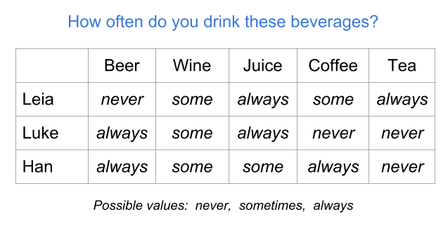
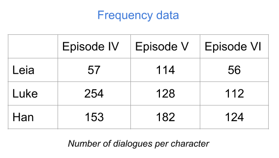
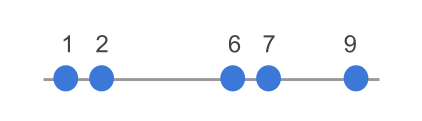

--- 
title: "A Matrix Algebra Companion for Statistical Learning"
subtitle: "(work in progress)"
author: "Gaston Sanchez"
description: "This book provides a review of matrix algebra concepts central to the study of Statistical Learning Methods."
date: ""
bibliography: [book.bib, packages.bib]
biblio-style: apalike
link-citations: yes
always_allow_html: yes
url: 'http\://gastonsanchez.com/matrix4sl/'
github-repo: gastonstat/matrix4sl
site: bookdown::bookdown_site
documentclass: book
---


# Welcome {-}

The purpose of this book is to help you understand how statistical notions are connected to matrix algebra concepts that constantly appear around Statistical Learning methods.

This book will teach you how to make the transition from a data table to a data matrix, how to think of a data matrix from a geometric perspective, and how to express---and interpret---statistical operations with vector-matrix notation. More specifically, you will learn how to express common statistical summaries (e.g. mean, variance, covariance, correlation) with vector-matrix notation. You will also learn how to _see_ data---geometrically speaking---and how to provide a geometric interpretation to statistical summaries and related measures.


__How to cite this book__: 

Sanchez, G. (2018) __A Matrix Algebra Companion for Statistical Learning__ <br>
http://gastonsanchez.com/matrix4sl


-----


<a rel="license" href="http://creativecommons.org/licenses/by-nc-sa/4.0/"></a><br />This work is licensed under a <a rel="license" href="http://creativecommons.org/licenses/by-nc-sa/4.0/">Creative Commons Attribution-NonCommercial-ShareAlike 4.0 International License</a>.

<!--chapter:end:index.rmd-->


# Introduction {#intro}

You've typically heard something like this before: "in order to have a solid understanding of statistical learning methods, you need a good knowledge of matrix algebra." Which I agree with. Matrix algebra is fundamental for a good understanding of Statistical Learning methods, Machine Learning methods, Data Mining techniques, as well as Multivariate Data Analysis methods (keep in mind that there is a considerable amount of overlap in all these fields).

What you probably haven't heard is that "knowing matrix algebra is not (really) enough." You also need to learn how various matrix algebra concepts are connected with the ideas and notions behind statistical learning methods.

In my opinion, the three main reasons for why you should bother learning about matrix algebra are:

1. Multivariate data is commonly represented in __tabular format__ (rows and columns).

2. Mathematically, a data table can be treated as a __matrix__.

3. Matrix algebra provides the __analytical machinery__ and tools to
manipulate and exploit values, information, and patterns of variability in data.


## How this book is organized?

By and large, I focus on concepts like mean, variance, covariance, notions of spread, distances, and their relationships with linear combinations, projections---that sort of thing. You will learn how to express statistical concepts with vector and matrix notation. The underlying goal is to show you how to get a geometrical interpretation of common statistical operations.

- Data tables
- Data matrix
- Variables
- Transformations
- Duality of the data matrix
- Statistical Summaries
- Spreads and Distances


## Prerequisites

This is NOT a book on matrix algebra, and it is also NOT a book on Statistical Learning. Instead, this book discusses general material from linear algebra that has to do with statistics. The level of exposure of the contents in this text is based on three ideal assumptions about you:

- You have some basic knowledge of matrix algebra.

- You have taken introductory statistics.

- You have some experience working with statistical learning techniques.


## Why this book?

As with most of the books that I have written, this book is the result of my professional experience and personal frustration of not having resources like these out there. More specifically, this book was motiviated by the lack of a text that I could refer my students to so they could learn about how various matrix algebra concepts are connected with statistical ideas.

Likewise, throughout my teaching activities to different user profiles, I've seen time and again that we are not trained to see the connections between many analytical notions, and their matrix-geometric interpretation. 

This book is my attempt to provide a resource for future (and current) data scientists that may have the software know-how, and a strong understanding of the working principles of the techniques they use, yet they have gaps at the matrix algebra level that prevents them to fully grasp the "under the hood" principles of their daily tools.

My hope is that the concepts and notions described in this text will allow you to get a good grasp of the methods discussed in any textbook about Statistical Learning, and how they work. I'm sure this book will be a great resource and consulting text for undergraduate and graduate students, as well as data scientists in the more general sense of this term.


## Acknowledgements

A very special and heartfelt mention to Mohamed Hanafi, who ignited a spark in me that eventually fired up the idea of this work. Very likely I wouldn't have started writing some notes had he not invited me to be part of his one-man lab in the _Unit of Sensometrics and Chemometrics_ at Oniris-Nantes. I don't think I'll ever be able to forget our marathonian discussion sessions, the many dozens of whiteboards filled with illuminating scribbles, the corresponding quota of used markers, the constant skipped lunch breaks, the steady climbing of his voice volume as he got excited talking about some abstract concept, and of course his unique skill for breaking my patience beyond my tolerable limits. Now I know there's a toll to pay when working with a genious of such astounding talent. I also know I wouldn't have been able to connect all the dots without him sharing his wisdom, secrets, and utopic dreams. _Ustadh Hanafi... Shukran Jazilan_.

As always, you wouldn't be reading this book if it wasn't for the patience and support of my loving wife Jessica. Once again, she has let me occupy the dining table as my personal workspace for many months (consequently eating at the couches in uncountable occasions). If you find any value from the content in this book, which I am sure you will, you owe her almost as much as you owe me.


<!--chapter:end:introduction.Rmd-->


# (PART) Data Essentials {-}

# Data Tables {#data}

Pretty much all statistical learning methods require data in a table format with multiple columns and rows. However, data comes in many different forms. In fact, data can come in many different presentations, and in a wide range of sizes, shapes, colors, textures, and flavors. It can come from one single source, or it may be the result of a variety of sources. It can have a very well defined structure, or it can simply be unstructured. In this chapter, we review some of the common types of data tables that you can typically encounter in practice while applying a statistical learning procedure.


## Data: Individuals and Variables

To illustrate some of the ideas presented in this chapter I'm going to use a toy example with data of three individuals from a galaxy far, far away: Leia Organa, Luke Skywalker, and Han Solo.

<div class="figure" style="text-align: center">

<p class="caption">(\#fig:unnamed-chunk-4)Three individuals</p>
</div>

In particular, let's consider the following information about these subjects:

- Leia is a woman, 150 centimeters tall, and weighs 49 kilograms.
- Luke is a man, 172 centimeters tall, and weighs 77 kilograms.
- Han is a man, 180 centimeters tall, and weighs 80 kilograms.

We can say that the above information lists characteristics of three individuals. Or put in an equivalent way, that three subjects are described based on some of their characteristics: Name, Sex, Height, and Weight. Using statistical terminology, we formally say that we have data consisting of three _individuals_ described by some _variables_.

Statistical terminology is abundant and you'll find that individuals are also known as observations, cases, objects, samples or items. Example of individuals can be people, animals, plants, planets, spaceships, countries, or any other kind of object. 

A variable is any characteristic of an individual. Sometimes we refer to variables as features, aspects, indicators, descriptors, or properties that we measure or observe on individuals. 

This combo of __individuals and variables__ is perhaps the most common conceptualization of the term "data" within Statistical Learning methods. But it's not the only one. Bear in mind that there are other ways in which analysts and researchers think about data.


### Representing Data

Assuming that our data consists of Name, Sex, Height and Weight for three individuals, we can present this information in various forms. One option is to organize the information in some sort of rectangular or tabular layout, like the one below:

<div class="figure" style="text-align: center">

<p class="caption">(\#fig:unnamed-chunk-5)Conceptual table</p>
</div>

We can say that this data set is in tabular form, with four columns and three rows (four if you include the row of column names). 

The same data could be represented in a non-tabular form. An example of a non-tabular format is XML (eXtensible Markup Language). In this case, we can organize the information in a hierarchical way with embeded elements also known as _nodes_, like in the following example:

```
<character>
  <name>Leia</name>
  <sex>female</sex>
  <weight>150 cm</weight>
  <height>49 kg</height>
</character>
<character>
  <name>Luke</name>
  <sex>male</sex>
  <weight>172 cm</weight>
  <height>77 kg</height>
</character>
<character>
  <name>Han</name>
  <sex>male</sex>
  <weight>180 cm</weight>
  <height>80 kg</height>
</character>
```

In the above example there are three `<character>` nodes, each one containing four nodes: `<name>`, `<sex>`, `<weight>`, and `<height>`. This is an example of what I call __raw data__. Don't worry if you are not familiar with XML. I just want to give you an example of the various ways in which data can be organized.

From a computational point of view, you could actually find a plethora of formats and conventions used to store information, and data sets in particular. Some formats have been designed to store data in a way that mimics the structure of a rectangular table. But you can find other formats that use a non-tabular structure, like XML.

When data is stored in a format that is supposed to represent a table, it is common to find visual displays with some grid of rows and columns.

<div class="figure" style="text-align: center">

<p class="caption">(\#fig:unnamed-chunk-6)Data in tabular format</p>
</div>

This is another example of raw data, in particular a _raw data table_. The data is visually organized and displayed in a rectangular grid of cells. However, this table is not ready yet to be manipulated statistically, much less algebraically. Obviously, this table needs some processing and reshaping in order to obtain a table with numerical information that becomes useful for matrix algebra operations. 

More often than not, raw data will be far from being in tabular format, or at least it will require extra reshaping steps so that it can be ready for the analysis. Although this is a very common issue in practice, in this book I will assume that you've already struggled to get the data in the _right_ rectangular shape. 


### Tabular Data

Eventually, to be analyzed with statistical learning tools and other multivariate techniques, your data will typically be required to have a certain specific structure, usually in the form of some sort of table or spreadsheet format (e.g. rows and columns). 

<div class="figure" style="text-align: center">

<p class="caption">(\#fig:unnamed-chunk-7)Data Table Format</p>
</div>

Depending on the nature of the data, and the way it is organized, rows and columns will have a particular meaning. The most common data table setting is the one of individuals-and-variables. Although somewhat arbitrary, the standard convention is that we use the columns to represent __variables__, and the rows to represent __individuals__. 

<div class="figure" style="text-align: center">

<p class="caption">(\#fig:unnamed-chunk-8)Conceptual table of individuals and variables</p>
</div>


## Types of Tables

The most typical table format is that of individuals (rows) and variables (columns). However, the individuals-variables layout is not the only type of setting; there are other types of tables like contingency tables, crosstabulations, distance tables, as well as similarity and proximity tables. So let's review some examples of various kinds of rectangular formats.


### Heterogeneous Table

Perhaps the most ubiquitous type of table is that of inidividuals and variables in which the variables represent mixed or heterogeneous information. The toy data introduced so far is an example of a heterogeneous table involving distinct flavors of variables such as Name, Sex, Hieght and Weight. In other words, Name and Sex have strings values or categories, while Height and Weight have numeric values (representing quantities).

<!--
| Name   |  Sex    | Height   | Weight  |
|:-------|:--------|:---------|:--------|
| Leia   | female  | 150      | 49      |
| Luke   | male    | 172      | 77      |
| Han    | male    | 180      | 80      |
-->

<div class="figure" style="text-align: center">

<p class="caption">(\#fig:unnamed-chunk-9)Mixed or heterogeneous variables</p>
</div>

As you can tell, Height and Weight are already expressed in numeric values, and you can actually do some math on them (i.e. apply arithmetic and algebraic operations). In contrast, Name and Sex are not codified numerically, so the type of mathematical operations that you can perform on them is very limited. In or der to exploit their information in a deeper sense, you would have to transform the categories _male_ and _female_ with some numeric coding.


### Binary table

Another common type of table is a binary table. As its name indicates, this type of table contains variables that can only take two values. For example presence-absence, female-male, yes-no, success-failure, case-control, etc. In the table below, the variables represent drinks consumed: Beer, Wine, Juice, Coffee, and Tea. Each variable takes two possible values, _yes_ and _no_, indicating whether an individual consumes a specific type of drink.

<div class="figure" style="text-align: center">

<p class="caption">(\#fig:unnamed-chunk-10)Binary table (raw values)</p>
</div>

Although the values _yes_ and _no_ are very descriptive, you will need to codify them numerically to be able to perform statitical or algebraic operations with them. Perhaps the most natural way to codify binary values is with zeros and ones: "yes" = 1, and "no" = 0.

<div class="figure" style="text-align: center">

<p class="caption">(\#fig:unnamed-chunk-11)Binary table (numeric values)</p>
</div>

Another possible codification could be "yes" = 1, and "no" = -1. Or also with logical values: "yes" = TRUE, and "no" = FALSE.


### Modalities table

Another type of table consists of so-called _modalities_. These can come from variables or questions in a survey about how frequent you use/consume a specific product.

<div class="figure" style="text-align: center">

<p class="caption">(\#fig:unnamed-chunk-12)Table of modalities (raw values)</p>
</div>

In order to statistically treat a modalities table, you will very likely have to transform the values of the categories (i.e. the modalities) to some numeric coding. For instance, you can assign values 1 = "never", 2 = "sometimes", and 3 = "always."

<div class="figure" style="text-align: center">

<p class="caption">(\#fig:unnamed-chunk-13)Table of modalities (numeric values)</p>
</div>


### Preference table

A preference table is a special case of individuals-variables table in which the  variables are measured in some kind of preference scale. For example, we can measure the preference level for various types of fruit juices on an ordinal scale ranging from 1 = "don't like at all" to 5 = "like it very much."

<div class="figure" style="text-align: center">

<p class="caption">(\#fig:unnamed-chunk-14)Table of frequencies</p>
</div>


### Frequency table

As its name suggests, this type of table contains the frequencies (i.e. counts) resulting from _crossing_ two categorical variables. This is the reason why you also find the name cross-tables for this type of tabular data. Another common name for this type of tables is _contingency table_.

The example below shows a frequency table of the number of dialogues of each character, per episode (in the original trilogy of Star Wars). The rows correspond to the categories of the variable Name, while the columns corresponds to the categories of the variable Episode.

<div class="figure" style="text-align: center">

<p class="caption">(\#fig:unnamed-chunk-15)Table of frequencies</p>
</div>

The value in the _ij_-th cell (_i_-th row, _j_-th column) tells you the number of occurrences that share Name's category _i_ and Episode's category _j_. If you add all the entries, you get the total number of individuals in each variable.

This tabular format is not really an individuals-variables table. Even though the example above has rows with names of the three individuals, the way you get a table like this is with two categorical variables.


### Distance table

Another interesting type of table is a distance table. Depending on who you talk to, the term "distance" may be used with slightly different meanings. Some authors refer to the word distance conveying a metric distance meaning. Other authors instead use the word distance to convey a general idea of dissimilarity. 

In general, you can find _distance_ tables under two opposite perspectives: similarities and disimilarities. The table below is an example of a similarity table.

<div class="figure" style="text-align: center">

<p class="caption">(\#fig:unnamed-chunk-16)Table of proximities</p>
</div>


## Summary

- Most statistical learning methods require data in a table format with multiple columns and rows. 

- It's important to be aware of the difference between a _raw_ data table, and a _clean_ table numerically codified.

- Unless otherwise specified, in this book we'll assume that all the variables in a data matrix have numerical variables.

- For most of this book, we'll consider a data set to be integrated by a group of _individuals_ or objects on which we observe or measure one or more characteristics called _variables_.

<!--chapter:end:data-table.Rmd-->


# Data Matrix {#datamatrix}


In the previous chapter we talked about the standard notion of _data_ from the statistical learning perspective, that is, as a "set of individuals described by one or more variables". In addition, we looked at various types of data tables, and we also discussed about the distinction between _raw_ tables and _clean_ tables. In this chapter, we make the transition from a data table to a data matrix. I will introduce some notation used in the rest of the book, and focus on how to think of a data table in terms of a matrix, and what aspects to keep in mind while converting any data table into a mathematical matrix.


## About Matrices

First let's talk about matrices in the mathematical sense of the word. A matrix is a rectangular array of elements. More formally, a matrix is a mathematical object whose structure is a rectangular array of entries.

Typically, we consider the elements of a matrix to be numbers. Although you can certainly generalize the contents of a matrix and think about them as any type of symbols, not necessarily numbers. This is perhaps a common way to conceive a generic matrix from a more computational-oriented perspective.

From example, an R matrix may be numeric, but you can also have matrices containing logical values (`TRUE` or `FALSE`), or even a matrix made up of characters.


```r
# numeric matrix
A <- matrix(1:12, nrow = 4, ncol = 3)
A
     [,1] [,2] [,3]
[1,]    1    5    9
[2,]    2    6   10
[3,]    3    7   11
[4,]    4    8   12
```


```r
# logical matrix
L <- matrix(c(TRUE, FALSE), nrow = 4, ncol = 3)
L
      [,1]  [,2]  [,3]
[1,]  TRUE  TRUE  TRUE
[2,] FALSE FALSE FALSE
[3,]  TRUE  TRUE  TRUE
[4,] FALSE FALSE FALSE
```


```r
# character matrix
S <- matrix(sample(letters, 12), nrow = 4, ncol = 3)
S
     [,1] [,2] [,3]
[1,] "h"  "y"  "t" 
[2,] "c"  "m"  "u" 
[3,] "n"  "a"  "d" 
[4,] "l"  "z"  "i" 
```


## Data Matrix

While the raw ingredient for any statistical learning endevour is a data set, typically reshaped and organized in a tabular form, the core input of any statistical learning method consists of the data matrix, or in some cases, matrices.

To make things less abstract I'm going to use the following toy data table with four variables measured on six individuals:


```
                 gender height weight     jedi
Anakin Skywalker   male   1.88   84.0 yes_jedi
Padme Amidala    female   1.65   45.0  no_jedi
Luke Skywalker     male   1.72   77.0 yes_jedi
Leia Organa      female   1.50   49.0  no_jedi
Qui-Gon Jinn       male   1.93   88.5 yes_jedi
Obi-Wan Kenobi     male   1.82   77.0 yes_jedi
```

You can actually find the corresponding CSV file in the `data/` folder of the book's github repository.


### Why a data matrix?

The reason to use matrices is simple: the typical structure in which the data can be mathematically manipulated from a multivariate standpoint is a __data matrix__.
No other mathematical object adapts so well to the rectangular structure of a data table.

Since we are getting into more formal mathematical territory, we need to define some terminology and notation that we'll use in the rest of the book. 

We're going to represent matrices with bold upper-case letters like $\mathbf{A}$ or $\mathbf{B}$. 

In general, a matrix $\mathbf{X}$ has $n$ rows and $p$ columns, and we say that $\mathbf{X}$ is an $n \times p$ matrix. In addition, we are going to assume that all the matrices are real matrices, that is, matrices containing elements in the set of Real numbers.

\[ 
\underset{n \times p}{\mathbf{X}} = 
\left[\begin{array}{ccccc}
x_{11} & \cdots & x_{1j} & \cdots & x_{1p} \\
\vdots &        & \vdots &        & \vdots \\
x_{i1} & \cdots & x_{ij} & \cdots & x_{ip} \\
\vdots &        & \vdots &        & \vdots \\
x_{n1} & \cdots & x_{nj} & \cdots & x_{np} \\
\end{array}\right]
\]

An element of a matrix $\mathbf{X}$ is denoted by $x_{ij}$ which represents the element in the $i$-th row and the $j$-th column. For instance, the element $x_{23}$ in our toy $6 \times 4$ data matrix has the value 45 and it represents the weight of Padme Amidala.

Together with matrices we also have variables, and vectors. We are going to represent variables with italized capital letters such as $Y$ and $Z$. Also, variables in a matrix $\mathbf{X}$ can be represented with subscripts such as $X_j$ to indicate the column-index position. The first three variables in our matrix $\mathbf{X}$ would be represented as $X_1$ (gender), $X_2$ (height), and $X_3$ (weight). 

Vectors will be represented by bold lower case letters such as $\mathbf{w}$ or $\mathbf{u}$. A vector $\mathbf{w}$ with $m$ elements can be expressed as $\mathbf{w} = (w_1, w_2, \dots, w_m)$. Since variables can be expressed as vectors, we can use the vector notation $\mathbf{x}$ to represent a variable $X$. However, keep in mind that not all vectors are variables: a vector may well refer to an object or to any row of a matrix.


### Matrix Representations

You will that find people represent matrices in multiple ways, using various notations, symbols, and diagrams.

We can represent a data matrix $\mathbf{X}$ by simply regarding the table from its columns (i.e. variables) perspective:

$$
\mathbf{X} =
\left[\begin{array}{c|c|c|c|c|c}
  &   &   &   &  & \\
  \mathbf{x}_{1} & \mathbf{x}_{2} & \cdots & \mathbf{x}_{j} & \cdots & \mathbf{x}_{p} \\
  &   &   &   &  & \\
\end{array}\right]
$$

Note that each variable $X_j$ is represented with a column vector $\mathbf{x}_{j}$. In turn, the vertical lines are just a visual cue indicating separation between columns. Taking our toy data data matrix, we could represent it as:

$$
\mathbf{Data} =
\left[\begin{array}{c|c|c|c}
  &   &   &  \\
  \texttt{gender} & \texttt{height} & \texttt{weight} & \texttt{jedi} \\
  &   &   &  \\
\end{array}\right]
$$

Being more minimalists, we can even get a more compact representation by just expressing a matrix $\mathbf{X}$ as a list or sequence of its variables:

\[
\mathbf{X} = 
\left[\begin{array}{cccccc}
\mathbf{x}_{1} & \mathbf{x}_{2} & \cdots & \mathbf{x}_{j} & \cdots & \mathbf{x}_{p} \\
\end{array}\right]
\]


### A Block of Variables

While most of us are used to think of multivariate data in terms of a table or matrix, there can be other interesting representation options. If you are a visual person like me, we can also use an alternative way to display the variables using a standard convention of drawing them in rectangular shape. In this way, we can depict a set of variables in a data matrix as a series of rectangles, like those below inside the dashed box:

<div class="figure" style="text-align: center">

<p class="caption">(\#fig:unnamed-chunk-22)Variables in a matrix depicted as a set of rectangles</p>
</div>

The rectangular-box shape perfectly illustrates the idea of a __block__ of variables. I will use the term __block__ to convey the idea of a group or set of variables measured on a set of objects. If you prefer, you can also think of a block as a data table.


## Types of Matrices

There are various kinds of matrices which are commonly used in statistical learning methods. Let's briefly revisit some of them.


### General Rectangular Matrix

The most general type of matrix is a rectangular matrix. This means that there is an arbitrary number of $n$ rows and $p$ columns.

\[ 
\left[\begin{array}{ccc}
1 & 2 & 3  \\
4 & 5 & 6  \\
7 & 8 & 9  \\
10 & 11 & 12  \\
\end{array}\right]
\]

If a matrix has more rows than columns $n > p$, sometimes we call this a vertical or _tall_ matrix:

\[ 
\left[\begin{array}{ccc}
1 & 2 & 3  \\
4 & 5 & 6  \\
7 & 8 & 9  \\
10 & 11 & 12  \\
13 & 14 & 15  \\
\end{array}\right]
\]

In contrast, if a matrix has more columns than rows, $p > n$, sometimes we call this a horizontal, _flat_ or _wide_ matrix:

\[ 
\left[\begin{array}{cccc}
1 & 2 & 3 & 4 & 5 \\
6 & 7 & 8 & 9 & 10 \\
11 & 12 & 13 & 14 & 15 \\
\end{array}\right]
\]


### Square Matrix

A square matrix is one with same number of rows and columns, $n = p$. In statiscal learning, various matrices derived from a data matrix are typically square, this typically happens when working with derived cross-products such as $\mathbf{X^\mathsf{T} X}$ or $\mathbf{X X^\mathsf{T}}$.

\[ 
\left[\begin{array}{ccc}
1 & 2 & 3  \\
4 & 5 & 6  \\
7 & 8 & 9  \\
\end{array}\right]
\]


### Symmetric Matrix

A symmetric matrix is a special case of a square matrix: the corresponding elements of corresponding rows and columns are equal. In other words, in a symmetric matrix we have that the element $x_{ij}$ is equal to $x_{ji}$.

\[ 
\left[\begin{array}{ccc}
1 & 2 & 3  \\
2 & 4 & 5  \\
3 & 5 & 6  \\
\end{array}\right]
\]


### Diagonal Matrix

A diagonal matrix is a special case of symmetric matrix in which all nondiagonal elements are 0. 

\[ 
\left[\begin{array}{ccc}
1 & 0 & 0  \\
0 & 2 & 0  \\
0 & 0 & 3  \\
\end{array}\right]
\]

In other words, in a symmetric matrix, $x_{ij} = 0$ for $i \neq j$. The only elements that may not necessarily be qual to zero are those in the diagonal.

\[ 
\left[\begin{array}{ccc}
x_{11} & 0 & 0  \\
0 & x_{22} & 0  \\
0 & 0 & x_{33}  \\
\end{array}\right]
\]


### Scalar Matrix

The scalar matrix is a special type of diagonal matrix in which all the diagonal elements are equal scalars.

\[ 
\left[\begin{array}{ccc}
5 & 0 & 0  \\
0 & 5 & 0  \\
0 & 0 & 5  \\
\end{array}\right]
\]


### Identity Matrix

The identity matrix is a special case of the scalar matrix in which the diagonal elements are all equal to one. This matrix is typically represented with the letter $\mathbf{I}$. To indicate the dimensions of this matrix, we typically write it with a subscript for the number of rows (or columns). For example, $\mathbf{I}_{n}$ represents the identity matrix of dimension $n \times n$.

\[ 
\mathbf{I}_{3} = 
\left[\begin{array}{ccc}
1 & 0 & 0  \\
0 & 1 & 0  \\
0 & 0 & 1  \\
\end{array}\right]
\]

In matrix algebra, the identity matrix plays the same role as the number 1 in ordinary or scalar algebra.


### Triangular Matrix

A square matrix with only 0's above or below the diagonal is called a _triangular_ matrix. There are two flavors of this type of matrix: upper triangular and lower triangular. 

An upper triangular matrix has zeros below the diagonal. 

\[ 
\left[\begin{array}{ccc}
1 & 2 & 3  \\
0 & 5 & 6  \\
0 & 0 & 9  \\
\end{array}\right]
\quad \textsf{or} \quad 
\left[\begin{array}{ccc}
1 & 2 & 3  \\
 & 5 & 6  \\
 &  & 9  \\
\end{array}\right]
\]

Conversely, a lower triangular matrix has zeros above the diagonal.

\[ 
\left[\begin{array}{ccc}
1 & 0 & 0  \\
4 & 5 & 0  \\
7 & 8 & 9  \\
\end{array}\right]
\quad \textsf{or} \quad 
\left[\begin{array}{ccc}
1 &  &   \\
4 & 5 &  \\
7 & 8 & 9  \\
\end{array}\right]
\]


### Shapes of Matrices

To summarize the various types of matrices described so far, here's a diagram depicting their shapes. The general type of matrix is a rectangular matrix which can be divided in three types: vertical or tall ($n > p$), square ($n = p$), and horizontal or wide ($n < p$). Among square matrices, the notion of symmetry plays a special role, and among symmetric matrices, we can say that diagonal ones have the most basic structure.

<div class="figure" style="text-align: center">

<p class="caption">(\#fig:unnamed-chunk-23)Various shapes of matrices</p>
</div>


<!--chapter:end:data-matrix.Rmd-->


# Variables {#variables}

To illustrate some of the ideas presented in this chapter I'm going to use a toy example with data from the characters of the Star Wars universe. You can actually find the corresponding CSV file in the `data/` folder of the book's github repository.


```
               name gender height weight     species     jedi
1  Anakin Skywalker   male   1.88   84.0       human yes_jedi
2     Padme Amidala female   1.65   45.0       human  no_jedi
3    Luke Skywalker   male   1.72   77.0       human yes_jedi
4       Leia Organa female   1.50   49.0       human  no_jedi
5      Qui-Gon Jinn   male   1.93   88.5       human yes_jedi
6    Obi-Wan Kenobi   male   1.82   77.0       human yes_jedi
7          Han Solo   male   1.80   80.0       human  no_jedi
8   Sheev Palpatine   male   1.73   75.0       human  no_jedi
9             R2-D2   male   0.96   32.0       droid  no_jedi
10            C-3PO   male   1.67   75.0       droid  no_jedi
11             Yoda   male   0.66   17.0        yoda yes_jedi
12       Darth Maul   male   1.75   80.0 dathomirian  no_jedi
13            Dooku   male   1.93   86.0       human yes_jedi
14        Chewbacca   male   2.28  112.0     wookiee  no_jedi
15            Jabba   male   3.90     NA        hutt  no_jedi
16 Lando Calrissian   male   1.78   79.0       human  no_jedi
17        Boba Fett   male   1.83   78.0       human  no_jedi
18       Jango Fett   male   1.83   79.0       human  no_jedi
19         Grievous   male   2.16  159.0     kaleesh  no_jedi
20     Chief Chirpa   male   1.00   50.0        ewok  no_jedi
            weapon
1       lightsaber
2          unarmed
3       lightsaber
4          blaster
5       lightsaber
6       lightsaber
7          blaster
8  force-lightning
9          unarmed
10         unarmed
11      lightsaber
12      lightsaber
13      lightsaber
14       bowcaster
15         unarmed
16         blaster
17         blaster
18         blaster
19     slugthrower
20           spear
```

The table consists of 20 rows and 7 columns. The rows correspond to _individuals_ and the columns correspond to _variables_. Although this data set is a toy example, it contains variables of different types commonly found in real data sets.


## Types of Variables

In statistical learning, the most typical data format involves a set of individuals or objects described by several characteristics commonly known as _variables_. Interestingly, we can classify variables in a couple of different ways.

The most basic and usual way to classify variables is in two distinct types: __quantitative__ variables and __categorical__ (or qualitative) variables.


The variables `height` and `weight` are examples of quantitative variables because their values represent quantities. That is, they can be measured numerically on some sort of interval scale. 

In turn, variables such as `name`, `gender`, `species`, `jedi`, and `weapon` are categorical or qualitative variables because their values represent categories (or qualities). More formally, they describe a quality of an individual, and allows you to place an individual into a category or group, such as male or female.


## Variable Flavors

The division between categorical and quantitative variables is not the only one. Often, data scientists further classifiy categorical variables as _nominal_ or _ordinal_. Likewise, quantitative variables can be classified as _discrete_ or _continuous_. This next level of classification is chiefly based on the notion of _scales of measurement_ of the variables.

<div class="figure" style="text-align: center">

<p class="caption">(\#fig:unnamed-chunk-27)Further classification of variables</p>
</div>


### Nominal Variable

A categorical variable is __nominal__ when it results from naming or labeling values that don't have a natural order. An example of a nominal variable is `weapon` which has the following values:


```
[1] "blaster"         "bowcaster"       "force-lightning" "lightsaber"     
[5] "slugthrower"     "spear"           "unarmed"        
```

Can you order the categories in a "natural" way? Not really. The term _nominal_ according the dictionary means "existing in name only". Thus, nominal values are just that: names. There is no reason why blaster is better or greater than lightsaber. You could say that you prefer a blaster over a lightsaber but that's a different variable: personal preference.

Other typical examples of nominal variables are:

- the sex of a newborn child: e.g. female or male

- the ethnicity of an individual: e.g. Native-American, African-American, Asian, White

- ice cream flavors: e.g. chocolate, vanilla, strawberry

- the numbers on the players' jerseys of a soccer team: numbers used as identifiers


### Ordinal Variable

A categorical variable is __ordinal__ when it results from ordering values into a series of categories when no appropriate numerical scale is available. For example, consider a variable "usage frequency" measured with values _never_, _sometimes_, and _always_. In this case we can order the categories from less usage to more usage, or viceversa.

Some examples of ordinal variables are:

- size of clothes: extra-small, small, medium, large, extra-large

- college year: freshman, sophomore, junior, senior

- spiciness: none, mild, moderate, very

- jedis ranks: youngling, padawan, knight, master, and grand master


### Discrete Variable

A quantitative variable is __discrete__ when it results from counting. To be more precise, a discrete variable takes on zero or a positive integer value. Some examples of discrete variables are:

- the number of male ewooks in a family with four children (0, 1, 2, 3, or 4).

- the number of robots per Imperial Star Destroyer

- the number of moons orbiting around a planet


### Continuous Variable

A quantitative variable is __continuous__ when it results from measuring. More technically, a continuous variable theoretically takes on an infinite number of possible values, however, its reported values are subject to the precision or accuracy of the measurement device. Some examples of continuous variables are:

- the height of an individual
- the weight of a robot
- the speed of a starship


### Caveat

Keep in mind that not all variables fit neatly and unambiguously into one of the previous classes. For example, the age of an individual could be considered of a discrete variable when it gets reported in (whole) number of years. However, age could also be considered to be continuous when measured in a more granular scale: e.g. days, or hours, or seconds. Moreover, sometimes age is reported into ordered categories such as 0 to 5 years, 6 to 10, 11 to 15, and so on. These values would turn age into an ordinal variable.


## Coding Values

Another important aspect intimately connected with the various types of variables is that of how variable values are codified. To better understand what this is about, let me discuss a simple example.

Notice that the quantitative variables in the star wars data set have numeric values, while the categorical variables have non-numeric values. Does that mean that all numeric variables can be considered to be quantitative? And that all non-numeric variables can be considered to be categorical? The answer is: Not necessarily.

Often, analysts assign numeric values to the categories of a qualitative variable. Sooner or later you will find variables with numeric values that are not quantitative. An example could be a ice-cream flavors in which the categories are codified with numbers. For example, consider three ice-cream flavors: vanilla, chocolate, and lemon. And imagine that we assign a numeric code to each flavor: 1 = vanilla, 2 = chocolate, 3 = lemon. This numeric labeling is just for convenience purposes.

Assume that you get the preferred ice-cream flavor of 10 subjects with the following values: 


```
1 1 2 2 1 2 1 2 1 3
```

The above numbers, which are hypothetical values of a variable `icecream`, do not represent quantities; they represent flavors. Just because there are numbers, it does not mean that we can use those numbers to carry out arithmetic operations. What is the result of: 3 - 1, that is, lemon minus vanilla? It is meaningless to attempt this type of operation. 

Likewise, we could assign numbers to sizes: 1=small, 2=medium, 3=large. In this case, the numers are again used for convenient purposes. And we can even take one further step and say that we can use the numbers to rank the categories. But it will be impossible to add 1+2, since small + medium does not equal large.

The point is that just because a variable contains numbers, that doesn't automatically make it quantitative. You should always ask yourself if the numbers represent some sort of quantity. If the answer is a sounded yes, then you have a quantitative variable. Otherwise, you have a categorical one.


### More on coding

We can find categorical data under a wide range of formats. I've seen categorical data codified in different ways, and sometimes people are very creative in the way they do this.

The main types of formats can be classified in three main groups:

- text or characters
- numbers (ideally integers)
- logical (TRUE / FALSE), typically for binary variables

Here's an example with a `gender` variable:

- as text: `"F"` (female), `"M"` (male)
- as numbers: 1 (female), 0 (male)
- as logical: `TRUE` (female), `FALSE` (male)

When talking about the way data is stored and codified, I don't think there's an ideal/universal way to store categorical data effectively and efficiently. It all depends on the field of application, the size of the data, the legibility, the usage purposes, etc. What I do believe is that, when categorical data is being analyzed, we should consider a couple of issues:

- __understandability__: the analyst should be able to read, interpret and understand. Reduce friction, avoid having to decodified numbers.

- __compatibility__: this has to do with functions and commands in data analysis and statistical software. Some functions are programmed in a way that they accept a specific type of input (either a vector, a factor, a data frame, etc).

- __visibility__: this aspect is related to visual displays in graphics. Maybe long labels look fine in a table, but for plotting purposes they could cluttered the screen.


<!--chapter:end:variables.Rmd-->


# Transformations {#transformations}

In many situations you will need to transform and modify the raw values of your data.

Transformations are useful for many reasons, for example:

- to change the scale of a variable from continuous to discrete
- to linearize a variable that has a non-linear distribution
- to make distributions more symmetric
- to re-center the data (mean-center, or center by other reference value)
- to stretch or compress the values (by standard deviation, by range, by eigenvalues)
- to binarize or dummify a categorical variable

In this chapter, I will cover common transformations:

- dummyfication
- mean-center
- standardization
- logarithmic transformation
- power transformation


## Dummy Variables

As we saw in the previous chapter, categorical variables are characteristics or qualities observed on individuals. An example of a categorical variable is Sex with possible values _male_ and _female_. Most of the time, categorical variables will be codified in a non-numeric way, usually as strings or character values. However, it is not unusual to find numeric codes such as "female" = 1, and "male" = 2.

More often than not, it is convenient to code categorical variables as __dummy variables__, that is, decompose a categorical variable into one or more indicator variables that take on the values 0 or 1. For example, suppose that Sex has two values _male_ and _female_. This variable can be coded as two dummy variables which have values [1 0 0] for _female_, [0 1 1] for _male_:

\[ 
\left[\begin{array}{c}
female \\
male \\
male \\
\end{array}\right]
= 
\left[\begin{array}{cc}
1 & 0 \\
0 & 1 \\
0 & 1 \\
\end{array}\right]
\]

For some statistical learning methods such as regression analysis---due to a technical reason---only one of these two dummies can be used. This means that you would drop one of the dummy columns:

\[ 
\left[\begin{array}{c}
female \\
male \\
male \\
\end{array}\right]
= 
\left[\begin{array}{c}
1 \\
0 \\
0 \\
\end{array}\right]
\]

The resulting one dummy variable is interpreted as the difference of _female_ and _male_, keeping _female_ as the reference value.


## Standardization

When variables are quantitative, they can be measured in the same scale. But they can also be measured in different scales. For example, consider four variables: 1) Weight measured in kilograms, 2) Height measured in centimeters, 3) Income measured in dollars, and 4) Temperature measured in Celsius degrees. When you use a method in which comparisons or calculations are made taking into account the variance of the variables, you will face an interesting phenomenon: the variable that has the largest magnitude will dominate the variability in the data. And this could be a (serious) problem.

To compensate for the differences in scales, something must be done. The question is then: how to balance the contributions of the variables in a way that you can have a fair comparison among them? The key is to put them all under a common scale. Let's review four options to standardize a variable:

- by standard deviations from the mean (i.e. standard units)
- by the overall range
- by chosen percentiles
- by the mean

As a working example, let's use the same data from chapter [Data Matrix](#data-matrix). 


```
                 gender height weight     jedi
Anakin Skywalker   male   1.88   84.0 yes_jedi
Padme Amidala    female   1.65   45.0  no_jedi
Luke Skywalker     male   1.72   77.0 yes_jedi
Leia Organa      female   1.50   49.0  no_jedi
Qui-Gon Jinn       male   1.93   88.5 yes_jedi
Obi-Wan Kenobi     male   1.82   77.0 yes_jedi
```

We will use variable `height` and denoted with $X$:


```r
x <- dat$height
x
[1] 1.88 1.65 1.72 1.50 1.93 1.82
```


### By Standard Units

One way to obtain a common scale is to standardize the variables by number of standard deviations from the mean. The goal is to convert a variable $X$ into a variable $Z$ in standard units. You do this by subtracting the mean $\bar{x}$ from every value $x_i$, and then divide by the standard deviation $s$. The conversion formula is:

$$
z_i = \frac{x_i - \bar{x}}{s}
$$

where $\bar{x}$ is the mean of $X$, and $s$ is the standard deviation of $X$. A value that is expressed in standard units measures how far that value is from the mean, in terms of standard deviations.

In vector notation, the standardized vector $\mathbf{z}$ of $\mathbf{x}$ is:

$$
\mathbf{z} = \frac{1}{s} (\mathbf{x} - \mathbf{\bar{x}})
$$

Here's some code in R that shows step-by-step the operations to obtain a variable in standard units:


```r
# mean
x_mean <- mean(x)
x_mean
[1] 1.75

# standard deviation
x_sd <- sd(x)
x_sd
[1] 0.16

# height in stadard units
std_units <- (x - x_mean) / x_sd
std_units
[1]  0.814 -0.626 -0.188 -1.565  1.127  0.438
```

The standardized vector `std_units` now has a mean of 0 and standard deviation 0:


```r
mean(std_units)
[1] -2.73e-16
sd(std_units)
[1] 1
```


### By the Overall Range

Another kind of standardization is to subtract the minimum value from every value $x_i$, and then divide by the overall range: $max(x) - min(x)$.

$$
z_i = \frac{x_i - min(x)}{max(x) - min(x)}
$$

Notice that this type of standardization will produce a variable $Z$ that is linearly transformed ranging from 0 to 1, where 0 is its minimum and 1 its maximum value.


```r
# maximum
x_max <- max(x)
x_max
[1] 1.93

# minumum
x_min <- min(x)
x_min
[1] 1.5

# height standardized by overall range
std_range <- (x - x_min) / (x_max - x_min)
std_range
[1] 0.884 0.349 0.512 0.000 1.000 0.744
```

The standardized vector `std_range` now ranges from 0 to 1:


```r
min(std_range)
[1] 0
max(std_range)
[1] 1
```


### By Chosen Percentiles

A general type of range-based standardization is to divide by a different type of range, not just the overall range. This is done by using any range given from a pair of symmetric percentiles. For example, you can choose the 25-th and the 75-th percentiles, also known as the first quartile $Q_1$ and third quartile $Q_3$, respectively. In other words, standardized by the __interquartile range__ or IQR:

$$
z_i = \frac{x_i}{Q_3 - Q_1} = \frac{x_i}{\text{IQR}(x)}
$$

Why to standardize by chosen percentiles other than the maximum and the minimum? Because the overall range is sensitive to outliers; so to have a less sensitive scale, we divide by a more _robust_ range. As another example of this type of standardization, you can divide by the range between the 5-th and the 95-th percentiles.


```r
# inter-quartile range
x_iqr <- IQR(x)

# height standardized by IQR
std_iqr <- x / x_iqr
std_iqr
[1] 9.52 8.35 8.71 7.59 9.77 9.22
```

The standardized vector `std_iqr` now has an IQR of 1:


```r
IQR(std_iqr)
[1] 1
```


### By the Mean

A less common but equally interesting type of standardization is to divide the values $x_i$ by their mean $\bar{x}$ which causes transformed values $z_i$ to have standard deviations equal to their coefficient of variation:

$$
z_i = \frac{x_i}{\bar{x}}
$$


### About standardization

All the previous standardizations can be put in terms of a form of weighting given by the following formula:

$$
z_i = w \times x_i
$$

where $w$ represents a weight or scaling factor that can be:

- the standard deviation: $w = s$
- the overall range: $w = max(x) - min(x)$
- the IQR: $w = \text{IQR}$
- the mean: $w = \bar{x}$


## Logarithmic Transformations

It is not uncommon to find ratio variables with distributions that are skew. While this is not necessarily an issue, certain statistical learning methods assume that variables have fairly symmetric bell-shaped distributions. One transformation typically used by analysts to obtain more symmetric distributions from skewed ones is the logarithmic one.

When a variable has positive values, we can log-transform it. This will shrink or compact the long tails, making them more symmetrical. In addition, it will also convert multiplicative relationships to additive ones. Why? Because of the properties of logarithm: $log(xy) = log(x) + log(y)$ and $log(x/y) = log(x) - log(y)$.


## Power Transformations

A transformation that is similar to the logarithmic one is the __Box-Cox__ transformation.

$$
z = \frac{1}{\lambda} (x^\lambda - 1)
$$

where $\lambda$ is a positive real number that plays the role of a power parameter.

Interestingly, the Box-Cox transformation approximates to the log-transformation as the power parameter $\lambda$ tends to 0. The division by $\lambda$ has a reason: it keeps the scale of the original variable from collapsing. For instance, if you take the 10th roots $x^{0.1}$ of a variable, you should see that all the values are close to 1, so dividing by 1/10 multiplies the values by 10, which is almost a logarithmic scale.
In summary, Box-Cox transformations provide a way of making data more symmetric, which could be very helpful in regression analysis tools.


<!--chapter:end:transformations.Rmd-->


# (PART) Geometric Mindset {-}

# Geometric Duality {#duality}

In chapter [Data Matrix](#data-matrix) we talked about how a data table can be mathematically treated as a data matrix: typically as an array of individuals and variables. In this chapter we take a further step that should let you adopt a __geometrical mindset__. More specifically, you will learn how to think and look at any data matrix from a geometric standpoint. This is an incredible insightful concept which some authors refer to as the _duality_ of a data matrix. 


## Matrix Perspectives

It's very enlightening to think of a data matrix as viewed from the glass of Geometry. The key idea is to think of the data in a matrix as elements living in a multidimensional space. Actually, we can regard a data matrix from two apparently different perspectives that, in reality, are  intimately connected: the _rows perspective_ and the _columns perspective_. In order to explain these perspectives, let me use the following diagram of a data matrix $\mathbf{X}$ with $n$ rows and $p$ columns, with $x_{ij}$ representing the element in the $i$-th row and $j$-th column.

<div class="figure" style="text-align: center">

<p class="caption">(\#fig:unnamed-chunk-41)Duality of a data matrix</p>
</div>

When we look at a data matrix from the _columns_ perpective what we are doing is focusing on the $p$ variables. In a similar way, when looking at a data matrix from its _rows_ perspective, we are focusing on the $n$ individuals. This double perspective or __duality__ for short, is like the two sides of the same coin.


### Rows Space

We know that human vision is limited to three-dimensions, but pretend that you had superpowers that let you visualize a space with any number of dimensions. 

Because each row of the data matrix has $p$ elements, we can regard individuals as objects that live in a $p$-dimensional space. For visualization purposes, think of each variable as playing the role of a dimension associated to a given axis in this space; likewise, consider each of the $n$ individuals as being depicted as a point (or particle) in such space, like in the following diagram:

<div class="figure" style="text-align: center">

<p class="caption">(\#fig:unnamed-chunk-42)Rows space</p>
</div>

In the figure above, even though I'm showing only three axes, you should pretend that you are visualizing a $p$-dimensional space (imaging that there are $p$ axes). Each point in this scape corresponds to a single individual, and they all form what you can call a _cloud of points_.


### Columns Space

We can do the same visual exercise with the columns of a data matrix. Since each variable has $n$ elements, we can regard the set of $p$ variables as objects that live in an $n$-dimensional space. For convention purposes, and in order to distinguish them from the individuals, we use an arrow (or vector) to graphically represent each variable:

<div class="figure" style="text-align: center">

<p class="caption">(\#fig:unnamed-chunk-43)Columns space</p>
</div>

Analogously to the rows space and its cloud of individuals, you should also pretend that the image above is displaying an $n$-dimensional space with a bunch of blue arrows pointing in various directions.


### Toy Example

To make things less abstract, let's consider a toy $2 \times 2$ data matrix of _weight_ and _height_ values measured on two individuals Leia and Luke. Here's the code in R to create a matrix `X` for this example:


```r
# toy matrix
X <- matrix(c(150, 172, 49, 77), nrow = 2, ncol = 2)
rownames(X) <- c("Leia", "Luke")
colnames(X) <- c("weight", "height")

X
     weight height
Leia    150     49
Luke    172     77
```

__Space of individuals__: If you look at the data in `X` from the individuals standpoint, each of them can be depicted as a dot in the 2-dimensional space of variables `weight` and `height`:


__Space of variables__: If you look at the data in `X` from the variables standpoint, each of them can be depicted as a vector in the 2-dimensional space spanned by `Leia` and `Luke`:


### Dual Space

The following figure illustrates the dual perspective of a data matrix. The standard convention is to represent __individuals as points__ in a $p$-dimensional space; and in turn represent __variables as vectors__ in an $n$-dimensional space.

<div class="figure" style="text-align: center">

<p class="caption">(\#fig:unnamed-chunk-47)Rows and columns perspectives</p>
</div>

<!--chapter:end:duality.Rmd-->


# Vector Basics

Because variables can be treated as vectors in a geometric sense, I would like to briefly revisit a couple of key concepts for operating with vectors: __the inner product__ and derived operations.


```r
# data matrix
X <- matrix(c(150, 172, 180, 49, 77, 80), nrow = 3, ncol = 2)
rownames(X) <- c("Leia", "Luke", "Han")
colnames(X) <- c("weight", "height")

X
     weight height
Leia    150     49
Luke    172     77
Han     180     80
```


## Inner Product

The concept of an inner product is one of the most important matrix algebra concepts, also referred to as the _dot product_. The inner product is a special operation defined on two vectors $\mathbf{x}$ and $\mathbf{y}$ that, as its name indicates, allows us to multiply $\mathbf{x}$ and $\mathbf{y}$ in a certain way.

The inner product of two vectors $\mathbf{x}$ and $\mathbf{y}$---of the same size--- is defined as:

$$
\mathbf{x \cdot y} = \sum_{i = 1}^{n} x_i y_i 
$$

basically the inner product consists of the element-by-element product of $\mathbf{x}$ and $\mathbf{y}$, and then adding everything up. The result is not another vector but a single number, a scalar. We can also write the inner product $\mathbf{x \cdot y}$ in vector notation as $\mathbf{x^\mathsf{T} y}$ since

$$
\mathbf{x^\mathsf{T} y} = (x_1 \dots x_n) 
\begin{pmatrix} 
y_1 \\
\vdots \\
y_n
\end{pmatrix}
= \sum_{i = 1}^{n} x_i y_i
$$

Consider the data about Leia and Luke used in the last chapter:


```
     weight height
Leia    150     49
Luke    172     77
```

For example, the inner product of `weight` and `height` in $\mathbf{M}$ is

$$
\texttt{weight}^\mathsf{T} \hspace{1mm} \texttt{height} = (150 \times 49) + (172 \times 77) = 20594
$$

What does this value mean? To answer this question we need to discuss three other concepts that are directly derived from having an inner product:

1. Length of a vector

2. Angle between vectors

3. Projection of vectors

All these aspects play a very important role for multivariate methods. But not only that, we'll see in a moment how many statistical summaries can be obtained through inner products.


## Length

Another important usage of the inner product is that it allows us to define the __length__ of a vector $\mathbf{x}$, denoted by \| \mathbf{x} \|, as the square root of the inner product with itself::

$$
\| \mathbf{x} \| = \sqrt{\mathbf{x^\mathsf{T} x}}
$$

which is typically known as the __norm__ of a vector. We can calculate the length of the vector `weight`:

$$
\| \texttt{weight} \| = \sqrt{(150 \times 150) + (172 \times 172)} = 228.2192
$$

Likewise, the length of the vector `height`:

$$
\| \texttt{height} \| = \sqrt{(49 \times 49) + (77 \times 77)} = 91.2688
$$

Note that the inner product of a vector with itself is equal to its squared norm: $\mathbf{x^\mathsf{T} x} = \| \mathbf{x} \|^2$


## Angle

In addition to the length of a vector, the __angle__ between two nonzero vectors $\mathbf{x, y}$ can also be expressed using inner products. The angle $\theta$ is such that:

$$
cos(\theta) = \frac{\mathbf{x^\mathsf{T} y}}{\sqrt{\mathbf{x^\mathsf{T} x}} \hspace{1mm} \sqrt{\mathbf{y^\mathsf{T} y}}}
$$

or

$$
cos(\theta) = \frac{\mathbf{x^\mathsf{T} y}}{\| \mathbf{x} \| \hspace{1mm} \| \mathbf{y} \|}
$$

Equivalently, we can reexpress the formula of the inner product using 

$$
\mathbf{x^\mathsf{T} y} = \| \mathbf{x} \| \hspace{1mm} \| \mathbf{y} \| \hspace{1mm} cos(\theta)
$$

The angle between `weight` and `height` in $\mathbf{M}$ is such that:

$$
cos(\theta) = \frac{20594}{228.2192 \times 91.2688} = 0.9887
$$


## Orthogonality

Besides calculating lengths of vectors and angles between vectors, an inner product allows us to know whether two vectors are orthogonal. In a two dimensional space, orthogonality is equivalent to perpendicularity; so if two vectors are perpendicular to each other---the angle between them is a 90 degree angle---they are orthogonal. Two vectors vectors $\mathbf{x}$ and $\mathbf{y}$ are orthogonal if their inner product is zero:

$$
\mathbf{x^\mathsf{T} y} = 0 \iff \mathbf{x} \hspace{1mm} \bot \hspace{1mm} \mathbf{y} 
$$


## Projection

The last aspect I want to touch related with the inner product is the so-called projections. The idea we need to consider is the orthogonal projection of a vector $\mathbf{y}$ onto another vector $\mathbf{x}$. 

The basic notion of projection requires two ingredients: two vectors $\mathbf{x}$ and $\mathbf{y}$. To obtain the projection of $\mathbf{y}$ onto $\mathbf{x}$, we need to express $\mathbf{x}$ in unit norm. The obtained projection $\hat{\mathbf{y}}$ is expressed as $a \mathbf{x}$. This means that a projection implies multiplying $\mathbf{x}$ by some number $a$, such that $\hat{\mathbf{y}} = a \mathbf{x}$ is a stretched version of $\mathbf{x}$. This is better appreciated in the following figure.

Having two nonzero vectors $\mathbf{x}$ and $\mathbf{y}$, we can project $\mathbf{y}$ on $\mathbf{x}$

$$
projection = \mathbf{x} \left( \frac{\mathbf{y^\mathsf{T} x}}{\mathbf{x^\mathsf{T} x}} \right)
$$

$$
= \mathbf{x} \left( \frac{\mathbf{y^\mathsf{T} x}}{\| \mathbf{x} \|^2} \right)
$$


<!--chapter:end:vector-basics.Rmd-->


# (PART) Statistical Measures {-}

# Mean {#mean}

The starting point in multivariate analysis consists in computing various summary measures---such as means, and variances---to get an idea of the common or central values, and the amount of variability of each variable. In this chapter you will learn how concepts like means can be expressed in terms of vector-matrix operations.


## Mean of a variable

To measure variation, we usually begin by calculating a "typical" value. The idea is to summarize the values of a variable with one or two representative values. You will find this notion under several terms like measures of center, location, central tendency, or centrality.

The prototypical summary value of center is the mean, sometimes referred to as average. The mean of a variable $X = (x_1, x_2, \dots, x_n)$, represented by $\bar{x}$, is obtained by adding all the $x_i$ values and then dividing by their total number $n$:

$$
\bar{x} = \frac{x_1 + x_2 + \dots + x_n}{n}
$$

Using summation notation we can express $\bar{x}$ in a very compact way as:

$$
\bar{x} = \frac{1}{n} \sum_{i = 1}^{n} x_i
$$

If we want to compute the mean value of `weight`

$$
\overline{\texttt{weight}} = \frac{1}{5} (22 + 15 + 23 + 19 + 14) = 18.6
$$

If you associate a constant weight of $1/n$ to each observation $x_i$, you can look at the formula of the mean as a weighted sum: 

$$
\bar{x} = \frac{1}{n} x_1 + \frac{1}{n} x_2 + \dots + \frac{1}{n} x_n
$$

This is a slightly different way of looking at the mean that will allow you to generalize the concept of an "average" as a _weighted aggregation of information_. For example, if we denote the weight of the $i$-th individual as $w_i$, then the average can be expressed as:

$$
\bar{x} = w_1 x_1 + w_2 x_2 + \dots + w_n x_n = \sum_{i=1}^{n} w_i x_i
$$


## Mean as a Balancing Point

What does the mean do? In what sense the mean is a "typical" value? How do you make sense of a mean value?

To understand what the mean is doing is helpful to visualize the values of a variable as points in a number-line, or with a dot-plot. Imagine that the number line is like a weighting scale or a teeter-totter (or see-saw). The mean plays the role of the __balancing point__. In other words, $\bar{x}$ is the value that balances out the scale and keeps things on equilibrium.

<div class="figure" style="text-align: center">

<p class="caption">(\#fig:unnamed-chunk-52)Values on a number-line</p>
</div>

The value of 5 is the balancing point:


<div class="figure" style="text-align: center">

<p class="caption">(\#fig:unnamed-chunk-53)Mean as a balancing point</p>
</div>

Saying that 5 is the balancing point has a specific meaning. It means that the signed distances of all the values with respect to the mean cancel out. If you calculate the _deviations_ from the mean: $(x_i - \bar{x})$, and add them all, the sum would be zero.

$$
(1 - 5) + (2 - 5) + (6 - 5) + (7 - 5) + (9 - 5) = 0
$$

This is a very special property of the mean, indicating that this value is optimal in the sense that it is the only number for which the sum of deviations with itself is zero. In a more algebraic way, say you are looking for a number $a$ that makes the sum of deviations zero:

$$
\sum_{i=1}^{n} (x_i - a) = 0
$$

What would $a$ be? Then mean $\bar{x}$! No other value would be able to cancel out the sum of deviations around itself.

Keep in mind that the mean is just a summary. One possible kind of "typical" value (other common measures of center are the median or the mode). As any summary statistic, it involves compressing the information of a variable into a single representative number. But remember: this number does not tell you the whole story about a variable.


## Mean with Vector Notation

It is very useful to be able to compute a mean using vector-matrix notation. First, notice that the formula of the mean consists of computing a (weighted) sum. Second, recall that a sum of numbers can be expressed with an inner product by using the unit vector (or summation operator). If we denote $\mathbf{1}_{n}$ a vector of ones of size $n$, then the mean value of a vector $\mathbf{x}$ can be obtained with an inner product:

$$
\bar{x} = \left(\frac{1}{n}\right) \mathbf{1}_{n}^\mathsf{T} \mathbf{x}
$$

As you can tell, $\bar{x}$ is calculated by multiplying the scalar $1/n$ with the inner product $\mathbf{1}_{n}^\mathsf{T} \mathbf{x}$, which is equivalent to:

$$
\bar{x} = \left(\frac{1}{n}\right) <\mathbf{1}_{n}, \mathbf{x}> = \left(\frac{1}{n}\right) <\mathbf{x}, \mathbf{1}_{n}>
$$

This way of using an inner product can also be genelarized with the notation $<\mathbf{a}, \mathbf{b}>_{M}$ which is simply an inner product in a vector space endowed with a metric matrix $\mathbf{M}$

$$
<\mathbf{a}, \mathbf{b}>_{M} = \mathbf{a}^\mathsf{T} \mathbf{M b}
$$

If we use a metric matrix $\mathbf{D} = diag(1/n)$ then we have that the mean is given by:

$$
\bar{x} = <\mathbf{x}, \mathbf{1}>_{D} = \mathbf{x}^\mathsf{T} \mathbf{D 1}
$$


## Mean as a Projection

We can gain insight to what a mean is doing if we regard a variable from the space of individuals perspective. This interpretation is less common than the balancing point, but it is equally revealing and informative.

Consider the $n$-dimensional space $\mathbb{R}^n$ illustrated in the figure below. In this space, each dimension is associated to an individual. The variable $X$ is represented by the blue vector $\mathbf{x}$. In turn, the orange vector represents the $n$-element unit-vector $\mathbf{1}$. From this point of view, the mean acquires a very interesting meaning: it turns out that the mean is the measure of the projection of $\mathbf{x}$ onto the axis spanned by the unit vector $\mathbf{1}$.

<div class="figure" style="text-align: center">

<p class="caption">(\#fig:unnamed-chunk-54)Mean as the measure of a projection</p>
</div>

So what is the meaning of this orthogonal projection? It tells you that $\bar{x} \mathbf{1}$ is the multiple of the unit-vector that is the closest to $\mathbf{x}$ in the least squares sense:

<div class="figure" style="text-align: center">

<p class="caption">(\#fig:unnamed-chunk-55)A variable and its mean vector</p>
</div>

The size of the residual vector $\mathbf{e} = \mathbf{x} - \bar{x} \mathbf{1}$ is the smallest among all other multiples of $\mathbf{1}$ that you can use to approximate $\mathbf{x}$.


## Centroid

If we have several variables or vectors of the same size---like in a $n \times p$ matrix $\mathbf{X}$---we can get the mean vector also known as __centroid__. The row vector of means of $\mathbf{X}$ is denoted by:

$$ 
\mathbf{\bar{x}} = \frac{1}{n} \mathbf{1}_{n}^\mathsf{T} \mathbf{X} 
$$


<!--chapter:end:mean.Rmd-->


# Variance {#variance}

A measure of center such as the mean is not enoguh to summarize the information of a variable. We also need a measure of the amount of variability. Synonym terms are variation, spread, scatter, and dispersion.

There are several ways to measure spread:

- overall range: $max(X) - min(X)$

- interquartile range $Q_3(X) - Q_1(X)$

- the length between two quantiles

- variance (and its square root the standard deviation)


Because of its relevance and importance for statistical learning methods, we will focus on the variance.


## About the variance

Simply put, the variance is a measure of spread around the mean. The main idea behind the calculation of the variance is to quantify the typical concentration of values around the mean. The way this is done is by averaging the squared deviations from the mean.

$$
var(X) = \frac{(x_i - \bar{x})^2 + \dots + (x_n - \bar{x})^2}{n} = \frac{1}{n} \sum_{i=1}^{n} (x_i - \bar{x})^2
$$

Let's disect the terms and operations involved in the formula of the variance.

- the main terms are the _deviations from the mean_ $(x_i - \bar{x})$, that is, the difference between each observation $x_i$ and the mean $\bar{x}$.

- conceptually speaking, we want to know what is the average size of the deviations around the mean.

- simply averaging the deviations won't work because their sum is zero (i.e. the sum of deviations around the mean will cancel out because the mean is the balancing point).

- this is why we square each deviation: $(x_i - \bar{x})^2$, which literally means getting the squared distance from $x_i$ to $\bar{x}$.

- having squared all the deviations, then we average them to get the variance.

Because the variance has squared units, we need to take the square root to "recover" the original units in which $X$ is expressed. This gives us the __standard deviation__

$$
sd(X) = \sqrt{\frac{1}{n} \sum_{i=1}^{n} (x_i - \bar{x})^2}
$$

In this sense, you can say that the standard deviation is roughly the average distance that the data points vary from the mean.


### Sample Variance

In practice, you will often find two versions of the formula for the variance: one in which the sum of squared deviations is divided by $n$, and another one in which the division is done by $n-1$. Each version is associated to the statistical inference view of variance in terms of whether the data comes from the _population_ or from a _sample_ of the population. 

The _population variance_ is obtained dividing by $n$:

$$
\textsf{population variance:} \quad \frac{1}{(n)} \sum_{i=1}^{n} (x_i - \bar{x})^2
$$

The _sample variance_ is obtained dividing by $n - 1$ instead of dividing by $n$. The reason for doing this is to get an unbiased estimor of the population variance:

$$
\textsf{sample variance:} \quad \frac{1}{(n-1)} \sum_{i=1}^{n} (x_i - \bar{x})^2
$$

It is important to note that most statistical software compute the variance with the unbiased version. This is also the case in R with the function `var()`. For instance, the unbiased variance for the number of shots is:


```r
# variance of shots
#var(X[,1])
```

Compare it to the biased variance:


```r
# biased variance of shots
#(nrow(X) - 1) / (nrow(X)) * var(X[,1])
```

As you can tell from the two types of variances, there seems to be an important difference. This is because the number of observations $n = 5$ in this case is small. However, as the sample size increases, the difference between $n-1$ and $n$ will be negligible.

If you implement your own functions and are planning to compare them against other software, then it is crucial to known what other programmers are using for computing the variance. Otherwise, your results might be a bit different from the ones with other people's code.

In this book, to keep notation as simpler as possible, we will use the factor $\frac{1}{n}$ for the rest of the formulas. However, keep in mind that most variance-based computations in R use $\frac{1}{n-1}$.


## Variance with Vector Notation

In a similar way to expressing the mean with vector notation, you can also formulate the variance in terms of vector-matrix notation. First, notice that the formula of the variance consists of the addition of squared terms. Second, recall that a sum of numbers can be expressed with an inner product by using the unit vector (or summation operator). If we denote $\mathbf{1}_{n}$ a vector of ones of size $n$, then the variance of a vector $\mathbf{x}$ can be obtained with an inner product:

$$
var(\mathbf{x}) = \frac{1}{n} (\mathbf{x} - \mathbf{\bar{x}})^\mathsf{T} (\mathbf{x} - \mathbf{\bar{x}})
$$

where $\mathbf{\bar{x}}$ is an $n$-element vector of mean values $\bar{x}$.

Assuming that $\mathbf{x}$ is already mean-centered, then the variance is proportional to the squared norm of $\mathbf{x}$

$$
var(\mathbf{x}) = \frac{1}{n} \hspace{1mm} \mathbf{x}^\mathsf{T} \mathbf{x} = \frac{1}{n} \| \mathbf{x} \|^2
$$

This means that we can formulate the variance with the general notion of inner product:

$$
var(\mathbf{x}) = \frac{1}{n} <\mathbf{x}, \mathbf{x}>
$$


## Standard Deviation as a Norm

If we use a metric matrix $\mathbf{D} = diag(1/n)$ then we have that the variance is given by a special type of inner product:

$$
var(\mathbf{x}) = <\mathbf{x}, \mathbf{x}>_{D} = \mathbf{x}^\mathsf{T} \mathbf{D x}
$$

From this point of view, we can say that the variance of $\mathbf{x}$ is equivalent to its squared norm when the vector space is endowed with a metric $\mathbf{D}$. Consequently, the standard deviation is simply the length of $\mathbf{x}$ in this particular geometric space.

$$
sd(\mathbf{x}) = \| \mathbf{x} \|_{D}
$$

When looking at the standard deviation from this perspective, you can actually say that the amount of spread of a vector $\mathbf{x}$ is actually its length (in metric $\mathbf{D}$).


<!--chapter:end:variance.Rmd-->


# Covariance and Correlation {#covar}


One of the most common tasks in statistics and data analysis that we have to deal with is answering the ever-present question: Given two variables $X$ and $Y$, what is the relationship between them? The answer to this question largely depends on two major factors. 

One factor is the way in which the notion of "relationship" is defined in mathematical terms. The other factor has to do with the nature of the variables (e.g. continuous, discrete, ordinal, nominal, binary, etc). 


## Two Variables

Let us start by considering the most simple scenario when we have two variables $X$ and $Y$, represented by vectors $\mathbf{x}$ and $\mathbf{y}$, respectively. 

Different types of relations between $\mathbf{x}$ and $\mathbf{y}$ are possible, 
as shown in the figure below containing several scatter-plots. There are linear 
relations of both type positive and negative. There are also two types of 
nonlinear relations, one monotone and the other one non-montone. In addition, 
the last two plots show absence of relations.

<div class="figure" style="text-align: center">

<p class="caption">(\#fig:unnamed-chunk-60)Different relations between two variables</p>
</div>

<br>

- __Positive linear relation__: $\mathbf{x}$ and $\mathbf{y}$ vary 
simultaneously in the same direction; an increase in $\mathbf{x}$ is 
accompanied by an increase in $\mathbf{y}$ in constant proportion.

- __Negative linear relation__: $\mathbf{x}$ and $\mathbf{y}$ vary in opposite 
directions; an increase in $\mathbf{x}$ is accompanied by a decrease in 
$\mathbf{y}$.

- __Nonlinear monotone relation__: $\mathbf{x}$ and $\mathbf{y}$ vary in the 
same direction but the slope is not constant; changes in $\mathbf{y}$ are 
different dependening on the values of $\mathbf{x}$.

- __Nonlinear non-monotone relation__: although there is a functional relation 
between $\mathbf{x}$ and $\mathbf{y}$, the relation is not monotone; 
$\mathbf{y}$ increases and decrases accordingly to $\mathbf{x}$.

- __No relation__: regardless of the values of $\mathbf{x}$, two things may 
happen. One is that knowing $\mathbf{x}$,  nothing can be said about $\mathbf{y}$; the other is that $\mathbf{y}$ remains constant.

For convenience sake most multivariate techniques focus on linear relations.
Even though two variables $\mathbf{x}$ and $\mathbf{y}$ may show a nonlinear 
relation, it is often possible to apply some transformation to one of the them 
in order to have a more linear association.


The general approach to determine if $\mathbf{x}$ and $\mathbf{y}$ are related 
is to assess whether there is _simultaneous variation_ between them. The idea 
is to define a measure for _quantifying_ the strength of the relation. When 
$\mathbf{x}$ and $\mathbf{y}$ are in a quantitative scale, the most common way 
to quantify and assess the relationship between them is with the covariance and 
correlation.


## Covariance

The covariance generalizes the concept of variance for two variables. Recall that the formula for the covariance between $\mathbf{x}$ and $\mathbf{y}$ is:

$$
cov(\mathbf{x, y}) = \frac{1}{n} \sum_{i=1}^{n} (x_i - \bar{x}) (y_i - \bar{y})
$$

where $\bar{x}$ is the mean value of $\mathbf{x}$ obtained as:

$$
\bar{x} = \frac{1}{n} (x_1 + x_2 + \dots + x_n) = \frac{1}{n} \sum_{i = 1}^{n} x_i
$$

and $\bar{y}$ is the mean value of $\mathbf{y}$:

$$
\bar{y} = \frac{1}{n} (y_1 + y_2 + \dots + y_n) = \frac{1}{n} \sum_{i = 1}^{n} y_i
$$

Basically, the covariance is a statistical summary that is used to assess the 
__linear association between pairs of variables__.

Assuming that the variables are mean-centered, we can get a more compact 
expression of the covariance in vector notation:

$$
cov(\mathbf{x, y}) = \frac{1}{n} (\mathbf{x^\mathsf{T} y})
$$

Properties of covariance:

- the covariance is a symmetric index: $cov(X,Y) = cov(Y,X)$
- the covariance can take any real value (negative, null, positive)
- the covariance is linked to variances under the name of the Cauchy-Schwarz inequality:
 $$cov(X,Y)^2 \leq var(X) var(Y) $$


## Correlation

Although the covariance indicates the direction---positive or negative---of a possible linear relation, it does not tell us how big or small the relation might be. To have a more interpretable index, we must transform the convariance into a unit-free measure. To do this we must consider the standard deviations of the variables so we can normalize the convariance. The result of this normalization is the coefficient of linear correlation defined as:

$$
cor(X, Y) = \frac{cov(X, Y)}{\sqrt{var(X)} \sqrt{var(Y)}}
$$

Representing $X$ and $Y$ as vectors $\mathbf{x}$ and $\mathbf{y}$, we can express the correlation as:

$$
cor(\mathbf{x}, \mathbf{y}) = \frac{cov(\mathbf{x}, \mathbf{y})}{\sqrt{var(\mathbf{x})} \sqrt{var(\mathbf{y})}}
$$

Assuming that $\mathbf{x}$ and $\mathbf{y}$ are mean-centered, we can express the correlation as:

$$
cor(\mathbf{x, y}) = \frac{\mathbf{x^\mathsf{T} y}}{\|\mathbf{x}\| \|\mathbf{y}\|}
$$


As it turns out, the norm of a mean-centered variable $\mathbf{x}$ is 
proportional to the square root of its variance (or standard deviation):

$$
\| \mathbf{x} \| = \sqrt{\mathbf{x^\mathsf{T} x}} 
 = \sqrt{n} \sqrt{var(\mathbf{x})}
$$

Consequently, we can also express the correlation with inner products as:

$$
cor(\mathbf{x, y}) = \frac{\mathbf{x^\mathsf{T} y}}{\sqrt{(\mathbf{x^\mathsf{T} x})} \sqrt{(\mathbf{y^\mathsf{T} y})}}
$$

or equivalently:

$$
cor(\mathbf{x, y}) = \frac{\mathbf{x^\mathsf{T} y}}{\| \mathbf{x} \| \hspace{1mm} \| \mathbf{y} \|}
$$

In the case that both $\mathbf{x}$ and $\mathbf{y}$ are standardized (mean zero 
and unit variance), that is:

$$
\mathbf{x} = \begin{bmatrix}
\frac{x_1 - \bar{x}}{\sigma_{x}} \\
\frac{x_2 - \bar{x}}{\sigma_{x}} \\
\vdots \\
\frac{x_n - \bar{x}}{\sigma_{x}}
\end{bmatrix},
\hspace{5mm}
\mathbf{y} = \begin{bmatrix}
\frac{y_1 - \bar{y}}{\sigma_{y}} \\
\frac{y_2 - \bar{y}}{\sigma_{y}} \\
\vdots \\
\frac{y_n - \bar{y}}{\sigma_{y}}
\end{bmatrix}
$$

the correlation is simply the inner product:

$$
cor(\mathbf{x, y}) = \mathbf{x^\mathsf{T} y} \hspace{5mm} \mathrm{(standardized} \hspace{1mm} \mathrm{variables)}
$$


Let's look at two variables (i.e. vectors) from a geometric perspective.

<div class="figure" style="text-align: center">

<p class="caption">(\#fig:unnamed-chunk-61)Two vectors in a 2-dimensional space</p>
</div>

The inner product ot two mean-centered vectors $\mathbf{x'y}$ is obtained with the following equation:

$$
\mathbf{x^\mathsf{T} y} = \|\mathbf{x}\| \|\mathbf{y}\| cos(\theta_{x,y})
$$

where $cos(\theta_{x,y})$ is the angle between $\mathbf{x}$ and $\mathbf{y}$. Rearranging the terms in the previous equation we get that:

$$
cos(\theta_{x,y}) = \frac{\mathbf{x^\mathsf{T} y}}{\|\mathbf{x}\| \|\mathbf{y}\|} = cor(\mathbf{x, y}) 
$$

which means that the correlation between mean-centered vectors $\mathbf{x}$ and $\mathbf{y}$ turns out to be the cosine of the angle between $\mathbf{x}$ and $\mathbf{y}$.


## Relation as Linear Approximation

A linked but different way to examine relations between the variables is when 
we ask: Can we approximate one of the variables in terms of the other? This is 
an asymmetric type of association since we seek to say something about the 
variability of one variable, say $\mathbf{y}$, in terms of the variability of 
$\mathbf{x}$.

We can think of several ways to approximate $\mathbf{y}$ in terms of 
$\mathbf{x}$. The approximation of $\mathbf{y}$, denoted by $\hat{\mathbf{y}}$, 
means finding a coefficient $b$ such that:

$$
\hat{\mathbf{y}} = b \mathbf{x}
$$

The common approach to get $\hat{\mathbf{y}}$ in some optimal way is by 
minimizing the square difference between $\mathbf{y}$ and $\hat{\mathbf{y}}$. 

<div class="figure" style="text-align: center">

<p class="caption">(\#fig:unnamed-chunk-62)Linear approximation</p>
</div>

The answer to this question comes in the form of a projection. More precisely, 
we orthogonally project $\mathbf{y}$ onto $\mathbf{x}$:

$$
\hat{\mathbf{y}} = \mathbf{x} \left( \frac{\mathbf{y^\mathsf{T} x}}{\mathbf{x^\mathsf{T} x}} \right)
$$

or equivalently:

$$
\hat{\mathbf{y}} = \mathbf{x} \left( \frac{\mathbf{y^\mathsf{T} x}}{\| \mathbf{x} \|^2} \right)
$$

Note that the term in parenthesis is just a scalar, so we can actually express 
$\hat{\mathbf{y}}$ as $b \mathbf{x}$. This means that a projection implies 
multiplying $\mathbf{x}$ by some number $b$, such that 
$\hat{\mathbf{y}} = b \mathbf{x}$ is a stretched or shrinked version of 
$\mathbf{x}$. This is nothing else than the least squares regression of 
$\mathbf{y}$ on $\mathbf{x}$. This is better appreciated in the following 
figure.


<div class="figure" style="text-align: center">

<p class="caption">(\#fig:unnamed-chunk-63)Orthogonal projection</p>
</div>

Note that the correlation between $\mathbf{y}$ and $\hat{\mathbf{y}}$ is:

$$
cor(\mathbf{y}, \hat{\mathbf{y}}) = \frac{\mathbf{y^\mathsf{T} x}}{\| \mathbf{y} \|}
$$


or alternatively:

$$
cor^{2}(\mathbf{y}, \hat{\mathbf{y}}) = \frac{\mathbf{y^\mathsf{T} x}}{\mathbf{y^\mathsf{T}}y}
$$


<!--chapter:end:covariance.Rmd-->


# Matrix Cross-Products {#crossprods}

Until now, we have been discussing statistical measures pertaining to one and two variables: things like mean, variance, covariance, and correlation. All of these summaries can be expressed with vector notation, and using common vector operations such as inner products, norms, angles, and projections. However, we can also use the entire data matrix to obtain other types of statistical measures. In this chapter, we'll describe statistical objects that are based on cross-products of a data matrix.


## Common Data Matrices

To begin our discussion we need to consider a data matrix $\mathbf{X}$ formed by $p$ variables measured on $n$ individuals. For convenience, we will also assume that the variables are quantitative. In other words, we assume that the data matrix contains columns with (roughly) continuous values. If the raw data matrix has categorical variables with string values or coded in a non-numerical way, you would have to transform and codify such variables to end up with a numeric data matrix.

One general way to depict $\mathbf{X}$ is as:

\[ \underset{n \times p}{\mathbf{X}} = 
\left[\begin{array}{cccc}
x_{11} & x_{12} & \cdots & x_{1p} \\
x_{21} & x_{22} & \cdots & x_{2p} \\
\vdots & \vdots & \ddots & \vdots \\
x_{n1} & x_{n2} & \cdots & x_{np} \\
\end{array}\right]
\]


#### Centered Matrix {-}

If the variables are __mean-centered__, then $\mathbf{X}$ become $\mathbf{X_C}$ with elements:

\[ \underset{n \times p}{\mathbf{X_C}} = 
\left[\begin{array}{cccc}
x_{11} - \bar{x}_1 & x_{12} - \bar{x}_2 & \cdots & x_{1p} - \bar{x}_p \\
x_{21} - \bar{x}_1 & x_{22} - \bar{x}_2 & \cdots & x_{2p} - \bar{x}_p \\
\vdots & \vdots & \ddots & \vdots \\
x_{n1} - \bar{x}_1 & x_{n2} - \bar{x}_2 & \cdots & x_{np} - \bar{x}_p \\
\end{array}\right]
\]

where $\bar{x}_j$ is the mean of the $j$-th variable ($j = 1, \dots, p$).

Using matrix notation, the centering operation is expressed as:

$$
\mathbf{X_C} = (\mathbf{I} - \frac{1}{n} \mathbf{11^\mathsf{T}}) \mathbf{X} 
$$

where:

- $\mathbf{I}$ is the $n \times n$ identity matrix
- $\mathbf{1}$ is an $n \times 1$ vector of ones
- $\mathbf{I} - \frac{1}{n} \mathbf{11^\mathsf{T}}$ is sometimes called the 
__centering operator__


#### Normalized Matrix {-}

The scaled or normalized matrix $\mathbf{X_N}$:

\[ \underset{n \times p}{\mathbf{X_N}} = 
\left[\begin{array}{cccc}
a_1 x_{11} & a_2 x_{12} & \cdots & a_p x_{1p} \\
a_1 x_{21} & a_2 x_{22} & \cdots & a_p x_{2p} \\
\vdots & \vdots & \ddots & \vdots \\
a_1 x_{n1} & a_2 x_{n2} & \cdots & a_p x_{np} \\
\end{array}\right]
\]

where $a_j$ is a scaling factor for the $j$-th column

Probably the most common scaling option is to divide by the standard deviation:

$$
a_j = \frac{1}{sd_j} = \frac{1}{\sqrt{\frac{1}{n-1} \sum_{i=1}^{n} (x_{ij} - \bar{x}_j)^2}}
$$

The scaling factors $a_j$ can be put in a diagonal matrix $\mathbf{D_a}$

\[ \underset{p \times p}{\mathbf{D_a}} = 
\left[\begin{array}{cccc}
a_1 & 0   & \cdots & 0 \\
0   & a_2 & \cdots & 0 \\
\vdots & \vdots & \ddots & \vdots \\
0   & 0   & \cdots & a_p \\
\end{array}\right]
\]

then the scaled or normalized data matrix is given by:

$$
\mathbf{X_N} = \mathbf{X D_a}
$$


#### Standardized Matrix {-}

The standardized matrix $\mathbf{X_S}$ is the mean-centered and scaled 
(by the standard deviation) matrix:

\[ \underset{n \times p}{\mathbf{X_S}} = 
\left[\begin{array}{cccc}
\frac{x_{11} - \bar{x}_1}{sd_1} & \frac{x_{12} - \bar{x}_2}{sd_2} & \cdots & \frac{x_{1p} - \bar{x}_p}{sd_p} \\
\frac{x_{21} - \bar{x}_1}{sd_1} & \frac{x_{22} - \bar{x}_2}{sd_2} & \cdots & \frac{x_{2p} - \bar{x}_p}{sd_p} \\
\vdots & \vdots & \ddots & \vdots \\
\frac{x_{n1} - \bar{x}_1}{sd_1} & \frac{x_{n2} - \bar{x}_2}{sd_2} & \cdots & \frac{x_{np} - \bar{x}_p}{sd_p} \\
\end{array}\right]
\]

- $\bar{x}_j$ is the mean of the $j$-th variable
- $sd_j$ is the standard deviation of the $j$-th variable

When the scaling factors $a_j$ are the standard deviations $sd_j$, 
the scaling matrix $\mathbf{D}_{\frac{1}{sd}}$ is:

\[ \underset{p \times p}{\mathbf{D}_{\frac{1}{sd}}} = 
\left[\begin{array}{cccc}
\frac{1}{sd_1} & 0 & \cdots & 0 \\
0 & \frac{1}{sd_2} & \cdots & 0 \\
\vdots & \vdots & \ddots & \vdots \\
0 & 0 & \cdots & \frac{1}{sd_p} \\
\end{array}\right]
\]

then the standardized data matrix $\mathbf{X_S}$
$$
\mathbf{X_S} = \mathbf{X_C} \mathbf{D}_{\frac{1}{sd}} = (\mathbf{I} - \frac{1}{n} \mathbf{11^\mathsf{T}}) \mathbf{X} \mathbf{D}_{\frac{1}{sd}}
$$


## Cross-Products

There are two fundamental matrix products that play a crucial role when the data is in an $n \times p$ matrix $X$ with objects in rows, and variables in columns 
(assume $n > p$):

$$
\mathbf{X^\mathsf{T} X} \quad \& \quad \mathbf{X X^\mathsf{T}}
$$


$\mathbf{X^\mathsf{T} X}$ is also known as the __minor product moment__ because it is of size $p \times p$ (assuming $n > p$).

- sum-of-squares and cross-products (SSCP) of columns
- made of inner products of the columns of $\mathbf{X}$
- _association_ matrix for the variables


$\mathbf{X X^\mathsf{T}}$ is also known as the __major product moment__ because is of size $n \times n$ (assuming $n > p$).

- sum-of-squares and cross-products of rows
- made of inner products of the rows of $\mathbf{X}$
- association matrix for the objects


#### Covariance Matrix {-}

If $\mathbf{X}$ is mean-centered, i.e. $\mathbf{X} = \mathbf{X_C}$, then

$$
\frac{1}{n} \mathbf{X^\mathsf{T} X}  \qquad \text{and} \qquad \frac{1}{n-1} \mathbf{X^\mathsf{T} X}
$$ 

are the covariance matrices (population and sample flavors).


#### Correlation Matrix {-}

If $\mathbf{X}$ is standardized, i.e. $\mathbf{X} = \mathbf{X_S}$, then

$$
\frac{1}{n} \mathbf{X^\mathsf{T} X}  \qquad \text{and} \qquad \frac{1}{n-1} \mathbf{X^\mathsf{T} X}
$$ 

are the correlation matrices (population and sample flavors).


<!--chapter:end:cross-products.Rmd-->

