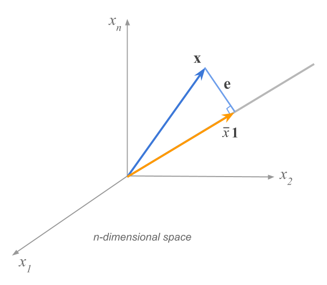

# (PART) Statistical Measures {-}

# Mean {#mean}

The starting point in multivariate analysis consists in computing various summary measures---such as means, and variances---to get an idea of the common or central values, and the amount of variability of each variable. In this chapter you will learn how concepts like the mean of a variable can be expressed in terms of vector-matrix operations.


## Mean of a variable

To measure variation, we usually begin by calculating a "typical" value. The idea is to summarize the values of a variable with one or two representative values. You will find this notion under several terms like measures of center, location, central tendency, or centrality.

The prototypical summary value of center is the __mean__, sometimes referred to as average. The mean of an $n-$element variable $X = (x_1, x_2, \dots, x_n)$, represented by $\bar{x}$, is obtained by adding all the $x_i$ values and then dividing by their total number $n$:

$$
\bar{x} = \frac{x_1 + x_2 + \dots + x_n}{n}
$$

Using summation notation we can express $\bar{x}$ in a very compact way as:

$$
\bar{x} = \frac{1}{n} \sum_{i = 1}^{n} x_i
$$

If we want to compute the mean value of `weight`

$$
\overline{\texttt{weight}} = \frac{1}{5} (22 + 15 + 23 + 19 + 14) = 18.6
$$

If you associate a constant weight of $1/n$ to each observation $x_i$, you can look at the formula of the mean as a weighted sum: 

$$
\bar{x} = \frac{1}{n} x_1 + \frac{1}{n} x_2 + \dots + \frac{1}{n} x_n
$$

This is a slightly different way of looking at the mean that will allow you to generalize the concept of an "average" as a _weighted aggregation of information_. For example, if we denote the weight of the $i$-th individual as $w_i$, then the average can be expressed as:

$$
\bar{x} = w_1 x_1 + w_2 x_2 + \dots + w_n x_n = \sum_{i=1}^{n} w_i x_i
$$


## Mean as a Balancing Point

What does the mean do? In what sense the mean is a "typical" value? How do you 
make sense of a mean value?

To understand what the mean is doing, I find it helpful to visualize the values 
of a variable as points in a number-line, or with a dot-plot. Consider a variable 
having five numbers: $X = (1, 2, 6, 7, 9)$, that can be visualized on a number 
line (see image below). Imagine that the number line is like a weighting scale 
or a teeter-totter (or see-saw). 

```{r fig.cap='Values on a number-line', echo = FALSE, out.width = '35%'}
knitr::include_graphics("images/mean/mean-number-line.png")
```

The mean plays the role of the __balancing point__. In other words, $\bar{x}$ is the value that balances out the scale and keeps things on equilibrium.


In this example, the value of 5 is the balancing point:


```{r fig.cap='Mean as a balancing point', echo = FALSE, out.width = '75%'}
knitr::include_graphics("images/mean/mean-balancing.png")
```

Saying that 5 is the balancing point has a specific meaning. It means that the 
signed distances of all the values with respect to the mean cancel out. If you 
calculate the _deviations_ from the mean: $(x_i - \bar{x})$, and add them all up, 
the sum is zero:

$$
(1 - 5) + (2 - 5) + (6 - 5) + (7 - 5) + (9 - 5) = 0
$$

This is a very special property of the mean, indicating that this value is optimal in the sense that it is the only number for which the sum of deviations with itself is zero. In a more algebraic way, say you are looking for a number $a$ that makes the sum of deviations zero:

$$
\sum_{i=1}^{n} (x_i - a) = 0
$$

What would $a$ be? Then mean $\bar{x}$! No other value would be able to cancel out the sum of deviations around itself.

Keep in mind that the mean is just a summary. In fact, it is just one possible kind of "typical" value (other common measures of center are the median or the mode). As any summary statistic, it involves compressing the information of a variable into a single representative number. But remember: this number does not tell you the whole story about the variability in a variable.


## Mean with Vector Notation

It is very useful to be able to compute a mean using vector-matrix notation. First, notice that the formula of the mean consists of computing a (weighted) sum. Second, recall that a sum of numbers can be expressed with an inner product by using the unit vector (or summation operator). If we denote $\mathbf{1}_{n}$ a vector of ones of size $n$, then the mean value of a vector $\mathbf{x}$ can be obtained with an inner product:

$$
\bar{x} = \left(\frac{1}{n}\right) \mathbf{1}_{n}^\mathsf{T} \mathbf{x}
$$

As you can tell, $\bar{x}$ is calculated by multiplying the scalar $1/n$ with the inner product $\mathbf{1}_{n}^\mathsf{T} \mathbf{x}$, which is equivalent to:

$$
\bar{x} = \left(\frac{1}{n}\right) <\mathbf{1}_{n}, \mathbf{x}> = \left(\frac{1}{n}\right) <\mathbf{x}, \mathbf{1}_{n}>
$$

This way of using an inner product can also be genelarized with the notation $<\mathbf{a}, \mathbf{b}>_{M}$ which is simply an inner product in a vector space endowed with a metric matrix $\mathbf{M}$

$$
<\mathbf{a}, \mathbf{b}>_{M} = \mathbf{a}^\mathsf{T} \mathbf{M b}
$$

If we use a metric matrix $\mathbf{D} = diag(1/n)$ then we have that the mean is given by:

$$
\bar{x} = <\mathbf{x}, \mathbf{1}>_{D} = \mathbf{x}^\mathsf{T} \mathbf{D 1}
$$


## Mean as a Projection

We can gain insight to what a mean is doing if we regard a variable from the perspective of the individuals' space. This interpretation is less common than the balancing point, but it is equally revealing and informative.

Consider the $n$-dimensional space $\mathbb{R}^n$ illustrated in the figure below. In this space, each dimension is associated to an individual. The variable $X$ is represented by the blue vector $\mathbf{x}$. In turn, the orange vector represents the $n$-element unit-vector $\mathbf{1}$. From this point of view, the mean acquires a very interesting meaning: it turns out that the mean is the measure of the projection of $\mathbf{x}$ onto the axis spanned by the unit vector $\mathbf{1}$.

```{r fig.cap='Mean as the measure of a projection', echo = FALSE}
knitr::include_graphics("images/mean/mean-projection1.png")
```

So what is the meaning of this orthogonal projection? It tells you that $\bar{x} \mathbf{1}$ is the multiple of the unit-vector that is the closest to $\mathbf{x}$ in the least squares sense:

```{r fig.cap='A variable and its mean vector', echo = FALSE}

```

The size of the residual vector $\mathbf{e} = \mathbf{x} - \bar{x} \mathbf{1}$ is the smallest among all other multiples of $\mathbf{1}$ that you can use to approximate $\mathbf{x}$.


## Centroid

So far we've considered the mean of a single variable $X$, which gives us one 
measure of center or measure of a typical individual. But what about the mean 
in a multivariate sense? If we have more than one variable, say $p$ variables 
$X_1, \dots, X_p$, is there an extension of the notion of typical individual?

If we have several variables or vectors of the same size, like in a $n \times p$ 
matrix $\mathbf{X}$, we can get the mean vector also known as __centroid__. 
The row vector of means of $\mathbf{X}$ is denoted by:

$$ 
\mathbf{\bar{x}} = \frac{1}{n} \mathbf{1}_{n}^\mathsf{T} \mathbf{X} 
$$

and it will be a vector containing the means of of all variables:

$$
\mathbf{\bar{x}} = (\bar{x}_1, \bar{x}_2, \dots, \bar{x}_p)
$$

