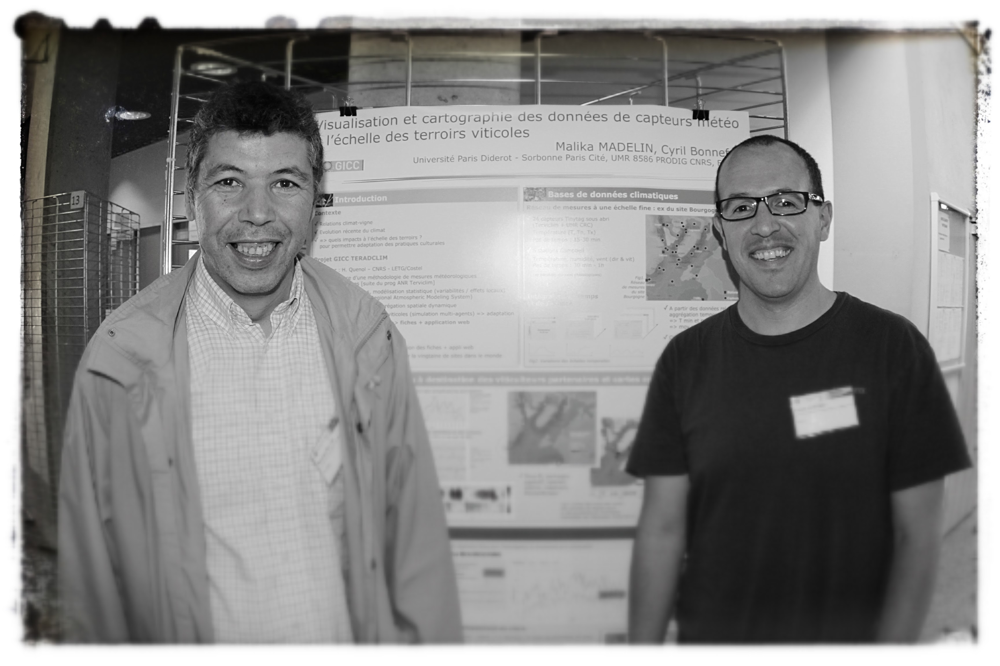

# Preface {-}

You've typically heard something like this before: "in order to have a solid understanding of statistical learning methods, you need a good knowledge of matrix algebra." Which I agree with. Matrix algebra is fundamental for a good understanding of Statistical Learning methods, Machine Learning methods, Data Mining techniques, as well as Multivariate Data Analysis methods (keep in mind that there is a considerable amount of overlap in all these fields).

What you probably haven't heard is that "knowing matrix algebra is not (really) enough." You also need to learn how various matrix algebra concepts are connected with the ideas and notions behind statistical learning methods.

In my opinion, the three main reasons for why you should bother learning about matrix algebra are:

1. Multivariate data is commonly represented in __tabular format__ (rows and columns).

2. Mathematically, a data table can be treated as a __matrix__.

3. Matrix algebra provides the __analytical machinery__ and tools to
manipulate and exploit values, information, and patterns of variability in data.


### How this book is organized? {-}

By and large, I focus on concepts like mean, variance, covariance, notions of spread, distances, and their relationships with linear combinations, projections---that sort of thing. You will learn how to express statistical concepts with vector and matrix notation. The underlying goal is to show you how to get a geometrical interpretation of common statistical operations.

- Data tables
- Data matrix
- Variables
- Transformations
- Duality of the data matrix
- Statistical Summaries
- Spreads and Distances


### Prerequisites {-}

This is NOT a book on matrix algebra, and it is also NOT a book on Statistical Learning. Instead, this book discusses general material from linear algebra that has to do with statistics. The level of exposure of the contents in this text is based on three ideal assumptions about you:

- You have some basic knowledge of matrix algebra.

- You have taken introductory statistics.

- You have some experience working with statistical learning techniques.


### Why this book? {-}

As with most of the books that I have written, this book is the result of my professional experience and personal frustration of not having resources like these out there. More specifically, this book was motiviated by the lack of a text that I could refer my students to so they could learn about how various matrix algebra concepts are connected with statistical ideas.

Likewise, throughout my teaching activities to different user profiles, I've seen time and again that we are not trained to see the connections between many analytical notions, and their matrix-geometric interpretation. 

This book is my attempt to provide a resource for future (and current) data scientists that may have the software know-how, and a strong understanding of the working principles of the techniques they use, yet they have gaps at the matrix algebra level that prevents them to fully grasp the "under the hood" principles of their daily tools.

My hope is that the concepts and notions described in this text will allow you to get a good grasp of the methods discussed in any textbook about Statistical Learning, and how they work. I'm sure this book will be a great resource and consulting text for undergraduate and graduate students, as well as data scientists in the more general sense of this term.


### Acknowledgements {-}

A very special and heartfelt mention to Mohamed Hanafi, who ignited a spark in me that eventually fired up the idea of this work. Very likely I wouldn't have started writing some notes had he not invited me to be part of his one-man lab in the _Unit of Sensometrics and Chemometrics_ at Oniris-Nantes. I don't think I'll ever be able to forget our marathonian discussion sessions, the many dozens of whiteboards filled with illuminating scribbles, the corresponding quota of used markers, the constant skipped lunch breaks, the steady climbing in the volume of his voice as he got excited talking about some abstract concept, and of course, his unique skill for breaking my patience beyond my tolerable limits. Now I know there's a toll to pay when working with a genious of such astounding talent. I also know I wouldn't have been able to connect all the dots without him sharing his wisdom, secrets, and utopic dreams. _Ustadh Hanafi... Shukran Jazilan_.

```{r fig.cap="Mohamed Hanafi and Gaston Sanchez (Summer 2013)", echo = FALSE, out.width = "55%"}

```

As always, you wouldn't be reading this book if it wasn't for the patience and support of my loving wife Jessica. Once again, she allowed me to occupy the dining table as my personal workspace for many months (consequently eating at the couches in countless occasions). If you find any value from the content in this book, which I am sure you will, you owe her almost as much as you owe me.


-----

#### _Make a donation_ {-}

_If you find this resource useful, please consider making a one-time donation in any amount. Your support really matters._

<form action="https://www.paypal.com/cgi-bin/webscr" method="post" target="_top">
<input type="hidden" name="cmd" value="_donations" />
<input type="hidden" name="business" value="ZF6U7K5MW25W2" />
<input type="hidden" name="currency_code" value="USD" />
<input type="image" src="https://www.paypalobjects.com/en_US/i/btn/btn_donateCC_LG.gif" border="0" name="submit" title="PayPal - The safer, easier way to pay online!" alt="Donate with PayPal button" />

</form>
