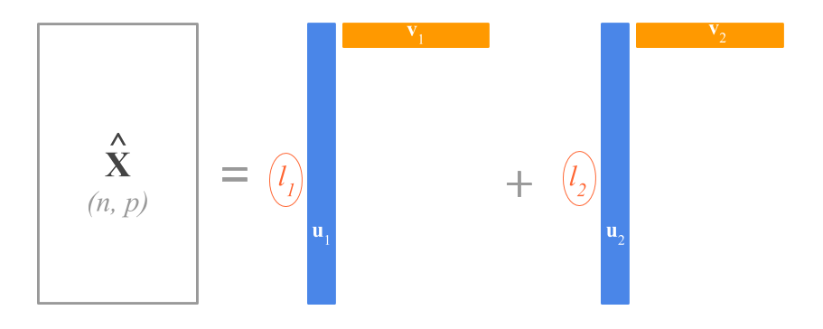

# Singular Value Decomposition {#svd}

One of the most important decompositions in matrix algebra is known as the __Singular Value Decomposition__, commonly known as SVD. One of the reasons why this decomposition is such fundamental is because it can be applied to __any__ type of matrix---rectangular or square, singular or nonsigular. In this chapter, you will learn about SVD and its role for statistical learning methods.


## SVD Basics

The Singular Value Decomposition expresses any matrix, such as an $n \times p$ matrix $\mathbf{X}$, as the product of three other matrices:

$$
\mathbf{X = U D V^\mathsf{T}}
$$

where:

- $\mathbf{U}$ is a $n \times p$ column _orthonormal_ matrix containing the 
__left singular vectors__.

- $\mathbf{D}$ is a $p \times p$ _diagonal_ matrix containing the __singular 
values__ of $\mathbf{X}$.

- $\mathbf{V}$ is a $p \times p$ column _orthonormal_ matrix containing the 
__right singular vectors__.

In terms of the shapes of the matrices, the SVD decomposition has this form:

$$
\begin{bmatrix} 
 &   & \\
 &   & \\
 & \mathbf{X} & \\
 &   & \\
 &   & \\
\end{bmatrix}
= 
\
\begin{bmatrix} 
 &   & \\
 &   & \\
 & \mathbf{U} & \\
 &   & \\
 &   & \\
\end{bmatrix}
\
\begin{bmatrix} 
 &   & \\
 & \mathbf{D} & \\
 &   & \\
\end{bmatrix}
\
\begin{bmatrix} 
 &   & \\
 & \mathbf{V}^\mathsf{T} & \\
 &   & \\
\end{bmatrix}
$$


The SVD says that we can factorize $\mathbf{X}$ with the product of an orthonormal matrix $\mathbf{U}$, a diagonal matrix $\mathbf{D}$, and an orthonormal matrix $\mathbf{V}$. 

$$
\mathbf{X} = 
\
\begin{bmatrix} 
u_{11} & \cdots & u_{1p} \\
u_{21} & \cdots & u_{2p} \\
\vdots & \ddots & \vdots \\
u_{n1} & \cdots & u_{np} \\
\end{bmatrix}
\
\begin{bmatrix} 
l_{1} & \cdots & 0 \\ 
\vdots & \ddots & \vdots \\
0 & \cdots & l_{p} \\
\end{bmatrix}
\
\begin{bmatrix} 
v_{11} & \cdots & v_{p1} \\
\vdots & \ddots & \vdots \\
v_{1p} & \cdots & v_{pp} \\
\end{bmatrix}
$$


### SVD Properties

You can think of the SVD structure as _the basic structure of a matrix_. What does this mean? Well, to understand the meaning of _basic_ structure, we need to say more things about what each of the matrices $\mathbf{U}$, $\mathbf{D}$, and $\mathbf{V}$ represent. To be more precise:


__About $\mathbf{U}$__

The matrix $\mathbf{U}$ is the orthonormalized matrix which is the most basic component. It's like the skeleton of the matrix.

- $\mathbf{U}$ is unitary, and its columns form a basis for the space spanned by the columns of $\mathbf{X}$.

$$
\mathbf{U^\mathsf{T} U} = \mathbf{I}_{p}
$$

- $\mathbf{U}$ cannot be orthogonal ($\mathbf{U U^\mathsf{T} = I_n}$) unless $r = p$


__About $\mathbf{V}$__

The matrix $\mathbf{V}$ is the orientation or correlational component. 

- $\mathbf{V}$ is unitary, and its columns form a basis for the space spanned by the rows of $\mathbf{X}$.

$$
\mathbf{V^\mathsf{T} V} = \mathbf{I}_{p}
$$

- $\mathbf{V}$ cannot be orthogonal ($\mathbf{V V^\mathsf{T} = I_p}$) unless $r = p = m$


__About $\mathbf{D}$__

- The matrix $\mathbf{D}$ is referred to as the _spectrum_ and it is a scale component. Note that all the values in the diagonal of $\mathbf{D}$ are non-negative numbers. 

- This matrix is also unique. It is a like a fingerprint of a matrix. It is assumed that the singular values are ordered from largest to smallest.

- All elements of $\mathbf{D}$ can be taken to be positive, ordered from large to small (with ties allowed).

- $\mathbf{D}$ has non-negative real numbers on the diagonal (assuming $\mathbf{X}$ is real).

- The rank of $\mathbf{X}$ is given by $r$, the number of such positive values (which are called singular values). Furthermore, $r(\mathbf{X}) \leq min(n,p)$. 


### Diagrams of SVD

Under the standard convention that $n > p$, if we assume that $\mathbf{X}$ is of full-column rank $r(\mathbf{X}) = p$, then we can display the decomposition with the following diagram:

```{r fig.cap = 'SVD Decomposition Diagram', echo = FALSE}
knitr::include_graphics("images/decomps/svd-decomposition1.png")
```

In general, when the decomposed matrix $\mathbf{X}$ is not of full column-rank, that is $rank(\mathbf{X}) = r < p$, then the diagram of SVD could be depicted as follows

```{r fig.cap = 'SVD Decomposition Diagram', echo = FALSE}
knitr::include_graphics("images/decomps/svd-decomposition2.png")
```


### Example

Here's an example of SVD in R, via the function `svd()`. First let's create a matrix $\mathbf{X}$ with random numbers:

```{r}
# X matrix
set.seed(22)
X <- matrix(rnorm(20), 5, 4)
X
```

R comes with the function `svd()`; it's output is a list with three elements:

```{r}
# singular value decomposition
SVD <- svd(X)

# elements returned by svd()
names(SVD)
```

- `d` is a vector containing the singular values (i.e. values in the diagonal of $\mathbf{D}$)

- `u` is the matrix of left singular values.

- `v` is the matrix of right singular values.

```{r}
# vector of singular values
(d <- SVD$d)

# matrix of left singular vectors
(U = SVD$u)

# matrix of right singular vectors
(V = SVD$v)
```

Let's check that $\mathbf{X} = \mathbf{U D V^\mathsf{T}}$

```{r}
# X equals U D V'
U %*% diag(d) %*% t(V)

# compare to X
X
```

Let's also confirm that $\mathbf{U}$ and $\mathbf{V}$ are orthonormal:

```{r}
# U orthonormal  (U'U = I)
t(U) %*% U

# V orthonormal  (V'V = I)
t(V) %*% V
```


### Relation of SVD and Cross-Product Matrices

If you consider $\mathbf{X}$ to be a data matrix of $n$ individuals and $p$ variables, you should be able to recall that we can obtain two cross-products: $\mathbf{X^\mathsf{T}X}$ and $\mathbf{X X^\mathsf{T}}$. It turns out that we can use the singular value decomposition of $\mathbf{X}$ to find the corresponding factorization of each of these products.

The cross-product matrix of columns can be expressed as:

\begin{align*}
\mathbf{X^\mathsf{T} X} &= (\mathbf{U D V^\mathsf{T}})^\mathsf{T} (\mathbf{U D V^\mathsf{T}}) \\
&= (\mathbf{V D U^\mathsf{T}}) (\mathbf{U D V^\mathsf{T}}) \\
&= \mathbf{V D} (\mathbf{U^\mathsf{T}} \mathbf{U}) \mathbf{D V^\mathsf{T}} \\
&= \mathbf{V D^2 V^\mathsf{T}}
\end{align*}

The cross-product matrix of rows can be expressed as:

\begin{align*}
\mathbf{X X^\mathsf{T}} &= (\mathbf{U D V^\mathsf{T}}) (\mathbf{U D V^\mathsf{T}})^\mathsf{T} \\
&= (\mathbf{U D V^\mathsf{T}}) (\mathbf{V D U^\mathsf{T}}) \\
&= \mathbf{U D} (\mathbf{V^\mathsf{T}} \mathbf{V}) \mathbf{D U^\mathsf{T}} \\
&= \mathbf{U D^2 U^\mathsf{T}}
\end{align*}


One of the interesting things about SVD is that $\mathbf{U}$ and $\mathbf{V}$ are 
matrices whose columns are eigenvectors of product moment matrices that are 
_derived_ from $\mathbf{X}$. Specifically, 

- $\mathbf{U}$ is the matrix of eigenvectors of (symmetric) 
$\mathbf{XX^\mathsf{T}}$ of order $n \times n$

- $\mathbf{V}$ is the matrix of eigenvectors of (symmetric) $\mathbf{X^\mathsf{T}X}$ 
of order $p \times p$

Of additional interest is the fact that $\mathbf{D}$ is a diagonal matrix whose 
main diagonal entries are the square roots of $\mathbf{U}^2$, the _common_ 
matrix of eigenvalues of $\mathbf{XX^\mathsf{T}}$ and $\mathbf{X^\mathsf{T}X}$. 

The EVD of the cross-product matrix of columns (or minor product moment) 
$\mathbf{X^\mathsf{T} X}$ can be expressed as:

$$
\mathbf{X^\mathsf{T} X} = \mathbf{V \Lambda V^\mathsf{T}}
$$

in terms of the SVD factorization of $\mathbf{X}$:

$$
\mathbf{X^\mathsf{T} X} = \mathbf{V D^2 V^\mathsf{T}}
$$


The EVD of the cross-product matrix of rows (or major product moment)
$\mathbf{X X^\mathsf{T}}$ can be expressed as:

$$
\mathbf{X X^\mathsf{T}} = \mathbf{U \Lambda U^\mathsf{T}}
$$

in terms of the SVD factorization of $\mathbf{X}$:

$$
\mathbf{X X^\mathsf{T}} = \mathbf{U D^2 U^\mathsf{T}}
$$


## SVD Rank-Reduction Theorem

A very interesting and alternative way to represent the SVD is with the following formula:

$$
\mathbf{X} = \sum_{k=1}^{p} \lambda_k \mathbf{u_k} \mathbf{v'_k}
$$

This equation expresses the SVD as a sum of $p$ rank 1 matrices. This result is formalized in what is known as the SVD theorem described by Carl Eckart and Gale Young in 1936, and it is often referred to as the Eckart-Young theorem. This theorem applies to practically any arbitrary rectangular matrix. 

The SVD theorem of Eckart and Young is related to the important problem of approximating a matrix. The basic result says that if $\mathbf{X}$ is an $n \times p$ rectangular matrix, then the best $r$-dimensional approximation $\hat{\mathbf{X}}$ to $\mathbf{X}$ is obtained by minimizing:

$$
min \| \mathbf{X - \hat{X}} \|^2
$$

This type of approximation is a least squares approximation and the solution is obtained by taking the first $r$ elements of matrices $\mathbf{U}, \mathbf{D}, \mathbf{V}$ so that the $n \times r$ matrix $\mathbf{\hat{X} = U_r D_r V^\mathsf{T}_r}$

The SVD theorem says that _any_ rectangular matrix $\mathbf{X}$ can be broken down into the product of three matrices---an orthogonal matrix $\mathbf{U}$, a diagonal matrix $\mathbf{D}$, and the transpose of an orthogonal matrix $\mathbf{V}$. 

In terms of the diagonal elements $l_1, l_2, \dots, l_r$ of $\mathbf{D}$, the columns $\mathbf{u_1}, \dots, \mathbf{u_r}$ of $\mathbf{U}$, and the columns $\mathbf{v_1}, \dots, \mathbf{v_r}$ of $\mathbf{V}$, the basic structure of $\mathbf{X}$ may be written as

$$
\mathbf{X} =  l_1 \mathbf{u_1 v^\mathsf{T}_1} + l_2 \mathbf{u_2 v^\mathsf{T}_2} + \dots + l_r \mathbf{u_r v^\mathsf{T}_r}
$$

which shows that the matrix $\mathbf{X}$ of rank $r$ is a linear combination 
of $r$ matrices of rank 1.

```{r fig.cap = 'SVD as a sum of rank-one matrices', echo = FALSE}
knitr::include_graphics("images/decomps/svd-rank-one.png")
```

For eample, if you take only the first two singular vectors and values, you can obtain a two-rank approximation $\mathbf{\hat{X}}$ of $\mathbf{X}$.

```{r fig.cap = 'SVD rank-two approximation', echo = FALSE}

```

If you think about it, the SVD is of great utility because it tells us that the 
best 1-rank approximation, in the least squares sense, of any matrix 
$\mathbf{X}$ is $l_1 \mathbf{u_1} \mathbf{v^\mathsf{T}_1}$. This implies that, 
from a conceptual standpoint, we can approximate the $n \times p$ numbers in 
$\mathbf{X}$ with just $n + p + 1$ values: $n$ numbers in $\mathbf{u_1}$, $p$ 
numbers in $\mathbf{v_1}$, and one scalar $l_1$.

