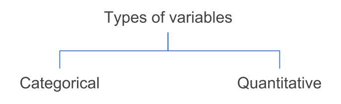

# Variables {#variables}

To illustrate some of the ideas presented in this chapter I'm going to use a toy example with data from the characters of the Star Wars universe. You can actually find the corresponding CSV file in the `data/` folder of the book's github repository.

```{r sw, echo = FALSE}
sw <- read.csv('data/starwars.csv')
```

```{r echo = FALSE, comment = ''}
dat <- sw[ ,c('name', 'gender', 'height', 'weight', 'species', 'jedi', 'weapon')]
dat
```

The table consists of `r nrow(dat)` rows and `r ncol(dat)` columns. The rows correspond to _individuals_ and the columns correspond to _variables_. Although this data set is a toy example, it contains variables of different types commonly found in real data sets.


## Types of Variables

In statistical learning, the most typical data format involves a set of individuals or objects described by several characteristics commonly known as _variables_. Interestingly, we can classify variables in a couple of different ways.

The most basic and usual way to classify variables is in two distinct types: __quantitative__ variables and __categorical__ (or qualitative) variables.

```{r out.width='50%', echo = FALSE}

```

The variables `height` and `weight` are examples of quantitative variables because their values represent quantities. That is, they can be measured numerically on some sort of interval scale. 

In turn, variables such as `name`, `gender`, `species`, `jedi`, and `weapon` are categorical or qualitative variables because their values represent categories (or qualities). More formally, they describe a quality of an individual, and allows you to place an individual into a category or group, such as male or female.


## Variable Flavors

The division between categorical and quantitative variables is not the only one. Often, data scientists further classifiy categorical variables as _nominal_ or _ordinal_. Likewise, quantitative variables can be classified as _discrete_ or _continuous_. This next level of classification is chiefly based on the notion of _scales of measurement_ of the variables.

```{r fig.cap='Further classification of variables', echo = FALSE}
knitr::include_graphics("images/variables/variable-qual-quant.png")
```


### Nominal Variable

A categorical variable is __nominal__ when it results from naming or labeling values that don't have a natural order. An example of a nominal variable is `weapon` which has the following values:

```{r echo = FALSE}
levels(dat$weapon)
```

Can you order the categories in a "natural" way? Not really. The term _nominal_ according the dictionary means "existing in name only". Thus, nominal values are just that: names. There is no reason why blaster is better or greater than lightsaber. You could say that you prefer a blaster over a lightsaber but that's a different variable: personal preference.

Other typical examples of nominal variables are:

- the sex of a newborn child: e.g. female or male

- the ethnicity of an individual: e.g. Native-American, African-American, Asian, White

- ice cream flavors: e.g. chocolate, vanilla, strawberry

- the numbers on the players' jerseys of a soccer team: numbers used as identifiers


### Ordinal Variable

A categorical variable is __ordinal__ when it results from ordering values into a series of categories when no appropriate numerical scale is available. For example, consider a variable "usage frequency" measured with values _never_, _sometimes_, and _always_. In this case we can order the categories from less usage to more usage, or viceversa.

Some examples of ordinal variables are:

- size of clothes: extra-small, small, medium, large, extra-large

- college year: freshman, sophomore, junior, senior

- spiciness: none, mild, moderate, very

- jedis ranks: youngling, padawan, knight, master, and grand master


### Discrete Variable

A quantitative variable is __discrete__ when it results from counting. To be more precise, a discrete variable takes on zero or a positive integer value. Some examples of discrete variables are:

- the number of male ewooks in a family with four children (0, 1, 2, 3, or 4).

- the number of robots per Imperial Star Destroyer

- the number of moons orbiting around a planet


### Continuous Variable

A quantitative variable is __continuous__ when it results from measuring. More technically, a continuous variable theoretically takes on an infinite number of possible values, however, its reported values are subject to the precision or accuracy of the measurement device. Some examples of continuous variables are:

- the height of an individual
- the weight of a robot
- the speed of a starship


### Caveat

Keep in mind that not all variables fit neatly and unambiguously into one of the previous classes. For example, the age of an individual could be considered of a discrete variable when it gets reported in (whole) number of years. However, age could also be considered to be continuous when measured in a more granular scale: e.g. days, or hours, or seconds. Moreover, sometimes age is reported into ordered categories such as 0 to 5 years, 6 to 10, 11 to 15, and so on. These values would turn age into an ordinal variable.


## Encoding Values

Another important aspect intimately connected with the various types of variables is that of how variable values are encoded. To better understand what this is about, let me discuss a simple example.

Notice that the quantitative variables in the star wars data set have numeric values, while the categorical variables have non-numeric values. Does that mean that all numeric variables can be considered to be quantitative? And that all non-numeric variables can be considered to be categorical? The answer is: Not necessarily.

Often, analysts assign numeric values to the categories of a qualitative variable. Sooner or later you will find variables with numeric values that are not quantitative. An example could be ice-cream flavors in which the categories are codified with numbers. For example, consider three ice-cream flavors: vanilla, chocolate, and lemon. And imagine that we assign a numeric code to each flavor: 1 = vanilla, 2 = chocolate, 3 = lemon. This numeric labeling is just for convenience purposes.

Assume that you get the preferred ice-cream flavor of 10 subjects with the following values: 

```{r echo = FALSE, comment = ''}
flavors <- c('vanilla', 'chocolate', 'lemon')
icecreams <- sample(1:3, size = 10, replace = TRUE)
cat(icecreams)
```

The above numbers, which are hypothetical values of a variable `icecream`, do not represent quantities; they represent flavors. Just because there are numbers, it does not mean that we can use those numbers to carry out arithmetic operations. What is the result of: 3 - 1, that is, _lemon_ minus _vanilla_? It is meaningless to attempt this type of operation. 

Likewise, we could assign numbers to sizes: 1=small, 2=medium, 3=large. In this case, the numbers are again used for convenient purposes. And we can even take one further step and say that we can use the numbers to rank the categories. But it will be impossible to add 1+2, since _small_ + _medium_ does not equal _large_.

The point is that just because a variable contains numbers, that doesn't automatically make it quantitative. You should always ask yourself if the numbers represent some sort of quantity. If the answer is a sounded yes, then you have a quantitative variable. Otherwise, you have a categorical one.


### More on encoding

We can find categorical data under a wide range of formats. I've seen categorical data codified in different ways, and sometimes people are very creative in the way they do this.

The main types of formats can be classified in three main groups:

- text or characters
- numbers (ideally integers)
- logical (TRUE / FALSE), typically for binary variables

Here's an example with a `gender` variable:

- as text: `"F"` (female), `"M"` (male)
- as numbers: 1 (female), 0 (male)
- as logical: `TRUE` (female), `FALSE` (male)

When talking about the way data is stored and encoded, I don't think there's an ideal/universal way to store categorical data effectively and efficiently. It all depends on the field of application, the size of the data, the legibility, the usage purposes, etc. What I do believe in is that, when categorical data is being analyzed, we should consider a couple of issues:

- __understandability__: the analyst should be able to read, interpret and understand what the available values represent. Whenever possible, you should aim to reduce friction, and avoid having to struggle with decodifying numbers.

- __compatibility__: this has to do with functions and commands in data analysis and statistical software. Some functions are programmed in a way that they accept a specific type of input (either a vector, a factor, a data frame, etc). Often, you will need to manipulate some kind of object in order to convert it into another type  of object better suited for a certain functions or command.

- __visibility__: this aspect is related to visual displays in graphics. Maybe long labels look fine in a table, but for plotting purposes they could cluttered the screen.


-----

#### Make a donation {-}

If you find this resource useful, please consider making a one-time donation in any amount. Your support really matters.

<form action="https://www.paypal.com/cgi-bin/webscr" method="post" target="_top">
<input type="hidden" name="cmd" value="_donations" />
<input type="hidden" name="business" value="ZF6U7K5MW25W2" />
<input type="hidden" name="currency_code" value="USD" />
<input type="image" src="https://www.paypalobjects.com/en_US/i/btn/btn_donateCC_LG.gif" border="0" name="submit" title="PayPal - The safer, easier way to pay online!" alt="Donate with PayPal button" />

</form>
